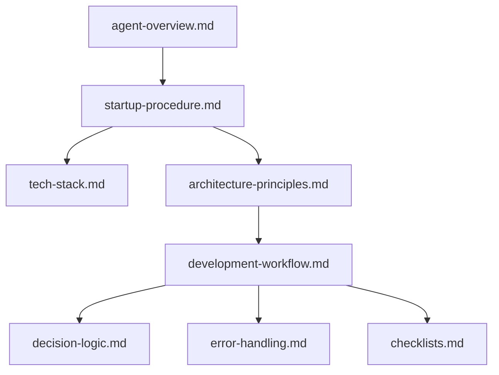

# Agent 核心配置

> **目的**：集中管理 GitHub Copilot Agent 的核心配置文件

---

## 📁 文件說明

本目錄包含 Agent 的核心配置與規範文件，這些文件定義了 Agent 的行為標準和工作流程。

### 文件清單

| 文件名 | 用途 | 重要性 |
|--------|------|--------|
| `agent-overview.md` | Agent 概覽與定位 | ⭐⭐⭐⭐⭐ |
| `startup-procedure.md` | 強制執行程序 | ⭐⭐⭐⭐⭐ |
| `tech-stack.md` | 技術棧與 MCP 工具鏈 | ⭐⭐⭐⭐⭐ |
| `architecture-principles.md` | 企業架構十大原則 | ⭐⭐⭐⭐⭐ |
| `development-workflow.md` | 五層架構開發流程 | ⭐⭐⭐⭐⭐ |
| `decision-logic.md` | 決策邏輯指南 | ⭐⭐⭐⭐ |
| `error-handling.md` | 錯誤處理流程 | ⭐⭐⭐⭐ |
| `checklists.md` | 完整檢查清單 | ⭐⭐⭐⭐⭐ |

---

## 🚀 快速開始

### 首次使用
1. 閱讀 **[agent-overview.md](./agent-overview.md)** 了解 Agent 定位
2. 熟悉 **[startup-procedure.md](./startup-procedure.md)** 強制執行程序
3. 參考 **[tech-stack.md](./tech-stack.md)** 了解技術棧

### 開發新功能
1. 遵循 **[development-workflow.md](./development-workflow.md)** 五層架構流程
2. 參考 **[architecture-principles.md](./architecture-principles.md)** 架構原則
3. 使用 **[checklists.md](./checklists.md)** 進行質量檢查

### 處理錯誤
1. 參考 **[error-handling.md](./error-handling.md)** 錯誤處理流程
2. 使用 **[decision-logic.md](./decision-logic.md)** 進行決策

---

## 📚 文件關聯

---

## 🔄 與其他目錄的關係

### 與 guides/ 的關係
- **core/**：核心配置與標準（What & Why）
- **guides/**：詳細指南與操作步驟（How）

### 與 domain/ 的關係
- **core/**：通用規範與流程
- **domain/**：特定領域的專家配置（Angular、TypeScript 等）

### 與 tools/ 的關係
- **core/**：標準與規範定義
- **tools/**：自動化檢查與驗證腳本

---

## 📖 相關資源

- **指南文件**：[../guides/](../guides/) - 詳細操作指南
- **領域專家**：[../domain/](../domain/) - 技術領域專家配置
- **工具腳本**：[../tools/](../tools/) - 自動化工具
- **專案記憶庫**：[../../copilot/memory.jsonl](../../copilot/memory.jsonl) - 知識圖譜

---

**最後更新**：2025-01-22  
**維護者**：開發團隊
