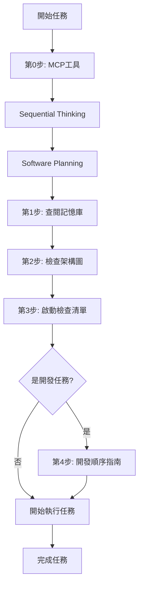

# Agent 強制執行程序

> **重要性**：⭐⭐⭐⭐⭐  
> **適用範圍**：每次任務開始前必須執行

---

## ⚠️ 強制執行程序（每次任務開始前）

### 🔴 第 0 步：必須使用 MCP 工具（最高優先級）⭐⭐⭐⭐⭐

**⚠️ 絕對強制：任何任務都必須先使用以下工具，不得跳過**

#### A. Sequential Thinking Tool（必須第一步使用）
**工具名稱**：`sequential-thinking`  
**何時使用**：**每次任務開始前的第一步**

```
✓ 使用 Sequential Thinking 分析任務
✓ 理解問題本質和目標
✓ 查閱記憶庫相關實體
✓ 分析架構影響
✓ 識別技術挑戰和風險
✓ 驗證可行性
✓ 記錄關鍵決策
```

#### B. Software Planning Tool（必須第二步使用）
**工具名稱**：`software-planning-tool`  
**何時使用**：**完成 Sequential Thinking 後立即使用**

```
✓ 創建規劃會話（start_planning）
✓ 將分析結果轉化為執行計畫
✓ 按五層架構順序創建 todos
✓ 設定複雜度和時間估算
✓ 添加代碼範例和參考
✓ 保存完整計畫（save_plan）
✓ 執行過程中更新狀態（update_todo_status）
```

**詳細工具使用指南**：[mcp-tools-workflow-guide.md](../guides/mcp-tools-workflow-guide.md) ⭐⭐⭐⭐⭐

---

### 🔴 第 1 步：查閱專案記憶庫（必須）✅
**位置**：[.github/copilot/memory.jsonl](../../copilot/memory.jsonl)  
**詳細指南**：[memory-usage-guide.md](../guides/memory-usage-guide.md)

```bash
# 快速查詢相關實體
grep -i "關鍵字" .github/copilot/memory.jsonl
cat .github/copilot/memory.jsonl | jq 'select(.name | contains("關鍵字"))'
```

**記憶庫包含**（v4.0）：149 實體 + 170 關係
- 架構設計、開發標準、安全規範、效能優化、測試策略、文檔結構

### 🔴 第 2 步：檢查系統架構思維導圖（必須）✅
**位置**：[docs/architecture/01-system-architecture-mindmap.mermaid.md](../../../docs/architecture/01-system-architecture-mindmap.mermaid.md)

**必須理解**：
- 系統整體架構（9 大模組）
- 當前任務在架構中的位置
- 相關模組和依賴關係
- 需要遵循的架構原則

### 🔴 第 3 步：完成啟動檢查清單（必須）✅
**位置**：[agent-startup-checklist.md](../guides/agent-startup-checklist.md)

**檢查項目**：
- ✅ 記憶庫查閱完成
- ✅ 架構思維導圖理解完成
- ✅ 相關文檔閱讀完成
- ✅ 任務範圍與目標確認
- ✅ 執行順序規劃完成

### 🔴 第 4 步：新功能開發必讀（開發任務必須）✅
**位置**：[development-sequence-guide.md](../guides/development-sequence-guide.md) ⭐⭐⭐⭐⭐

**強制遵循五層架構開發順序**：
```
Types → Repositories → Models → Services → Facades → Components → Tests
```

**關鍵原則**：
- 嚴格依賴方向：只能依賴下層
- P0 優先級：所有層級都必須完成
- 企業級檢查：每個層級都有完成標準

---

## 🧠 專案記憶庫（必讀）

**⚠️ 重要：每次執行任務前，請先查閱專案記憶庫**

本專案維護了一個完整的知識圖譜記憶庫，包含 149 個實體和 170 個關係，涵蓋：
- 📐 架構設計原則（Git-like Branch Model、51 張資料表、五層架構）
- 🛡️ 安全與權限規範（RLS 策略、認證流程、分支權限）
- 📝 開發標準與最佳實踐（SOLID、DRY、KISS、企業標準）
- 🚀 效能優化與測試策略
- 📚 文檔結構與閱讀路徑

### 記憶庫位置
- **主檔案**：[.github/copilot/memory.jsonl](../../copilot/memory.jsonl) ⭐⭐⭐⭐⭐
- **使用指南**：[memory-usage-guide.md](../guides/memory-usage-guide.md) ⭐⭐⭐⭐⭐
- **摘要說明**：[.github/copilot/MEMORY_SUMMARY.md](../../copilot/MEMORY_SUMMARY.md) ⭐⭐⭐⭐
- **README**：[.github/copilot/README.md](../../copilot/README.md) ⭐⭐⭐

### 系統架構思維導圖位置
- **主檔案**：[docs/architecture/01-system-architecture-mindmap.mermaid.md](../../../docs/architecture/01-system-architecture-mindmap.mermaid.md) ⭐⭐⭐⭐⭐
- **完整架構流程圖**：[docs/20-完整架構流程圖.mermaid.md](../../../docs/20-完整架構流程圖.mermaid.md) ⭐⭐⭐⭐⭐
- **架構審查報告**：[docs/21-架構審查報告.md](../../../docs/21-架構審查報告.md) ⭐⭐⭐⭐⭐

### 如何使用記憶庫
1. **開始任務前**（必須）：查閱 memory.jsonl 中相關實體，了解現有規範和模式
2. **檢查架構圖**（必須）：打開系統架構思維導圖，理解系統整體架構與模組關係
3. **設計決策時**：參考記憶庫中的架構原則和最佳實踐
4. **代碼實作時**：遵循記憶庫中定義的開發標準和檢查清單
5. **完成任務後**：如發現新的模式或規範，建議更新記憶庫

### 關鍵記憶實體範例（從 memory.jsonl 查詢）
- `Five Layer Development Order` - 五層架構開發順序 ⭐⭐⭐⭐⭐
- `Git-like Branch Model` - 分支模型架構 ⭐⭐⭐⭐⭐
- `OnPush Strategy` - 變更檢測策略 ⭐⭐⭐⭐⭐
- `Security Best Practices` - 安全最佳實踐 ⭐⭐⭐⭐⭐
- `UI Component Priority` - UI 元件優先級 ⭐⭐⭐⭐⭐
- `Four Core Development Principles` - 四大核心開發原則 ⭐⭐⭐⭐⭐
- `Repository Pattern` - 資料存取模式 ⭐⭐⭐⭐
- `SHARED_IMPORTS` - 共用模組導入 ⭐⭐⭐⭐
- `Testing Strategy` - 測試策略 ⭐⭐⭐⭐

### 快速查詢命令
```bash
# 查詢開發順序
cat .github/copilot/memory.jsonl | jq 'select(.name | contains("Five Layer")) | .observations'

# 查詢架構模型
cat .github/copilot/memory.jsonl | jq 'select(.name | contains("Git-like")) | .observations'

# 查詢安全規範
cat .github/copilot/memory.jsonl | jq 'select(.name | contains("Security")) | .observations'

# 列出所有實體
cat .github/copilot/memory.jsonl | jq -r 'select(.type=="entity") | .name'
```

---

## 📋 執行程序總結



---

**最後更新**：2025-01-22  
**維護者**：開發團隊
