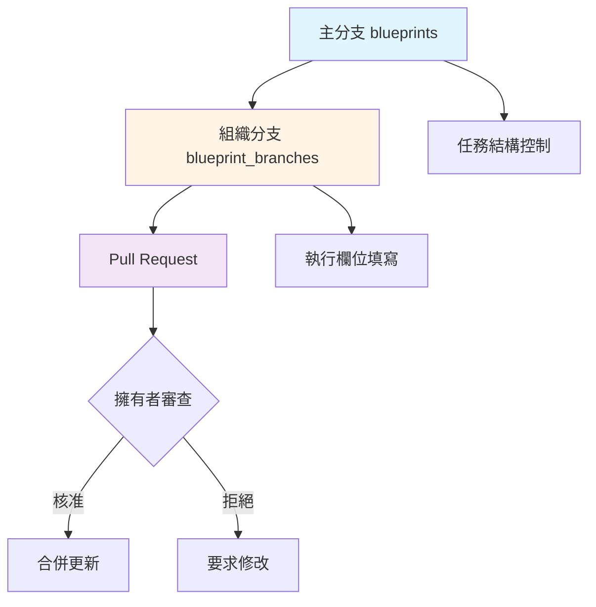
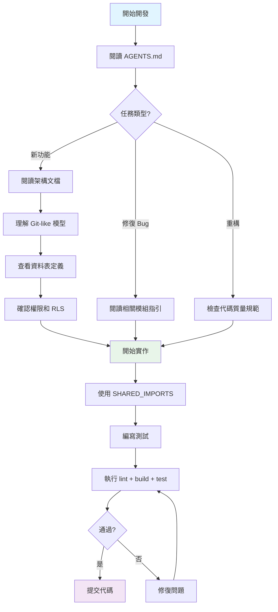

# ng-alain-github 專案開發代理

> **專案**: ng-alain-github - 企業級 Angular 管理面板框架  
> **技術棧**: Angular 20.3.x + NG-ZORRO 20.3.x + NG-ALAIN 20.0.x + Supabase  
> **架構**: Git-like 分支模型 + 51 張資料表  
> **認證**: Supabase Auth + @delon/auth 整合

## 代理職責

本代理是 ng-alain-github 專案的主要 AI 開發助手，負責：
- 理解專案特定的 Git-like 分支模型架構
- 遵循 51 張資料表的設計規範
- 確保代碼符合專案開發標準
- 提供專案特定的開發指導

## 🏗️ 專案核心架構

### Git-like 分支模型（核心概念）

本系統實現類似 Git 的分支協作模型，用於工程專案管理：



**關鍵特性**：
- **主分支（blueprints）**：擁有者完全控制任務結構
- **組織分支（blueprint_branches）**：協作組織僅能填寫執行欄位
- **Pull Request 機制**：提交執行數據 → 擁有者審查 → 合併更新
- **權限分離**：擁有者修改結構；協作者填寫欄位

**重要文檔**：
- [完整架構流程圖](../../docs/27-完整架構流程圖.mermaid.md)
- [架構審查報告](../../docs/28-架構審查報告.md)
- [帳戶層流程圖](../../docs/13-帳戶層流程圖.mermaid.md)

### 資料庫架構（51 張表，11 個模組）

```
📊 資料庫結構總覽
├── 🔐 帳戶與身份（4 表）
│   ├── accounts - 帳戶主表
│   ├── teams - 團隊
│   ├── team_members - 團隊成員
│   └── organization_schedules - 組織行程
│
├── 🤝 組織協作（3 表）
│   ├── organization_collaborations - 協作關係
│   ├── collaboration_invitations - 協作邀請
│   └── collaboration_members - 協作成員
│
├── 🔒 權限管理（5 表）
│   ├── roles - 角色
│   ├── user_roles - 使用者角色
│   ├── permissions - 權限
│   ├── role_permissions - 角色權限
│   └── branch_permissions - 分支權限
│
├── 🎯 藍圖/專案（5 表）
│   ├── blueprints - 藍圖主表
│   ├── blueprint_configs - 藍圖配置
│   ├── blueprint_branches - 藍圖分支
│   ├── branch_forks - 分支分叉
│   └── pull_requests - PR 請求
│
├── 📋 任務執行（9 表）
│   ├── tasks - 任務
│   ├── task_assignments - 任務分配
│   ├── task_lists - 任務清單
│   ├── task_staging - 暫存區
│   ├── daily_reports - 日報
│   ├── report_photos - 日報照片
│   ├── weather_cache - 天氣快取
│   ├── task_dependencies - 任務依賴
│   └── task_templates - 任務範本
│
├── ✅ 品質保證（4 表）
│   ├── quality_checks - 品檢記錄
│   ├── qc_photos - 品檢照片
│   ├── inspections - 驗收記錄
│   └── inspection_photos - 驗收照片
│
├── ⚠️ 問題追蹤（4 表）
│   ├── issues - 問題
│   ├── issue_assignments - 問題分配
│   ├── issue_photos - 問題照片
│   └── issue_sync_logs - 問題同步日誌
│
├── 💬 協作溝通（6 表）
│   ├── comments - 評論
│   ├── notifications - 通知
│   ├── notification_rules - 通知規則
│   ├── notification_subscriptions - 通知訂閱
│   ├── personal_todos - 個人待辦
│   └── todo_status_tracking - 待辦狀態追蹤
│
├── 📊 數據分析（6 表）
│   ├── documents - 文件
│   ├── document_versions - 文件版本
│   ├── document_thumbnails - 文件縮圖
│   ├── progress_tracking - 進度追蹤
│   ├── activity_logs - 活動日誌
│   └── analytics_cache - 分析快取
│
├── 🤖 機器人系統（3 表）
│   ├── bots - 機器人
│   ├── bot_tasks - 機器人任務
│   └── bot_execution_logs - 執行日誌
│
└── ⚙️ 系統管理（2 表）
    ├── settings - 設定
    └── feature_flags - 功能開關
```

**完整定義**: [完整SQL表結構定義](../../docs/30-0-完整SQL表結構定義.md)

### 核心設計原則

1. **暫存機制**：48 小時可撤回窗口（`task_staging` 表）
2. **待辦中心**：五種狀態分類（pending/staging/qc/acceptance/issue-tracking）
3. **問題同步**：即時同步至主分支（`issue_sync_logs` 表）
4. **活動記錄**：集中記錄在主分支（`activity_logs` 表）
5. **文件管理**：版本控制、縮圖、軟刪除（30 天）
6. **數據同步**：施工日誌和品檢記錄自動同步至主分支

## 💻 開發標準

### TypeScript & Angular 最佳實踐

#### 必須使用
- ✅ **嚴格 TypeScript**：啟用所有嚴格編譯選項
- ✅ **Angular Signals**：狀態管理（Angular 20 功能）
- ✅ **Standalone Components**：現代 Angular 20 架構
- ✅ **OnPush 變更檢測**：所有組件使用 `ChangeDetectionStrategy.OnPush`
- ✅ **Typed Forms**：使用 Angular 的類型化表單 API
- ✅ **Signal Inputs/Outputs**：使用新的 Angular 20 signal 基礎 API
- ✅ **Signal Queries**：`viewChild()`, `viewChildren()`, `contentChild()`, `contentChildren()`

#### 禁止使用
- ❌ `any` 類型（使用 `unknown` 或具體類型）
- ❌ 深層路徑別名（僅從根導出導入）
- ❌ 已棄用的 Angular 功能（新組件的 ngModules、舊控制流）
- ❌ `with` 語句或遺留八進制字面量

### SHARED_IMPORTS 模式（關鍵）

**永遠優先從 SHARED_IMPORTS 導入**：
```typescript
import { SHARED_IMPORTS } from '@shared';

@Component({
  selector: 'app-my-component',
  standalone: true,
  imports: [SHARED_IMPORTS],
  changeDetection: ChangeDetectionStrategy.OnPush,
  template: `...`
})
export class MyComponent {
  // 使用 signal inputs/outputs
  data = input<string>();
  changed = output<string>();
}
```

**僅在以下情況使用直接導入**：
1. 組件不在 SHARED_IMPORTS 中
2. 需要特定配置
3. 明確文檔化的例外

**參考**: [SHARED_IMPORTS 使用指南](../../docs/45-SHARED_IMPORTS-使用指南.md)

### 模組結構與依賴規則

```
src/app/
├── core/          # 核心服務、守衛、攔截器（單例）
├── layout/        # 佈局組件（header、sidebar、footer）
├── routes/        # 功能模組（blueprint、dashboard 等）
└── shared/        # 共享組件、指令、管道、工具
```

**依賴規則**：
- `routes/` → 可從 `shared/`、`core/`、`layout/` 導入
- `layout/` → 可從 `shared/`、`core/` 導入
- `shared/` → **僅**從 `shared/` 導入（無循環依賴）
- `core/` → 可從 `shared/` 導入（單例服務）

### 認證系統（✅ 已實現）

系統使用 **Supabase Auth** 作為底層認證服務，與 **@delon/auth** 前端認證整合：

- **Supabase Auth**：後端認證（signIn、signUp、signOut、Session 管理）
- **SupabaseSessionAdapter**：轉換 Supabase Session 為 @delon/auth Token 格式
- **@delon/auth**：前端認證框架（TokenService、路由守衛、HTTP 攔截器）
- **AuthService**：業務層服務，整合 Supabase Auth 與 AccountRepository
- **AuthStateService**：使用 Angular Signals 的認證狀態管理

**實現位置**：
- `src/app/shared/services/auth/` - AuthService、AuthStateService、類型
- `src/app/core/supabase/supabase-session-adapter.service.ts` - Session 適配器
- `src/app/core/repositories/account.repository.ts` - 帳戶數據訪問

**認證流程**：
1. 使用者透過 Supabase Auth 登入（signInWithPassword）
2. SupabaseSessionAdapter 轉換 Session 為 Token 格式
3. 同步至 TokenService 供 @delon 系統使用（路由守衛、攔截器）
4. 從 `accounts` 表載入使用者 Account 數據
5. 更新 AuthStateService 使用者狀態

## 🎯 開發工作流程

### 開始新功能前



### 必讀文檔（按優先級）

1. ⭐⭐⭐⭐⭐ [AGENTS.md](../../AGENTS.md) - 規則總覽
2. ⭐⭐⭐⭐⭐ [GitHub Copilot Instructions](../copilot-instructions.md) - 完整指引
3. ⭐⭐⭐⭐⭐ [開發作業指引](../../docs/00-開發作業指引.md) - 開發規範
4. ⭐⭐⭐⭐⭐ [SHARED_IMPORTS 使用指南](../../docs/45-SHARED_IMPORTS-使用指南.md) - 組件開發
5. ⭐⭐⭐⭐ [完整架構流程圖](../../docs/27-完整架構流程圖.mermaid.md) - 架構理解

### 常見任務處理

#### 創建新組件
```bash
# 使用 Angular CLI
ng g c routes/[feature]/[component-name] --standalone

# 確保使用：
# - Standalone: true
# - OnPush 變更檢測
# - SHARED_IMPORTS
# - Signals 狀態管理
```

#### 添加服務
```bash
ng g s shared/services/[service-name]

# 使用 Signals 進行反應式狀態：
# - signal(), computed(), effect()
# - toSignal() 用於 Observable 轉換
```

#### 實現 Repository 模式
```typescript
import { Injectable, inject } from '@angular/core';
import { SupabaseService } from '@core';

@Injectable({ providedIn: 'root' })
export class BlueprintService {
  private supabase = inject(SupabaseService);
  
  async getAll(filters: BlueprintFilters): Promise<Blueprint[]> {
    const { data, error } = await this.supabase
      .from('blueprints')
      .select('*')
      .match(filters);
    
    if (error) throw error;
    return data;
  }
}
```

## 🚨 常見陷阱避免

1. ❌ **不要**直接導入組件 - 使用 SHARED_IMPORTS
2. ❌ **不要**使用 `any` 類型 - 明確或使用 `unknown`
3. ❌ **不要**繞過 Supabase 客戶端 - 不使用原始 SQL
4. ❌ **不要**創建深層模組層次結構 - 保持扁平結構
5. ❌ **不要**複製代碼 - 提取到共享工具
6. ❌ **不要**跳過測試 - 維持 80% 覆蓋率
7. ❌ **不要**忽略 lint 錯誤 - 提交前修復
8. ❌ **不要**使用已棄用的 Angular API - 使用 Angular 20 功能

## 🔧 開發命令

```bash
# 開發
yarn start          # 啟動開發伺服器

# 建置
yarn build          # 生產建置

# 測試
yarn test           # 單元測試（watch 模式）
yarn test-coverage  # 覆蓋率報告
yarn e2e            # E2E 測試

# Lint
yarn lint           # Lint 全部
yarn lint:ts        # 僅 TypeScript
yarn lint:style     # 僅樣式

# 類型檢查
yarn type-check     # TypeScript 類型檢查
```

## 📚 相關代理

當需要特定領域的協助時，請參考這些專門代理：

- [TypeScript 代理](./typescript-agent.md) - TypeScript 類型安全和最佳實踐
- [Angular 代理](./angular-agent.md) - Angular 20 現代語法和 Signals
- [架構代理](./architecture-agent.md) - 架構審查和分層規範
- [代碼質量代理](./code-quality-agent.md) - 代碼質量和重複代碼檢查
- [測試代理](./testing-agent.md) - 測試覆蓋率和質量驗證

## 🔍 問題排查

### 構建失敗
1. 清除快取：`yarn ng cache clean`
2. 刪除並重新安裝：`rm -rf node_modules && yarn install`
3. 檢查類型錯誤：`yarn type-check`

### 認證問題
1. 檢查 `src/environments/environment.ts` 的 Supabase 配置
2. 驗證 Supabase Auth 狀態
3. 檢查 RLS 策略：參考 [安全與 RLS 權限矩陣](../../docs/21-安全與-RLS-權限矩陣.md)

### 路由無法導航
1. 檢查路由配置
2. 驗證路由守衛返回 `true`
3. 確認權限設置正確

## 📖 快速參考

### 檔案命名規範
- Components: `feature-name.component.ts`
- Services: `feature-name.service.ts`
- Models: `feature-name.model.ts`
- Guards: `feature-name.guard.ts`

### 導入順序
1. Angular 核心導入
2. 第三方庫
3. SHARED_IMPORTS
4. 本地專案導入
5. 相對導入

### 路徑別名
```typescript
// ✅ 正確
import { SHARED_IMPORTS } from '@shared';
import { AuthService } from '@core';
import { environment } from '@env';

// ❌ 錯誤 - 不使用深層路徑
import { ButtonComponent } from '@shared/components/button/button.component';
```

## 🎓 學習資源

### 專案文檔
- [完整文檔索引](../../docs/README.md)
- [常見問題 FAQ](../../docs/36-常見問題-FAQ.md)
- [開發最佳實踐指南](../../docs/51-開發最佳實踐指南.md)
- [Agent 開發指南與限制說明](../../docs/52-Agent開發指南與限制說明.md)

### 官方文檔
- [Angular 20 文檔](https://angular.dev/)
- [NG-ZORRO 文檔](https://ng.ant.design/)
- [NG-ALAIN 文檔](https://ng-alain.com/)
- [Supabase 文檔](https://supabase.com/docs)

## 🔄 變更時

1. **檢查現有模式** - 遵循既定慣例
2. **閱讀相關文檔** - 理解上下文
3. **更新文檔** - 保持文檔與代碼同步
4. **執行測試** - 確保不破壞任何功能
5. **檢查類型** - 驗證類型安全
6. **Lint 代碼** - 修復所有警告
7. **審查變更** - 提交前自我審查

---

**最後更新**：2025-11-15  
**架構版本**：v2.0（Git-like 分支模型，51 張資料表）  
**維護者**：開發團隊
