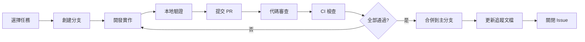

# 工作流程指南 (Workflow Guide)

> **版本**: 1.0.0  
> **最後更新**: 2025-11-22  
> **適用範圍**: ng-alain-gighub 專案所有開發工作

---

## 📋 概述

本指南定義了 ng-alain-gighub 專案的標準工作流程，確保所有團隊成員遵循相同的開發流程，並符合企業級 DoD 標準。

---

## 🎯 標準工作流程

### 階段概覽



---

## 📝 詳細工作流程

### 第 1 步：選擇任務

#### 1.1 從追蹤系統選擇任務

查看 [WORK_PROGRESS_TRACKER.md](./WORK_PROGRESS_TRACKER.md) 或 [INCOMPLETE_ITEMS.csv](./INCOMPLETE_ITEMS.csv)

**選擇標準**:
- ✅ 優先選擇 HIGH 優先級任務
- ✅ 選擇狀態為「待開始」的任務
- ✅ 確認沒有前置依賴或依賴已完成
- ✅ 確認預估工時符合當前可用時間

#### 1.2 分配任務給自己

更新任務狀態：
```csv
# INCOMPLETE_ITEMS.csv
Status: TODO → IN_PROGRESS
Owner: [待分配] → [你的名字]
```

更新追蹤器：
```markdown
# WORK_PROGRESS_TRACKER.md
- [ ] **任務名稱** (ID: XXX-001)
  - 負責人: [你的名字]  ← 更新
  - 狀態: 🟡 進行中      ← 更新
```

---

### 第 2 步：創建 Feature Branch

#### 2.1 從最新的主分支創建

```bash
# 更新主分支
git checkout new-main
git pull origin new-main

# 創建 feature branch
git checkout -b feature/[category]/[task-description]
```

**分支命名規範**:
- `feature/[category]/[description]` - 新功能
- `fix/[category]/[description]` - 錯誤修復
- `refactor/[category]/[description]` - 代碼重構
- `docs/[category]/[description]` - 文檔更新
- `test/[category]/[description]` - 測試補充

**範例**:
```bash
git checkout -b feature/issues/implement-list-loading
git checkout -b fix/security/upgrade-delon-packages
git checkout -b docs/deployment/add-deployment-guide
```

#### 2.2 設定上游追蹤

```bash
git push -u origin feature/[category]/[task-description]
```

---

### 第 3 步：開發實作

#### 3.1 遵循五層架構開發順序

必須嚴格按照以下順序開發：

```
Types → Repositories → Models → Services → Facades → Routes/Components → Tests
```

**詳細參考**: [docs/archive/00-順序.md](./docs/archive/00-順序.md)

#### 3.2 開發前檢查清單

- [ ] 閱讀相關技術文檔
- [ ] 查閱記憶庫 (`.github/copilot/memory.jsonl`)
- [ ] 確認架構設計（系統架構思維導圖）
- [ ] 確認需要的層級和依賴
- [ ] 準備測試計劃

#### 3.3 編碼規範

**TypeScript**:
```typescript
// ✅ 使用 Standalone Component
@Component({
  selector: 'app-example',
  standalone: true,
  imports: [SHARED_IMPORTS],
  changeDetection: ChangeDetectionStrategy.OnPush
})

// ✅ 使用 inject() 而非構造函數注入
export class ExampleComponent {
  private readonly facade = inject(ExampleFacade);
  private readonly router = inject(Router);
  
  // ✅ 使用 Signals
  readonly items = this.facade.items;
  readonly loading = this.facade.loading;
  
  // ✅ 使用 computed
  readonly displayItems = computed(() => {
    return this.items().filter(item => item.active);
  });
}
```

**避免的做法**:
```typescript
// ❌ 不要使用 any
const data: any = response;

// ❌ 不要繞過 OnPush
this.cd.detectChanges(); // 除非絕對必要

// ❌ 不要直接操作 DOM
document.getElementById('...'); // 使用 ViewChild 或 Renderer2
```

#### 3.4 頻繁提交

```bash
# 每完成一個小功能就提交
git add .
git commit -m "feat(issues): implement list loading logic"

# 遵循 Conventional Commits 規範
# feat: 新功能
# fix: 錯誤修復
# docs: 文檔更新
# refactor: 代碼重構
# test: 測試補充
# chore: 建構/工具變更
```

---

### 第 4 步：本地驗證

#### 4.1 代碼質量檢查

```bash
# 類型檢查
yarn type-check

# 代碼檢查
yarn lint

# 樣式檢查（如有樣式變更）
yarn lint:style

# 構建檢查
yarn build
```

**所有檢查必須通過！**

#### 4.2 測試驗證

```bash
# 運行單元測試
yarn test

# 生成覆蓋率報告
yarn test-coverage

# 確認覆蓋率達標
# - 服務層: ≥ 80%
# - 關鍵業務邏輯: 100%
```

#### 4.3 功能驗證

```bash
# 啟動開發服務器
yarn start
```

**手動測試清單**:
- [ ] 功能在瀏覽器中正常工作
- [ ] 沒有控制台錯誤或警告
- [ ] UI/UX 符合設計規範
- [ ] 響應式設計在不同設備上正常
- [ ] 錯誤處理正確
- [ ] Loading 狀態正確顯示

#### 4.4 企業標準檢查

參考 [DEFINITION_OF_DONE.md](./DEFINITION_OF_DONE.md) 完整檢查清單：

**快速檢查**:
- [ ] 常見做法 ✓（符合 Angular/TypeScript 最佳實踐）
- [ ] 企業標準 ✓（代碼結構、職責分離、錯誤處理）
- [ ] 符合邏輯 ✓（數據流、命名、條件判斷）
- [ ] 符合常理 ✓（功能可用、用戶體驗）

---

### 第 5 步：提交 Pull Request

#### 5.1 推送到遠端

```bash
git push origin feature/[category]/[task-description]
```

#### 5.2 創建 PR

在 GitHub 上創建 Pull Request，使用以下模板：

```markdown
## 變更摘要
簡要描述本次變更的內容和目的。

## 變更類型
- [ ] Feature (新功能)
- [ ] Bug Fix (錯誤修復)
- [ ] Refactoring (代碼重構)
- [ ] Documentation (文檔更新)
- [ ] Test (測試補充)
- [ ] Other (其他)

## 關聯 Issue
Closes #123
Related to #456

## 測試結果
- [x] 單元測試通過
- [x] 集成測試通過
- [x] E2E 測試通過（如適用）
- [x] 手動測試通過

### 測試覆蓋率
- Before: 75%
- After: 82%

## 風險評估

### 影響範圍
描述本次變更影響的模組和功能。

### 潛在風險
列出可能的風險和緩解措施。

### 性能影響
描述對性能的影響（正面/負面/無影響）。

## 回滾步驟
1. 回滾 PR merge
2. 回滾資料庫遷移（如有）
3. 恢復配置文件（如有）
4. 重新部署上一個穩定版本

## 部署注意事項
列出部署時需要注意的事項。

## 截圖或錄屏
（如有 UI 變更，請附上截圖或錄屏）

## DoD 檢查清單
- [x] 所有 DoD 檢查項已通過
- [x] 代碼已自我審查
- [x] 文檔已更新
- [x] 測試已補充
- [x] CI 全綠
```

#### 5.3 指定審查者

- 至少指定一位團隊成員審查
- 重大變更需要技術負責人審查
- 架構變更需要架構師審查

---

### 第 6 步：代碼審查

#### 6.1 審查者職責

**審查重點**:
- [ ] 代碼邏輯正確性
- [ ] 符合專案規範和最佳實踐
- [ ] 測試覆蓋充分
- [ ] 文檔完整清晰
- [ ] 無安全漏洞
- [ ] 性能考慮
- [ ] 錯誤處理完善
- [ ] DoD 檢查清單完整

**審查流程**:
1. 仔細閱讀 PR 描述
2. 檢查代碼變更
3. 驗證測試覆蓋
4. 檢查文檔更新
5. 提出建設性反饋
6. 批准或請求變更

#### 6.2 開發者職責

**處理審查意見**:
- 及時回覆所有評論
- 修復指出的問題
- 解釋設計決策（如有爭議）
- 更新代碼並推送
- 請求重新審查

```bash
# 修復問題後推送
git add .
git commit -m "fix: address code review feedback"
git push origin feature/[category]/[task-description]
```

---

### 第 7 步：CI 檢查

#### 7.1 自動化檢查

GitHub Actions 會自動執行：
- ✅ 類型檢查
- ✅ 代碼檢查（ESLint）
- ✅ 樣式檢查（Stylelint）
- ✅ 單元測試
- ✅ 構建
- ✅ 安全掃描

#### 7.2 CI 失敗處理

如果 CI 失敗：
1. 查看失敗原因
2. 在本地復現問題
3. 修復問題
4. 重新推送
5. 等待 CI 重新執行

```bash
# 修復 CI 失敗
git add .
git commit -m "fix: resolve CI failure"
git push origin feature/[category]/[task-description]
```

---

### 第 8 步：合併到主分支

#### 8.1 合併條件

必須滿足所有條件：
- ✅ 至少一位審查者批准
- ✅ 所有 CI 檢查通過
- ✅ 無未解決的評論
- ✅ DoD 檢查清單完整
- ✅ 無合併衝突

#### 8.2 合併方式

使用 **Squash and Merge**（推薦）:
- 保持主分支歷史清晰
- 每個 PR 一個 commit
- Commit 訊息遵循 Conventional Commits

#### 8.3 合併後

```bash
# 更新本地主分支
git checkout new-main
git pull origin new-main

# 刪除 feature branch
git branch -d feature/[category]/[task-description]
git push origin --delete feature/[category]/[task-description]
```

---

### 第 9 步：更新追蹤文檔

#### 9.1 更新 WORK_PROGRESS_TRACKER.md

```markdown
### 2025-11-22 (Day X)

**完成的工作**:
- ✅ [任務名稱] (ID: XXX-001)
  - PR: #XXX
  - 工時: X 小時
  - 測試覆蓋率: +5%
```

#### 9.2 更新 INCOMPLETE_ITEMS.csv

```csv
Status: IN_PROGRESS → DONE
CompletedDate: YYYY-MM-DD
PR_Link: https://github.com/.../pull/XXX
```

#### 9.3 更新 CHANGELOG.md

```markdown
## [Unreleased]

### Added
- [功能描述] (#XXX)

### Fixed
- [錯誤修復描述] (#XXX)

### Changed
- [變更描述] (#XXX)
```

---

### 第 10 步：關閉 Issue

#### 10.1 更新 Issue

在相關 Issue 中：
1. 貼上合併的 PR 連結
2. 添加完成總結
3. 標記為已完成
4. 關閉 Issue

**範例**:
```markdown
✅ 已在 PR #XXX 中完成

**完成內容**:
- 實現了 [功能]
- 添加了測試（覆蓋率 82%）
- 更新了文檔

**相關連結**:
- PR: #XXX
- Commit: [hash]
```

#### 10.2 通知利害關係人

如果是重要功能或修復：
- 在 Issue 中 @mention 相關人員
- 在週報中說明
- 在團隊會議中報告

---

## 🚨 特殊情況處理

### 緊急熱修復 (Hotfix)

**流程簡化**:
1. 從主分支創建 `hotfix/[description]`
2. 快速修復問題
3. 簡化測試（關鍵路徑）
4. 快速審查
5. 立即合併
6. **事後補充**：完整測試、文檔

**豁免項目**:
- 可豁免部分文檔更新
- 可豁免部分測試（需後補）
- 不可豁免 CI 檢查

### 實驗性功能

**標記方式**:
```typescript
/**
 * @experimental
 * This feature is experimental and may change in future versions.
 */
export class ExperimentalFeature {}
```

**豁免項目**:
- 可豁免部分測試
- 可豁免部分文檔
- 需要明確標記為 experimental

---

## 📊 工作流程 KPI

### 衡量指標

| 指標 | 目標值 | 監控方式 |
|------|--------|----------|
| PR 平均審查時間 | < 24 小時 | GitHub Insights |
| CI 通過率 | ≥ 95% | GitHub Actions |
| 首次 CI 通過率 | ≥ 80% | GitHub Actions |
| 代碼審查覆蓋率 | 100% | GitHub |
| DoD 合規率 | 100% | 人工檢查 |

### 持續改進

每月檢視工作流程效率：
- 識別瓶頸
- 收集團隊反饋
- 優化流程
- 更新文檔

---

## 🔗 相關資源

### 核心文檔
- [DEFINITION_OF_DONE.md](./DEFINITION_OF_DONE.md) - 完成標準
- [WORK_PROGRESS_TRACKER.md](./WORK_PROGRESS_TRACKER.md) - 進度追蹤
- [INCOMPLETE_ITEMS.csv](./INCOMPLETE_ITEMS.csv) - 任務清單

### 技術文檔
- [五層架構開發順序](./docs/archive/00-順序.md)
- [開發最佳實踐](./docs/42-開發最佳實踐指南.md)
- [SHARED_IMPORTS 指南](./docs/37-SHARED_IMPORTS-使用指南.md)

### 外部資源
- [Conventional Commits](https://www.conventionalcommits.org/)
- [Keep a Changelog](https://keepachangelog.com/)
- [Angular 風格指南](https://angular.dev/style-guide)

---

## 📞 支持與聯絡

如對工作流程有疑問或建議：
- 在團隊會議中提出
- 在專案 GitHub 提出 Issue
- 聯絡技術負責人

---

**最後更新**: 2025-11-22  
**維護者**: 開發團隊  
**版本**: 1.0.0
