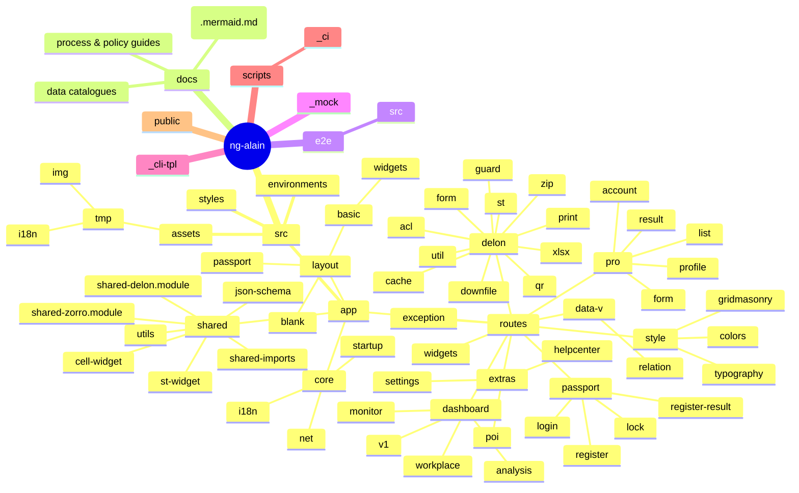

# ng-alain 專案結構圖

> 📋 **目的**：展示專案目錄結構，協助快速理解前端、後端介面與文件分層

本結構圖依據 `ng-alain` 儲存庫目前實際目錄繪製，協助快速理解前端、後端介面與文件分層。

**最後更新**：2025-11-15  
**維護者**：開發團隊

> **重要**：
> - 系統採用 Git-like 分支模型，包含 51 張資料表，分為 11 個模組
> - 技術棧：Angular 20.3.x + NG-ZORRO 20.3.x + NG-ALAIN 20.0.x + Supabase
> - 詳細架構請參考 `27-完整架構流程圖.mermaid.md`, `28-架構審查報告.md`, `30-0-完整SQL表結構定義.md`

---

## 主要層級說明

- **src/**：Angular 前端應用程式原始碼。
  - `app/`：核心程式、路由頁面與共享組件。以 `core/`（跨域服務）、`layout/`（骨架元件）、`routes/`（功能路由）、`shared/`（共用組件與工具）分層。
    - `core/`：核心服務模組，包含 `i18n/`（國際化）、`net/`（HTTP 攔截器與網路輔助）、`startup/`（啟動服務）。
    - `layout/`：佈局元件，包含 `basic/`（基礎佈局與工具列元件）、`blank/`（空白佈局）、`passport/`（認證頁面佈局）。
    - `routes/`：功能路由模組，包含 `dashboard/`（儀表板）、`data-v/`（數據視覺化）、`delon/`（@delon 組件示範）、`exception/`（異常頁面）、`extras/`（額外功能）、`passport/`（認證流程）、`pro/`（專業頁面模板）、`style/`（樣式示範）、`widgets/`（小工具）。
    - `shared/`：共享模組，包含 `cell-widget/`、`json-schema/`、`st-widget/`、`utils/`，以及 `shared-imports.ts`、`shared-delon.module.ts`、`shared-zorro.module.ts` 等模組定義。
  - `assets/`：靜態資源與範例資料，包含 `tmp/`（測試資料，內含 `i18n/` 多語字串與 `img/` 圖片）、主題樣式檔與 Logo 等。
  - `environments/`：環境組態檔（開發與生產環境）。
  - `styles/`、`styles.less`：全域樣式與主題設定。
- **docs/**：系統設計與作業文件。
  - `00-` ~ `09-`：開發規範與指引
  - `10-` ~ `26-`：架構、流程與安全視圖（多以 Mermaid 描述）
  - `30-` ~ `39-`：數據與開發文檔（包含 51 張資料表清單）
  - `40-` ~ `45-`：優化、安全與開發指南
  - `27-完整架構流程圖.mermaid.md`, `28-架構審查報告.md`：最新架構流程圖與審查報告（Git-like 分支模型）
  - `30-0-完整SQL表結構定義.md`：完整 51 張資料表 SQL 結構定義
- **e2e/**：端對端測試（Protractor 配置與測試案例）。
- **_mock/**：本地開發用 API / 資料模擬腳本。
- **_cli-tpl/**：Angular CLI 自訂模板（用於生成組件等）。
- **scripts/**：CI/CD 及維運輔助腳本（包含 `_ci/` 子目錄）。
- **public/**：公開靜態資源（如 `favicon.ico`）。

> 若專案結構調整，請同步更新此文件以維持設計與實作對齊。
