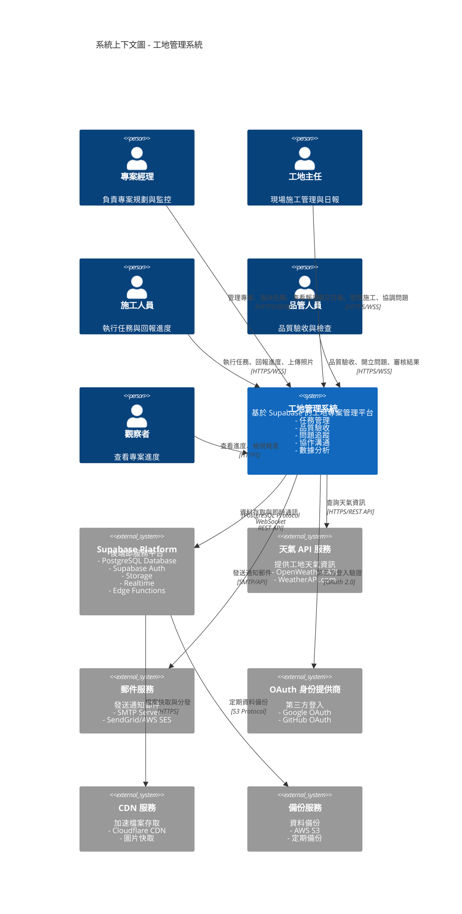

## 系統邊界說明

### 核心系統
- **工地管理系統 (CMS)**: 本專案的核心應用，提供完整的工地管理功能

### 外部依賴系統

#### Supabase Platform
- **用途**: 主要後端服務提供商
- **服務**:
  - PostgreSQL: 關聯式資料庫
  - Supabase Auth: 身份認證與 JWT 管理
  - Storage: 檔案物件儲存
  - Realtime: WebSocket 即時通訊
  - Edge Functions: 無伺服器運算
- **通訊協議**: PostgreSQL Protocol, WebSocket, REST API

#### 天氣 API 服務
- **用途**: 為每日報表提供天氣資訊
- **實現**: Edge Function 調用第三方 API
- **快取機制**: weather_cache 表減少 API 調用
- **通訊協議**: HTTPS REST API

#### 郵件服務
- **用途**: 發送系統通知郵件
- **觸發時機**: 任務指派、問題通知、驗收結果
- **實現**: Edge Function 調用 SMTP 或郵件 API
- **通訊協議**: SMTP / REST API

#### OAuth 身份提供商
- **用途**: 第三方登入支援
- **支援平台**: Google, GitHub
- **整合方式**: Supabase Auth 配置
- **通訊協議**: OAuth 2.0

#### CDN 服務
- **用途**: 加速 Storage 檔案存取
- **服務商**: Cloudflare CDN
- **快取內容**: 施工照片、驗收照片、文件
- **通訊協議**: HTTPS

#### 備份服務
- **用途**: 定期資料備份
- **備份內容**: PostgreSQL 資料、Storage 檔案
- **儲存位置**: AWS S3 或相容服務
- **備份頻率**: 每日增量、每週完整

### 用戶角色

#### 專案經理
- 建立與管理專案藍圖
- 指派任務與資源分配
- 查看統計報表與進度
- 管理團隊成員權限

#### 工地主任
- 提交每日施工報表
- 管理現場施工進度
- 協調處理現場問題
- 上傳施工照片記錄

#### 施工人員
- 執行指派的任務
- 回報工作進度
- 上傳施工照片
- 參與問題討論

#### 品管人員
- 執行品質驗收檢查
- 開立與追蹤問題
- 審核驗收結果
- 記錄缺陷照片

#### 觀察者
- 查看專案進度
- 檢視報表與統計
- 唯讀權限
- 無法修改資料

## 系統定位

根據專案願景，本系統是一個**企業級工程任務管理系統**，涵蓋：
- **13 維度任務管理**：任務本體、時間、關聯、空間、資源、進度、成本、品質、風險、安全、文件、溝通、變更
- **Blueprint ↔ Task 分層架構**：任務層專注資料採集，藍圖層專責聚合展示與 KPI
- **Git-like 分支模型**：主分支（擁有者控制任務結構）、組織分支（協作組織填寫承攬欄位）、PR 機制
- **51 張資料表架構**：分為 11 個模組（帳戶與身份、組織協作、權限、藍圖/專案、任務執行、品質驗收、問題追蹤、協作溝通、資料分析、機器人、系統管理）
- **現代化技術棧**：Angular 20.3.x + NG-ZORRO 20.3.x + NG-ALAIN 20.0.x + Supabase，採用 Standalone Components、Signals、Typed Forms

## 系統邊界

- **核心系統**：工地管理系統本身，包含前端 Angular 應用、Supabase 後端服務
- **外部整合**：透過標準 API（HTTPS、OAuth 2.0、SMTP、Webhook）與外部系統整合
- **資料邊界**：所有業務資料儲存於 Supabase，外部系統僅提供輔助功能（認證、通知、天氣資料）

## 外部系統整合詳情

### Slack 整合（可選）
- **用途**：團隊溝通與通知
- **整合方式**：Webhook 整合，發送任務通知與活動提醒
- **觸發時機**：任務指派、問題開立、驗收結果
- **通訊協議**：HTTPS Webhook
```
