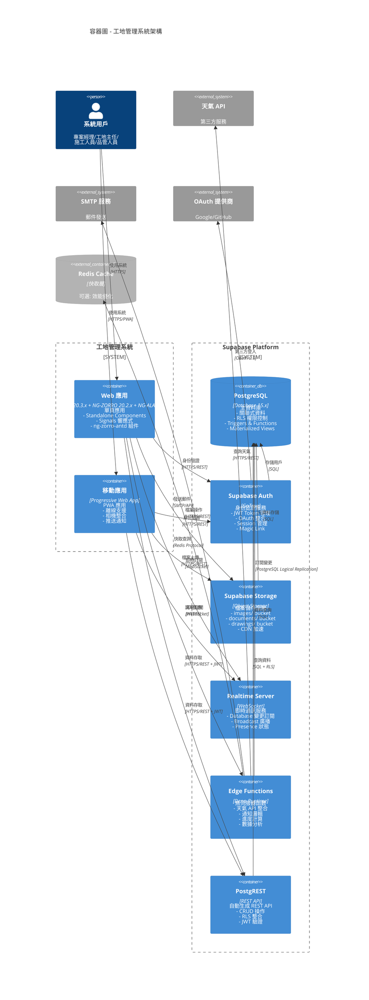

# 容器圖（Container Diagram）

> 📋 **目的**：展示系統的容器級架構，包含前端應用、後端服務、資料庫等主要容器組件

**最後更新**：2025-11-15  
**維護者**：開發團隊

---



## 容器職責說明

### 前端應用層

#### Web 應用 (Angular 20.3.x)
- **技術棧**: 
  - Angular 20.3.x (Standalone Components)
  - NG-ZORRO 20.2.x (UI 組件庫)
  - NG-ALAIN 20.1.x (企業級 UI 解決方案)
  - TypeScript 5
  - Angular Signals
- **功能**:
  - Standalone Components 架構
  - Signals 響應式狀態管理
  - 即時資料同步與通知
  - 豐富的互動式圖表與儀表板
- **部署**: Supabase Hosting / Cloudflare Pages

#### 移動應用 (PWA)
- **技術**: Progressive Web App
- **特性**:
  - 離線優先架構
  - 本地相機存取
  - 推送通知支援
  - 安裝到主畫面
- **優勢**: 無需 App Store 發布

### Supabase 平台層

#### PostgreSQL Database
- **版本**: PostgreSQL 15.x
- **功能**:
  - ACID 事務保證
  - Row Level Security (RLS)
  - Database Triggers 自動化
  - Materialized Views 效能優化
  - Full-text Search 全文檢索
- **擴展**: pgvector (向量搜尋), postgis (地理資訊)

#### Supabase Auth
- **引擎**: GoTrue
- **功能**:
  - JWT Token 簽發與驗證
  - Email/Password 認證
  - OAuth 社交登入
  - Magic Link 無密碼登入
  - Multi-factor Authentication (MFA)
- **整合**: 與 RLS 無縫整合

#### Supabase Storage
- **架構**: S3-compatible Object Storage
- **Buckets**:
  - `images/`: 施工照片、驗收照片、問題照片
  - `documents/`: 合約、報表文件
  - `drawings/`: CAD 圖檔、施工圖
- **功能**:
  - 自動 CDN 加速
  - 圖片轉換與優化
  - 權限控制整合 RLS
  - 檔案版本管理

#### Realtime Server
- **協議**: WebSocket
- **功能**:
  - Database Changes: 訂閱資料表變更
  - Broadcast: 廣播自訂訊息
  - Presence: 線上狀態追蹤
- **應用場景**:
  - 任務即時更新
  - 問題追蹤同步
  - 討論區即時訊息
  - 通知推送

#### Edge Functions
- **運行時**: Deno Runtime
- **部署**: 全球邊緣節點
- **函數類型**:
  - `weather-api`: 天氣資訊整合與快取
  - `notification-handler`: 通知邏輯處理
  - `progress-calculator`: 進度統計計算
  - `analytics-processor`: 數據分析處理
  - `report-generator`: 報表生成
- **優勢**: 低延遲、自動擴展

#### PostgREST
- **功能**: 自動將 PostgreSQL 表轉換為 REST API
- **特性**:
  - 自動 CRUD 端點
  - 複雜查詢支援 (filter, order, join)
  - RLS 權限自動應用
  - JWT Token 驗證
- **效能**: 高效能查詢優化

### 外部服務

#### Redis Cache (可選)
- **用途**: 
  - 天氣資料快取
  - Session 快取
  - 熱點資料快取
- **優化**: 減少資料庫查詢壓力

#### 天氣 API
- **服務商**: OpenWeather / WeatherAPI.com
- **調用**: 透過 Edge Function
- **快取**: weather_cache 表

#### SMTP 服務
- **用途**: 系統通知郵件
- **服務商**: SendGrid / AWS SES / Mailgun
- **觸發**: Edge Function 呼叫

#### OAuth 提供商
- **支援**: Google OAuth, GitHub OAuth
- **整合**: Supabase Auth 配置
- **優勢**: 簡化用戶註冊流程

## 技術堆疊對照

### 前端技術棧
| 層級 | 技術 | 說明 |
|------|------|------|
| **UI Layer** | Angular 20.3.x + NG-ZORRO 20.2.x + NG-ALAIN 20.1.x | Standalone Components、Signals |
| **Shared Layer** | Angular Shared Modules | 可重用元件、模型、工具 |
| **Core Layer** | Angular Services | Domain Service、Repository、Facade |
| **Infrastructure** | Supabase Client | 封裝 Supabase API |

### 後端技術棧
| 層級 | 技術 | 說明 |
|------|------|------|
| **Database** | PostgreSQL | 51 張資料表（11 個模組）、RLS 權限 |
| **Storage** | Supabase Storage | Bucket 組織結構 |
| **Compute** | Edge Functions (Deno) | 無伺服器運算 |
| **Realtime** | Supabase Realtime | WebSocket 推送 |

## 資料流

```
用戶操作 → Angular 前端 → Edge Functions / PostgREST → PostgreSQL
                ↓
          Supabase Auth (驗證)
                ↓
          Supabase Storage (檔案)
                ↓
          Realtime (即時推送)
```

## 開發與測試環境

### Playwright 測試
- **E2E 測試框架**：Playwright
- **覆蓋範圍**：關鍵用戶流程、瀏覽器兼容性
- **執行方式**：`yarn e2e`

### CI/CD 管道
- **GitHub Actions**：自動化建置與部署
- **流程**：Lint → Type Check → Test → Build → Deploy
- **品質檢查**：`yarn qa:verify` 零警告要求
```