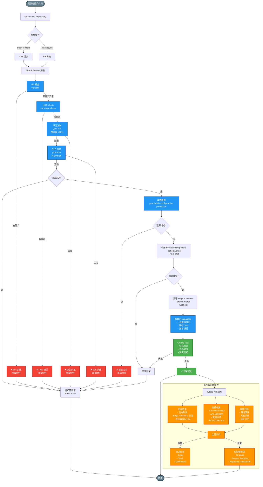

## CI/CD 流程說明

### 開發階段
- **代碼提交**：開發者提交代碼到 Git Repository
- **觸發條件**：
  - Push 到 main 分支 → 觸發完整 CI/CD 流程
  - Pull Request → 觸發 CI 檢查（不自動部署）

### CI/CD 流程階段

#### 1. Lint 檢查
- **指令**：`yarn lint`
- **檢查內容**：
  - ESLint：JavaScript/TypeScript 程式碼品質
  - Prettier：程式碼格式
  - Stylelint：CSS 樣式檢查
- **標準**：零警告要求
- **失敗處理**：阻擋合併，通知開發者

#### 2. Type Check
- **指令**：`yarn type-check`
- **檢查內容**：TypeScript 型別檢查
- **標準**：零錯誤
- **失敗處理**：阻擋合併，通知開發者

#### 3. 單元測試
- **指令**：`yarn test`
- **檢查內容**：單元測試執行
- **標準**：覆蓋率 ≥80%
- **失敗處理**：阻擋合併，通知開發者

#### 4. E2E 測試
- **指令**：`yarn e2e`
- **測試框架**：Playwright
- **測試範圍**：關鍵用戶流程、瀏覽器兼容性
- **失敗處理**：阻擋合併，通知開發者

#### 5. 建置應用
- **指令**：`yarn build --configuration production`
- **建置內容**：Angular 生產版本建置
- **失敗處理**：阻擋合併，通知開發者

#### 6. 部署
- **部署目標**：Supabase Hosting 或 CDN
- **部署步驟**：
  1. 上傳前端檔案
  2. 執行資料庫遷移（如需要）
  3. 驗證部署（Smoke Test）
- **驗證內容**：
  - 任務列表載入
  - 任務詳情顯示
  - 狀態變更流程

### 監控與可觀測性階段

#### 日誌收集
- **前端日誌**：錯誤追蹤、使用者行為分析
- **後端日誌**：Edge Functions 執行日誌、資料庫查詢日誌
- **儲存位置**：Supabase Logs、第三方日誌服務（可選）

#### 指標收集
- **效能指標**：LCP、FID/INP、CLS（Core Web Vitals）
- **業務指標**：任務完成率、用戶活躍度、錯誤率
- **系統指標**：API 回應時間、資料庫查詢時間、Storage 使用量

#### 事件追蹤
- **領域事件**：任務建立、狀態變更、活動記錄
- **系統事件**：部署、遷移、備份
- **審計日誌**：所有關鍵操作記錄於 `activity_logs`

#### 告警系統
- **告警機制**：Email、Slack Webhook、Dashboard 通知
- **錯誤處理**：使用 `ErrorStateService` 統一管理錯誤狀態
- **告警閾值**：
  - 效能：LCP >2.5s、FID/INP >100ms、CLS >0.1
  - 錯誤：錯誤率 >1%
  - 資源：配額使用率 >75%

## 品質檢查標準

| 檢查項目 | 指令 | 標準 | 失敗處理 |
|----------|------|------|----------|
| **Lint** | `yarn lint` | 零警告 | 阻擋合併 |
| **Type Check** | `yarn type-check` | 零錯誤 | 阻擋合併 |
| **單元測試** | `yarn test` | 覆蓋率 ≥80% | 阻擋合併 |
| **E2E 測試** | `yarn e2e` | 關鍵流程通過 | 阻擋合併 |
| **建置** | `yarn build` | 成功 | 阻擋合併 |

## QA Pipeline 要求

- **零警告政策**：`yarn lint:ts` 需降至零警告
- **自動化報告**：整合 Playwright/E2E 步驟，建立自動報告
- **Supabase RLS 回歸測試**：驗證 RLS 政策未被破壞

## 監控儀表板

### 核心指標
- **效能**：頁面載入時間、API 回應時間
- **錯誤**：錯誤率、錯誤類型分布
- **使用量**：活躍用戶數、API 呼叫次數
- **資源**：資料庫配額使用率、Storage 配額使用率

### 監控工具
- **Grafana**：統一監控儀表板
- **Angular Analytics**：前端效能監控
- **Supabase Dashboard**：資料庫與 API 監控

## 錯誤分類與處理

### 錯誤分類
- **HTTP 錯誤**：4xx/5xx 狀態碼
- **網路錯誤**：連線超時、網路中斷
- **驗證錯誤**：JWT Token 無效、權限不足
- **業務錯誤**：業務邏輯驗證失敗
- **權限錯誤**：RLS Policy 拒絕存取

### 錯誤處理機制
- **統一管理**：使用 `ErrorStateService` 統一管理錯誤狀態
- **錯誤記錄**：所有錯誤記錄到日誌系統
- **自動重試**：網路錯誤自動重試（最多 3 次）
- **用戶通知**：關鍵錯誤透過 Toast 通知用戶

## 維護與優化

### 定期檢查
- **每週**：檢查錯誤率、效能指標
- **每月**：審查日誌、優化慢查詢
- **每季**：容量規劃、效能優化

### 持續改進
- **效能優化**：資料庫索引優化、快取策略調整
- **錯誤修復**：追蹤錯誤趨勢，優先修復高頻錯誤
- **文檔更新**：同步更新 `MONITORING.md`、`QUALITY.md`

## 部署回滾機制

### 自動回滾條件
- Smoke Test 失敗
- 錯誤率超過閾值（>5%）
- 效能指標嚴重下降

### 回滾流程
1. 停止新版本流量
2. 切換回上一穩定版本
3. 通知開發團隊
4. 分析失敗原因
5. 修復問題後重新部署

