```mermaid
timeline
    title 工地管理系統 - 領域事件時間軸

    section 專案初始化階段
        專案建立事件 : blueprint.created
                      : - 建立藍圖記錄
                      : - 初始化專案設定
                      : - 建立預設角色
        
        團隊組建事件 : team.assembled
                     : - 指派專案經理
                     : - 添加團隊成員
                     : - 分配角色權限
        
        專案規劃事件 : project.planned
                     : - 設定時程範圍
                     : - 建立任務架構
                     : - 設定里程碑
        
    section 分支治理階段
        分支 Fork 事件 : branch.forked
                      : - 建立 branch_forks 記錄
                      : - 綁定承攬組織
                      : - 初始化 branch_roles
        
        協作邀請事件 : branch.invitation_sent
                     : - 建立 organization_collaborations
                     : - 設定邀請狀態
                     : - 推送通知
        
        PR 提交事件 : branch.pull_request_submitted
                   : - 建立 pull_requests
                   : - 附帶欄位變更 payload
                   : - 觸發審查流程
        
        PR 審查事件 : branch.pull_request_reviewed
                   : - 建立 pull_request_reviews
                   : - 記錄審查決策
                   : - 追加審查意見
        
        PR 合併事件 : branch.merged
                  : - Edge Function branch-merge
                  : - 更新主分支承攬欄位
                  : - 觸發進度/日誌同步

    section 任務執行階段
        任務建立事件 : task.created
                     : - 建立任務記錄
                     : - 設定優先級
                     : - 記錄預估工時
        
        任務指派事件 : task.assigned
                     : - 指派負責人
                     : - 發送通知
                     : - Realtime 推送
        
        任務開始事件 : task.started
                     : - 狀態變更為 in_progress
                     : - 記錄開始時間
                     : - 更新儀表板
        
        暫存提交事件 : staging.submission_created
                     : - 建立 staging_submissions
                     : - 設定 48h 到期
                     : - 可撤回
        
        暫存確認事件 : staging.submission_finalized
                    : - 轉入正式表
                    : - 觸發日誌 / 通知
                    : - 移除暫存記錄
        
        日報提交事件 : daily_report.submitted
                     : - 提交施工日誌
                     : - 上傳施工照片
                     : - 記錄天氣資訊
                     : - 記錄工時與人力
        
        任務完成事件 : task.completed
                     : - 狀態變更為 completed
                     : - 記錄完成時間
                     : - 計算實際工時
                     : - 觸發驗收流程

    section 品質驗收階段
        驗收申請事件 : qc.requested
                     : - 建立驗收記錄
                     : - 指派驗收人員
                     : - 發送驗收通知
        
        驗收開始事件 : qc.started
                     : - 狀態變更為 inspecting
                     : - 記錄檢查項目
                     : - 上傳驗收照片
        
        驗收通過事件 : qc.passed
                     : - 狀態變更為 passed
                     : - 記錄評分結果
                     : - 更新任務進度
                     : - 觸發進度計算
        
        驗收不通過事件 : qc.failed
                       : - 狀態變更為 failed
                       : - 自動開立問題
                       : - 任務狀態回退
                       : - 發送通知給負責人

    section 問題處理階段
        問題開立事件 : issue.created
                     : - 建立問題記錄
                     : - 設定嚴重程度
                     : - 上傳問題照片
                     : - 記錄問題來源
        
        問題指派事件 : issue.assigned
                     : - 指派處理人員
                     : - 指派審核人員
                     : - 發送 Edge Function 通知
                     : - Realtime 推送
        
        問題處理中事件 : issue.in_progress
                       : - 狀態變更為 in_progress
                       : - 開始處理流程
                       : - 討論區溝通
                       : - 上傳處理照片
        
        問題解決事件 : issue.resolved
                     : - 狀態變更為 resolved
                     : - 記錄解決方案
                     : - 等待審核確認
        
        問題關閉事件 : issue.closed
                     : - 狀態變更為 closed
                     : - 記錄關閉時間
                     : - Edge Function 結案通知
                     : - 更新統計數據
        
        問題重開事件 : issue.reopened
                     : - 狀態變更為 reopened
                     : - 重新指派處理
                     : - 發送重開通知

    section 協作通訊階段
        留言發布事件 : comment.posted
                     : - 建立留言記錄
                     : - 支援巢狀回覆
                     : - @提及通知
                     : - Realtime 廣播
        
        留言編輯事件 : comment.edited
                     : - 更新留言內容
                     : - 記錄編輯歷史
                     : - Realtime 更新
        
        通知推送事件 : notification.sent
                     : - 建立通知記錄
                     : - Realtime 推送
                     : - Email 通知 (可選)
                     : - 瀏覽器推送 (可選)
        
        通知已讀事件 : notification.read
                     : - 標記為已讀
                     : - 記錄閱讀時間
                     : - 更新未讀計數

    section 文件管理階段
        文件上傳事件 : document.uploaded
                     : - 上傳到 Storage
                     : - 記錄元資料
                     : - 圖片優化處理
                     : - 生成縮圖
        
        文件刪除事件 : document.deleted
                     : - 軟刪除標記
                     : - 歸檔備份
                     : - 權限撤銷
        
        圖紙版本更新事件 : drawing.versioned
                         : - 上傳新版本
                         : - 保留舊版本
                         : - 版本號遞增
                         : - 通知相關人員

    section 數據分析階段
        進度更新事件 : progress.updated
                     : - Edge Function 計算
                     : - 更新完成率
                     : - 統計任務數量
                     : - 更新儀表板
        
        報表生成事件 : report.generated
                     : - 收集統計數據
                     : - 生成圖表
                     : - 匯出 PDF/Excel
        
        物化視圖更新事件 : materialized_view.refreshed
                         : - 定期更新
                         : - 重新計算聚合
                         : - 優化查詢效能
        
        分支 KPI 更新事件 : branch.analytics_refreshed
                        : - 聚合各分支提交量
                        : - 計算 PR SLA
                        : - 更新承攬績效儀表板

    section 系統管理階段
        角色變更事件 : role.changed
                     : - 更新用戶角色
                     : - 權限重新計算
                     : - RLS Policy 生效
        
        備份完成事件 : backup.completed
                     : - 資料備份完成
                     : - 上傳到 S3
                     : - 驗證備份完整性
        
        系統設定更新事件 : settings.updated
                         : - 更新全域設定
                         : - 更新專案設定
                         : - 快取失效

    section 專案收尾階段
        專案暫停事件 : project.paused
                     : - 狀態變更為 paused
                     : - 暫停任務執行
                     : - 通知團隊成員
        
        專案恢復事件 : project.resumed
                     : - 狀態變更為 active
                     : - 恢復任務執行
                     : - 通知團隊成員
        
        專案竣工事件 : project.completed
                     : - 狀態變更為 completed
                     : - 所有任務完成
                     : - 生成最終報表
                     : - 專案歸檔
        
        專案歸檔事件 : project.archived
                     : - 資料歸檔
                     : - 移至冷儲存
                     : - 保留元資料索引
```

## 領域事件詳細說明

### 事件驅動架構 (Event-Driven Architecture)

#### 事件命名規範
- **格式**: `{domain}.{action}`
- **範例**: `task.created`, `issue.resolved`, `qc.passed`
- **原則**: 
  - 使用過去式 (created, updated, deleted)
  - 領域明確 (task, issue, qc, blueprint)
  - 動作具體 (assigned, started, completed)

### 事件流轉機制

#### 1. 事件發布
```typescript
// Database Trigger 自動發布事件
CREATE OR REPLACE FUNCTION publish_task_created_event()
RETURNS TRIGGER AS $$
BEGIN
  PERFORM pg_notify(
    'task_events',
    json_build_object(
      'event', 'task.created',
      'task_id', NEW.id,
      'blueprint_id', NEW.blueprint_id,
      'timestamp', NOW()
    )::text
  );
  RETURN NEW;
END;
$$ LANGUAGE plpgsql;

CREATE TRIGGER task_created_trigger
AFTER INSERT ON tasks
FOR EACH ROW
EXECUTE FUNCTION publish_task_created_event();
```

#### 2. 事件訂閱
```typescript
// Realtime 訂閱事件
const subscription = supabase
  .channel('task_events')
  .on('postgres_changes', 
    { event: 'INSERT', schema: 'public', table: 'tasks' },
    (payload) => {
      console.log('task.created event:', payload);
      // 更新前端狀態
      queryClient.invalidateQueries(['tasks']);
      // 顯示通知
      toast.success('新任務已建立');
    }
  )
  .subscribe();
```

#### 3. 事件處理
```typescript
// Edge Function 處理事件
export async function handleTaskAssignedEvent(event: TaskAssignedEvent) {
  // 1. 發送通知
  await sendNotification({
    recipient_id: event.assignee_id,
    type: 'task',
    title: '您有新的任務指派',
    content: `任務「${event.task_title}」已指派給您`
  });
  
  // 2. 發送 Email (可選)
  if (event.send_email) {
    await sendEmail({
      to: event.assignee_email,
      subject: '新任務指派通知',
      template: 'task-assigned',
      data: event
    });
  }
  
  // 3. 記錄活動日誌
  await logActivity({
    entity_type: 'task',
    entity_id: event.task_id,
    action: 'assigned',
    actor_id: event.assigner_id
  });
}
```

### 事件聚合與追蹤

#### 1. 事件溯源 (Event Sourcing)
所有事件記錄在 `activity_logs` 表，可以重建任意時間點的狀態:
```sql
-- 查詢任務的完整歷史
SELECT 
  action,
  changes,
  created_at
FROM activity_logs
WHERE entity_type = 'task' AND entity_id = '...'
ORDER BY created_at ASC;
```

#### 2. 事件關聯分析
```sql
-- 分析任務從建立到完成的時間
WITH task_events AS (
  SELECT 
    entity_id,
    action,
    created_at,
    LAG(created_at) OVER (PARTITION BY entity_id ORDER BY created_at) as prev_time
  FROM activity_logs
  WHERE entity_type = 'task'
)
SELECT 
  action,
  AVG(EXTRACT(EPOCH FROM (created_at - prev_time))) / 3600 as avg_hours
FROM task_events
WHERE prev_time IS NOT NULL
GROUP BY action;
```

### 事件處理模式

#### 1. 同步處理 (Synchronous)
- **場景**: 必須即時回應的操作
- **範例**: 權限驗證、資料驗證
- **實現**: Database Trigger, RLS Policy

#### 2. 非同步處理 (Asynchronous)
- **場景**: 不影響主流程的操作
- **範例**: 通知發送、郵件發送、報表生成
- **實現**: Edge Function, Message Queue

#### 3. 背景處理 (Background)
- **場景**: 定期執行的任務
- **範例**: 資料聚合、備份、歸檔
- **實現**: Cron Job, Scheduled Functions

### 事件監控與告警

#### 1. 事件指標
- **事件發布速率**: events/second
- **事件處理延遲**: 從發布到處理的時間
- **事件失敗率**: 處理失敗的事件比例

#### 2. 告警規則
- **高延遲告警**: 處理延遲 > 10 秒
- **高失敗率告警**: 失敗率 > 5%
- **事件堆積告警**: 未處理事件 > 1000

### 事件回溯與除錯

#### 1. 事件日誌查詢
```typescript
// 查詢特定時間範圍的事件
const events = await supabase
  .from('activity_logs')
  .select('*')
  .gte('created_at', '2025-01-01')
  .lte('created_at', '2025-01-31')
  .eq('entity_type', 'task')
  .order('created_at', { ascending: false });
```

#### 2. 事件重放 (Replay)
在開發環境中重放生產事件以復現問題:
```typescript
async function replayEvents(eventIds: string[]) {
  for (const id of eventIds) {
    const event = await fetchEvent(id);
    await processEvent(event);
  }
}
```

### 業務流程映射

每個領域事件都對應特定的業務流程節點，事件時間軸清晰呈現了整個工地專案的生命週期:

1. **規劃階段**: 專案建立 → 團隊組建 → 任務規劃
2. **執行階段**: 任務指派 → 施工開始 → 日報提交 → 任務完成
3. **驗收階段**: 驗收申請 → 驗收檢查 → 驗收結果
4. **異常處理**: 問題開立 → 問題處理 → 問題解決
5. **收尾階段**: 專案竣工 → 資料歸檔

這種事件驅動的設計使系統具備:
- **可追溯性**: 所有操作都有記錄
- **可擴展性**: 新增事件處理器無需修改核心邏輯
- **解耦合**: 各模組透過事件通訊,降低耦合度
- **可觀測性**: 透過事件日誌了解系統運行狀態

## Workflow Pattern 事件流程

### 任務建立流程
```
用戶建立任務
  ↓
TaskService.create()
  ↓
TaskRepository.insert() → 寫入 tasks
  ↓
ActivityService.record() → 寫入 activity_logs
  ↓
AggregationRefreshService.emit(blueprintId, ['tasks'])
  ↓
NotificationService.send() → 發送通知（Email/Slack）
  ↓
Realtime 推送 → 前端自動更新
```

### 任務狀態變更流程
```
用戶更新任務狀態
  ↓
TaskService.update()
  ↓
TaskRepository.update() → 更新 tasks
  ↓
ActivityService.record() → 記錄狀態變更活動
  ↓
AggregationRefreshService.emit(blueprintId, ['tasks', 'progress'])
  ↓
相關 Facade 自動 refresh() → UI 即時更新
```

## Aggregation Refresh Pattern

### 事件驅動刷新機制
1. **觸發條件**：Task / Document / Quality Service 完成 mutate
2. **事件發送**：`BlueprintAggregationRefreshService.emit(blueprintId, dimensions)`
3. **事件接收**：Blueprint Facade 於建構時 `listen()`
4. **自動刷新**：接收事件後自動 `load()` 聚合資料
5. **UI 更新**：維持 `signal` 或 `computed`，禁止手動 `detectChanges`

### 支援的維度
- `tasks`：任務相關聚合
- `documents`：文件相關聚合
- `progress`：進度相關聚合
- `quality`：品質相關聚合
- `activities`：活動相關聚合

## 領域事件類型

### 任務事件
- `task.created`：任務建立
- `task.updated`：任務更新
- `task.status_changed`：任務狀態變更
- `task.assigned`：任務指派
- `task.completed`：任務完成

### 藍圖事件
- `blueprint.created`：藍圖建立
- `blueprint.updated`：藍圖更新
- `blueprint.member_added`：成員加入
- `blueprint.member_removed`：成員移除

### 文件事件
- `document.uploaded`：文件上傳
- `document.updated`：文件更新
- `document.deleted`：文件刪除
- `document.version_created`：版本建立

### 活動事件
- `activity.recorded`：活動記錄
- `activity.notified`：活動通知

## 事件時間軸範例

### 完整任務生命週期
```
T0: 專案經理建立任務
T1: 系統記錄活動（task.created）
T2: 系統發送通知（Email/Slack）
T3: 前端 Realtime 接收更新
T4: 施工人員接受任務
T5: 系統記錄活動（task.assigned）
T6: 施工人員提交每日報表
T7: 系統記錄活動（daily_report.submitted）
T8: 品管人員執行品質檢查
T9: 系統記錄活動（quality_check.completed）
T10: 任務狀態變更為「完成」
T11: 系統記錄活動（task.completed）
T12: 系統觸發聚合刷新（tasks, progress）
T13: 前端自動更新 KPI 與統計
```

## 事件儲存與查詢

### 活動記錄表（activity_logs）
- **欄位**：`id`, `account_id`, `blueprint_id`, `entity_type`, `entity_id`, `action`, `changes`, `created_at`
- **用途**：記錄所有領域事件，支援審計與歷史查詢
- **查詢**：透過 `ActivityFacade` 取得活動 feed

### Realtime 訂閱
- **訂閱目標**：`activity_logs` 表
- **過濾條件**：`blueprint_id = ?`
- **推送內容**：新增的活動記錄
- **前端處理**：自動更新活動 feed，觸發聚合刷新