```mermaid
graph TD
    subgraph "Supabase Storage"
        Storage[Storage Service]
    end

    subgraph "Bucket: images/ (公開讀取)"
        Images[images/]
        
        subgraph "專案照片結構"
            BP1["{blueprint_id}/"]
            
            subgraph "每日報表照片"
                DR1[daily_reports/]
                DR2["{report_id}_001.jpg"]
                DR3["{report_id}_002.jpg"]
                DR4["{report_id}_thumbnail_001.jpg"]
                DR5["EXIF: GPS, 時間戳記, 裝置資訊"]
            end
            
            subgraph "品質驗收照片"
                QC1[quality_checks/]
                QC2["{qc_id}_before_001.jpg"]
                QC3["{qc_id}_during_001.jpg"]
                QC4["{qc_id}_after_001.jpg"]
                QC5["{qc_id}_defect_001.jpg"]
                QC6["標註: 問題區域, 測量數據"]
            end
            
            subgraph "問題追蹤照片"
                IS1[issues/]
                IS2["{issue_id}_001.jpg"]
                IS3["{issue_id}_002.jpg"]
                IS4["{issue_id}_fixed_001.jpg"]
            end
            
            BP1 --> DR1 & QC1 & IS1
            DR1 --> DR2 & DR3 & DR4 & DR5
            QC1 --> QC2 & QC3 & QC4 & QC5 & QC6
            IS1 --> IS2 & IS3 & IS4
        end
        
        Images --> BP1
    end

    subgraph "Bucket: documents/ (私有)"
        Documents[documents/]
        
        subgraph "專案文件結構"
            BP2["{blueprint_id}/"]
            
            subgraph "合約文件"
                CT1[contracts/]
                CT2["主合約.pdf"]
                CT3["變更單_001.pdf"]
                CT4["報價單.xlsx"]
            end
            
            subgraph "工程報表"
                RP1[reports/]
                RP2["週報_2025W03.pdf"]
                RP3["月報_202501.pdf"]
                RP4["驗收報告.pdf"]
                RP5["品質統計.xlsx"]
            end
            
            subgraph "會議記錄"
            MT1[meetings/]
                MT2["會議記錄_20250115.docx"]
                MT3["會議簽到表.pdf"]
            end
            
            subgraph "施工計畫書"
                PL1[plans/]
                PL2["施工計畫書.pdf"]
                PL3["安全衛生計畫.pdf"]
                PL4["品質計畫書.pdf"]
            end
            
            BP2 --> CT1 & RP1 & MT1 & PL1
            CT1 --> CT2 & CT3 & CT4
            RP1 --> RP2 & RP3 & RP4 & RP5
            MT1 --> MT2 & MT3
            PL1 --> PL2 & PL3 & PL4
        end
        
        Documents --> BP2
    end

    subgraph "Bucket: drawings/ (私有)"
        Drawings[drawings/]
        
        subgraph "圖紙結構"
            BP3["{blueprint_id}/"]
            
            subgraph "建築圖"
                AR1[architectural/]
                AR2["A01_平面圖.dwg"]
                AR3["A02_立面圖.dwg"]
                AR4["A03_剖面圖.dwg"]
                AR5["版本: v1.2"]
            end
            
            subgraph "結構圖"
                ST1[structural/]
                ST2["S01_基礎配筋圖.dwg"]
                ST3["S02_樑柱配筋圖.dwg"]
                ST4["S03_版配筋圖.dwg"]
            end
            
            subgraph "機電圖"
                ME1[mep/]
                ME2["M01_給排水.dwg"]
                ME3["E01_電力系統.dwg"]
                ME4["AC01_空調系統.dwg"]
            end
            
            subgraph "現場修改圖"
                AS1[as_built/]
                AS2["竣工圖_標註變更.pdf"]
                AS3["現場實測圖.dwg"]
            end
            
            BP3 --> AR1 & ST1 & ME1 & AS1
            AR1 --> AR2 & AR3 & AR4 & AR5
            ST1 --> ST2 & ST3 & ST4
            ME1 --> ME2 & ME3 & ME4
            AS1 --> AS2 & AS3
        end
        
        Drawings --> BP3
    end

    subgraph "Bucket: avatars/ (公開)"
        Avatars[avatars/]
        AV1["{account_id}.jpg"]
        AV2["預設頭像.png"]
        Avatars --> AV1 & AV2
    end

    subgraph "Bucket: exports/ (私有,暫存)"
        Exports[exports/]
        EX1["{blueprint_id}/"]
        EX2["報表_202501.pdf"]
        EX3["數據匯出.xlsx"]
        EX4["TTL: 7 days"]
        Exports --> EX1
        EX1 --> EX2 & EX3 & EX4
    end

    Storage --> Images & Documents & Drawings & Avatars & Exports

    subgraph "CDN 層"
        CDN[Cloudflare CDN]
        CDN_Cache["快取策略:<br/>images/*: 7 days<br/>avatars/*: 30 days<br/>documents/*: 不快取"]
    end

    subgraph "圖片處理 Pipeline"
        Pipeline[圖片上傳 Pipeline]
        
        P1[原圖上傳]
        P2[壓縮優化<br/>- WebP 轉換<br/>- 質量 85%]
        P3[生成縮圖<br/>- 200x200<br/>- 800x800]
        P4[EXIF 處理<br/>- 提取 GPS<br/>- 提取時間<br/>- 移除隱私資訊]
        P5[儲存到 Storage]
        P6[記錄元資料到 DB]
        
        P1 --> P2 --> P3 --> P4 --> P5 --> P6
        
        Pipeline --> P1
    end

    subgraph "Storage RLS 權限"
        RLS[Row Level Security]
        
        R1["images/:<br/>- 讀取: 專案成員<br/>- 上傳: authenticated<br/>- 刪除: 上傳者或管理員"]
        
        R2["documents/:<br/>- 讀取: 專案成員+權限<br/>- 上傳: 專案管理角色<br/>- 刪除: 管理員"]
        
        R3["drawings/:<br/>- 讀取: 工程相關角色<br/>- 上傳: 專案經理<br/>- 刪除: 專案經理"]
        
        R4["avatars/:<br/>- 讀取: public<br/>- 上傳: 帳戶擁有者<br/>- 刪除: 帳戶擁有者"]
        
        RLS --> R1 & R2 & R3 & R4
    end

    Images -.權限控制.-> R1
    Documents -.權限控制.-> R2
    Drawings -.權限控制.-> R3
    Avatars -.權限控制.-> R4

    Images --> CDN
    Avatars --> CDN

    %% 樣式
    classDef bucketStyle fill:#2196F3,stroke:#1565C0,color:#fff,stroke-width:3px
    classDef folderStyle fill:#4CAF50,stroke:#2E7D32,color:#fff,stroke-width:2px
    classDef fileStyle fill:#FF9800,stroke:#E65100,color:#fff
    classDef metaStyle fill:#9C27B0,stroke:#6A1B9A,color:#fff
    classDef cdnStyle fill:#00BCD4,stroke:#00838F,color:#fff,stroke-width:2px
    classDef pipelineStyle fill:#FFC107,stroke:#F57F17,color:#000
    classDef rlsStyle fill:#F44336,stroke:#C62828,color:#fff,stroke-width:2px

    class Images,Documents,Drawings,Avatars,Exports bucketStyle
    class BP1,BP2,BP3,DR1,QC1,IS1,CT1,RP1,MT1,PL1,AR1,ST1,ME1,AS1,EX1 folderStyle
    class DR2,DR3,DR4,QC2,QC3,QC4,QC5,IS2,IS3,IS4 fileStyle
    class CT2,CT3,CT4,RP2,RP3,RP4,RP5,MT2,MT3,PL2,PL3,PL4 fileStyle
    class AR2,AR3,AR4,ST2,ST3,ST4,ME2,ME3,ME4,AS2,AS3 fileStyle
    class AV1,AV2,EX2,EX3 fileStyle
    class DR5,QC6,AR5,EX4 metaStyle
    class CDN,CDN_Cache cdnStyle
    class Pipeline,P1,P2,P3,P4,P5,P6 pipelineStyle
    class RLS,R1,R2,R3,R4 rlsStyle
```

## Storage Bucket 詳細說明

### 1. Bucket 結構設計原則

#### 1.1 隔離策略
- **公開 Bucket**: `images/`, `avatars/` - 透過 CDN 公開存取
- **私有 Bucket**: `documents/`, `drawings/`, `exports/` - 需權限驗證

#### 1.2 路徑命名規範
```
{bucket}/{blueprint_id}/{category}/{entity_id}_{序號}.{ext}
```

範例:
```
images/550e8400-e29b-41d4-a716-446655440000/daily_reports/abc123_001.jpg
documents/550e8400-e29b-41d4-a716-446655440000/contracts/主合約.pdf
drawings/550e8400-e29b-41d4-a716-446655440000/architectural/A01_平面圖.dwg
```

### 2. images/ Bucket (公開讀取)

#### 2.1 每日報表照片
- **路徑**: `images/{blueprint_id}/daily_reports/`
- **格式**: JPEG, PNG, WebP
- **限制**: 單檔 10MB
- **處理**:
  - 自動壓縮 (質量 85%)
  - 生成縮圖 (200x200, 800x800)
  - 提取 EXIF (GPS, 時間戳記)
  - 移除隱私資訊 (裝置序號等)

#### 2.2 品質驗收照片
- **路徑**: `images/{blueprint_id}/quality_checks/`
- **命名規範**:
  - `{qc_id}_before_001.jpg`: 驗收前
  - `{qc_id}_during_001.jpg`: 驗收中
  - `{qc_id}_after_001.jpg`: 驗收後
  - `{qc_id}_defect_001.jpg`: 缺陷記錄
- **特殊功能**:
  - 照片標註 (問題區域圈選)
  - 測量數據覆蓋 (尺寸標註)
  - 前後對比視圖

#### 2.3 問題追蹤照片
- **路徑**: `images/{blueprint_id}/issues/`
- **用途**:
  - 問題現況記錄
  - 處理過程記錄
  - 完成後驗證

### 3. documents/ Bucket (私有)

#### 3.1 合約文件
- **路徑**: `documents/{blueprint_id}/contracts/`
- **檔案類型**: PDF, DOCX, XLSX
- **權限**: 僅專案經理與管理員可存取
- **版本控制**: 啟用 (保留所有歷史版本)

#### 3.2 工程報表
- **路徑**: `documents/{blueprint_id}/reports/`
- **報表類型**:
  - 週報 (Weekly Report)
  - 月報 (Monthly Report)
  - 驗收報告 (Acceptance Report)
  - 品質統計 (Quality Statistics)
- **自動生成**: Edge Function 定期生成

#### 3.3 會議記錄
- **路徑**: `documents/{blueprint_id}/meetings/`
- **內容**:
  - 會議記錄 (DOCX)
  - 會議簽到表 (PDF)
  - 會議照片 (JPG)

#### 3.4 施工計畫書
- **路徑**: `documents/{blueprint_id}/plans/`
- **文件**:
  - 施工計畫書
  - 安全衛生計畫
  - 品質計畫書
  - 環境保護計畫

### 4. drawings/ Bucket (私有)

#### 4.1 建築圖
- **路徑**: `drawings/{blueprint_id}/architectural/`
- **圖檔格式**: DWG, DXF, PDF
- **編號規範**: A01, A02, A03...
- **版本管理**: 
  - 每次修改產生新版本
  - 版本號格式: v1.0, v1.1, v2.0
  - 保留所有版本歷史

#### 4.2 結構圖
- **路徑**: `drawings/{blueprint_id}/structural/`
- **編號規範**: S01, S02, S03...
- **內容**:
  - 基礎配筋圖
  - 樑柱配筋圖
  - 版配筋圖

#### 4.3 機電圖
- **路徑**: `drawings/{blueprint_id}/mep/`
- **編號規範**: 
  - M01... (機械/給排水)
  - E01... (電力)
  - AC01... (空調)

#### 4.4 竣工圖 (As-Built)
- **路徑**: `drawings/{blueprint_id}/as_built/`
- **用途**: 記錄現場實際施工與設計變更
- **特點**: 
  - 標註變更內容
  - 現場實測尺寸
  - 隱蔽工程記錄

### 5. avatars/ Bucket (公開)

#### 5.1 用戶頭像
- **路徑**: `avatars/{account_id}.jpg`
- **格式**: JPEG, PNG
- **限制**: 單檔 2MB
- **處理**:
  - 自動裁切為正方形
  - 生成多尺寸 (50x50, 200x200, 400x400)
  - 壓縮優化

### 6. exports/ Bucket (私有,暫存)

#### 6.1 報表匯出
- **路徑**: `exports/{blueprint_id}/`
- **格式**: PDF, XLSX, CSV
- **TTL**: 7 天自動刪除
- **用途**:
  - 數據匯出
  - 報表下載
  - 批次處理結果

### 7. Storage RLS 權限策略

#### 7.1 images/ Bucket
```sql
-- 讀取: 專案成員可見
CREATE POLICY "Project members can view images"
ON storage.objects FOR SELECT
USING (
  bucket_id = 'images'
  AND
  EXISTS (
    SELECT 1 FROM blueprints b
    WHERE storage.objects.name LIKE b.id::text || '/%'
    AND (
      b.owner_id = auth.uid()
      OR
      EXISTS (SELECT 1 FROM user_roles WHERE account_id = auth.uid() AND blueprint_id = b.id)
    )
  )
);

-- 上傳: 已認證用戶可上傳
CREATE POLICY "Authenticated users can upload images"
ON storage.objects FOR INSERT
WITH CHECK (
  bucket_id = 'images'
  AND auth.role() = 'authenticated'
);

-- 刪除: 上傳者或管理員可刪除
CREATE POLICY "Users can delete their own images"
ON storage.objects FOR DELETE
USING (
  bucket_id = 'images'
  AND (
    (storage.objects.owner = auth.uid())
    OR
    EXISTS (SELECT 1 FROM user_roles WHERE account_id = auth.uid() AND role_id = (SELECT id FROM roles WHERE name = 'system_admin'))
  )
);
```

#### 7.2 documents/ Bucket
```sql
-- 讀取: 需專案成員且有文件讀取權限
CREATE POLICY "Authorized users can view documents"
ON storage.objects FOR SELECT
USING (
  bucket_id = 'documents'
  AND
  EXISTS (
    SELECT 1 FROM blueprints b
    JOIN user_roles ur ON ur.blueprint_id = b.id
    JOIN roles r ON ur.role_id = r.id
    WHERE storage.objects.name LIKE b.id::text || '/%'
    AND ur.account_id = auth.uid()
    AND r.name IN ('system_admin', 'project_manager', 'site_supervisor')
  )
);

-- 上傳: 僅管理角色可上傳
CREATE POLICY "Managers can upload documents"
ON storage.objects FOR INSERT
WITH CHECK (
  bucket_id = 'documents'
  AND
  EXISTS (
    SELECT 1 FROM user_roles ur
    JOIN roles r ON ur.role_id = r.id
    WHERE ur.account_id = auth.uid()
    AND r.name IN ('system_admin', 'project_manager')
  )
);
```

### 8. CDN 快取策略

#### 8.1 快取規則
```javascript
// Cloudflare Workers 配置
const cacheRules = {
  'images/*': {
    ttl: 604800, // 7 days
    browserTTL: 86400, // 1 day
    cacheEverything: true
  },
  'avatars/*': {
    ttl: 2592000, // 30 days
    browserTTL: 86400,
    cacheEverything: true
  },
  'documents/*': {
    ttl: 0, // 不快取
    cacheEverything: false
  }
};
```

#### 8.2 快取失效
- **手動**: 透過 API 清除特定檔案快取
- **自動**: 檔案更新時自動失效
- **全域**: 緊急情況清除所有快取

### 9. 圖片處理 Pipeline

#### 9.1 上傳流程
```typescript
async function uploadImage(file: File, path: string) {
  // 1. 驗證檔案
  if (file.size > 10 * 1024 * 1024) throw new Error('檔案過大');
  if (!['image/jpeg', 'image/png'].includes(file.type)) throw new Error('格式不支援');
  
  // 2. 壓縮優化
  const compressed = await compressImage(file, { quality: 0.85 });
  
  // 3. 生成縮圖
  const thumbnails = await generateThumbnails(compressed, [200, 800]);
  
  // 4. 提取 EXIF
  const exif = await extractEXIF(file);
  
  // 5. 上傳原圖
  const { data: original } = await supabase.storage
    .from('images')
    .upload(path, compressed);
  
  // 6. 上傳縮圖
  for (const [size, thumb] of Object.entries(thumbnails)) {
    const thumbPath = path.replace(/\.jpg$/, `_thumbnail_${size}.jpg`);
    await supabase.storage.from('images').upload(thumbPath, thumb);
  }
  
  // 7. 記錄元資料
  await supabase.from('documents').insert({
    storage_path: path,
    file_size: compressed.size,
    mime_type: compressed.type,
    metadata: { exif, thumbnails: Object.keys(thumbnails) }
  });
  
  return original;
}
```

### 10. 監控與維護

#### 10.1 儲存空間監控
- **告警閾值**: 使用率 > 80%
- **清理策略**: 
  - 刪除 exports/ 中 > 7 天的檔案
  - 歸檔 > 1 年未存取的文件

#### 10.2 存取日誌
- 記錄所有檔案存取
- 分析熱門檔案
- 優化 CDN 快取策略

#### 10.3 成本優化
- **圖片壓縮**: 減少 30-50% 儲存空間
- **CDN 快取**: 減少 80% 回源請求
- **冷儲存**: 歸檔舊專案至 Glacier

## Bucket 結構說明

| Bucket | 路徑前綴 | 命名規範 | 保留策略 | RLS 權限 | 說明 |
|--------|----------|----------|----------|----------|------|
| `images/` | `{blueprint_id}/` | `{entity_id}_{序號}.ext` | 90 天後歸檔 | 認證上傳、公開讀取 | 圖片儲存（每日報表、任務照片） |
| `documents/` | `{blueprint_id}/` | `{type}_{id}.ext` | 永久保留 | 認證上傳、專案成員讀取 | 文件儲存（合約、報告、文件） |
| `drawings/` | `{blueprint_id}/` | `v{version}_{name}.ext` | 永久保留 | 專案經理上傳、專案成員讀取 | 圖紙儲存（藍圖、設計圖、版本控制） |

## 詳細路徑結構

### images/ Bucket
```
images/
  └── {blueprint_id}/
      ├── daily_reports/
      │   └── {report_id}_001.jpg
      │   └── {report_id}_002.jpg
      ├── quality_checks/
      │   └── {qc_id}_before_001.jpg
      │   └── {qc_id}_after_001.jpg
      └── issues/
          └── {issue_id}_001.jpg
          └── {issue_id}_fixed_001.jpg
```

### documents/ Bucket
```
documents/
  └── {blueprint_id}/
      ├── contracts/
      │   ├── contract_001.pdf
      │   └── contract_002.pdf
      ├── reports/
      │   ├── report_2025-11.pdf
      │   └── report_2025-12.pdf
      └── general/
          └── {documentId}.pdf
```

### drawings/ Bucket
```
drawings/
  └── {blueprint_id}/
      ├── architectural/
      │   ├── v1.0_floor_plan.dwg
      │   ├── v1.1_floor_plan.dwg
      │   └── v2.0_floor_plan.dwg
      ├── structural/
      │   └── S01_foundation.dwg
      └── as_built/
          └── v1.0_revision_001.pdf
```

## 檔案命名規範

### images/ 命名規則
- **格式**：`{entity_id}_{序號}.ext` 或 `{entity_id}_{type}_{序號}.ext`
- **範例**：`{report_id}_001.jpg`、`{qc_id}_before_001.jpg`、`{issue_id}_001.jpg`
- **說明**：實體 ID + 序號，避免檔名衝突

### documents/ 命名規則
- **格式**：`{type}_{id}.ext`
- **範例**：`contract_001.pdf`、`report_2025-11.pdf`
- **說明**：類型前綴 + 識別碼，便於分類

### drawings/ 命名規則
- **格式**：`v{version}_{name}.ext`
- **範例**：`v1.0_floor_plan.dwg`、`v2.0_floor_plan.dwg`
- **說明**：版本號 + 檔案名稱，支援版本控制

## 上傳流程

1. 前端呼叫 Storage API：`POST /storage/v1/object/{bucket}/{path}`
2. 上傳成功後，必須在 `documents` 資料表寫入 metadata
3. Metadata 包含：`storagePath`、`fileName`、`fileSize`、`mimeType`、`ownerId`

## 配額管理

### 配額限制
- **Database Storage**：8 GB（75% 告警）
- **Storage Bucket**：100 GB（75% 告警）

### 監控與告警
- 使用 `@SUPABASE` 工具檢查配額使用率
- 達到 75% 時觸發告警
- 達到 90% 時暫停上傳（可選）

### 優化策略
- **圖片壓縮**：上傳前壓縮圖片
- **冷資料歸檔**：舊資料移至冷儲存
- **Lifecycle Policy**：自動清理過期檔案