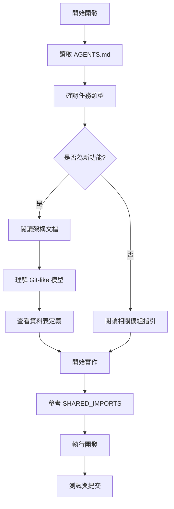

# Agent 開發指南與限制說明

> **目的**：說明專案中哪些內容可能影響 AI Agent 開發，以及如何處理這些限制

**最後更新**：2025-11-15  
**版本**：v1.0  
**維護者**：開發團隊

---

## 📋 概述

本文件說明專案中可能阻礙或影響 AI Agent（如 GitHub Copilot、Cursor AI）開發效率的內容，以及相應的解決方案。

## 🚫 已識別的阻礙因素

### 1. 大型檔案排除 (已修復)

#### 問題描述
- **原有問題**：`.cursorindexignore` 完全排除 `docs/` 目錄
- **影響**：AI Agent 無法訪問重要的架構文件、開發指引、FAQ 等
- **修復**：更新 `.cursorindexignore` 為選擇性排除

#### 當前狀態 ✅
```
# 僅排除以下內容：
- docs/Archive/          # 歷史文檔
- docs/fyi-codebase.md   # 大型生成檔案 (796KB)
- docs/DELON-Index/      # 組件索引 (204KB)
- docs/NG-ZORRO-Index/   # 組件索引 (344KB)

# 保留索引的重要文檔：
- 架構文檔（27-完整架構流程圖.mermaid.md, 28-架構審查報告.md）
- 開發指引（00-開發作業指引.md, 45-SHARED_IMPORTS-使用指南.md）
- 資料庫架構（30-0-完整SQL表結構定義.md）
- FAQ 和最佳實踐
```

### 2. 大型檔案的處理

#### docs/fyi-codebase.md (796KB, 23,213 行)
**內容**：Repomix 生成的完整代碼庫快照
**處理方式**：
- ❌ 不索引（太大，會降低性能）
- ✅ 需要時使用 `view` 工具讀取特定範圍
- ✅ 使用 Repomix MCP 工具直接訪問

**使用建議**：
```typescript
// 不要嘗試一次讀取整個檔案
// ❌ view(path: 'docs/fyi-codebase.md')

// 使用 Repomix MCP 工具
// ✅ repomix-read_repomix_output(outputId: '...', startLine: 1, endLine: 100)
// ✅ repomix-grep_repomix_output(outputId: '...', pattern: '特定模式')
```

#### docs/DELON-Index/ 和 docs/NG-ZORRO-Index/
**內容**：第三方組件庫的完整 API 索引
**處理方式**：
- ❌ 不索引（過於詳細，影響性能）
- ✅ 參考官方文檔：
  - DELON: https://ng-alain.com/
  - NG-ZORRO: https://ng.ant.design/

### 3. 腳本目錄 (已修復)

#### 問題描述
- **原有問題**：`scripts/` 目錄被排除
- **影響**：Agent 無法理解構建和部署流程
- **修復**：移除排除，允許索引

#### 當前狀態 ✅
- `scripts/` 目錄現在可被索引
- Agent 可以理解構建腳本和工具腳本

### 4. 文檔過於分散

#### 問題描述
專案文檔分佈在多個位置：
- `.github/agents/copilot-instructions.md` - GitHub Copilot 主要指引
- `.github/instructions/*.md` - 模組特定指引
- `.cursor/rules/*.mdc` - Cursor IDE 規則
- `docs/*.md` - 完整文檔集
- `AGENTS.md` - Agent 指引總覽

#### 解決方案
- ✅ `AGENTS.md` 作為入口文件，指向所有規則和文檔
- ✅ 每個文件都有清晰的交叉引用
- ✅ 使用一致的命名規範

### 5. 複雜的架構模型

#### Git-like 分支模型
**挑戰**：系統實現了 Git-like 的分支模型，概念較為複雜
**解決方案**：
- ✅ 詳細架構文檔：`docs/27-完整架構流程圖.mermaid.md`
- ✅ 架構審查：`docs/28-架構審查報告.md`
- ✅ 帳戶層流程：`docs/13-帳戶層流程圖.mermaid.md`

**建議 Agent 先讀取**：
1. `docs/27-完整架構流程圖.mermaid.md` - 理解整體架構
2. `docs/28-架構審查報告.md` - 理解設計決策
3. `AGENTS.md` - 理解規則體系

#### 51 張資料表
**挑戰**：資料庫結構龐大且複雜
**解決方案**：
- ✅ 完整 SQL 定義：`docs/30-0-完整SQL表結構定義.md`
- ✅ 資料表清單：`docs/30-資料表清單總覽.md`
- ✅ 模型對照表：`docs/34-資料模型對照表.md`

## 🔧 Agent 開發最佳實踐

### 1. 開始前必讀文檔

優先級順序：
1. ⭐⭐⭐⭐⭐ `AGENTS.md` - 規則總覽
2. ⭐⭐⭐⭐⭐ `.github/agents/copilot-instructions.md` - 完整指引
3. ⭐⭐⭐⭐⭐ `docs/00-開發作業指引.md` - 開發規範
4. ⭐⭐⭐⭐⭐ `docs/45-SHARED_IMPORTS-使用指南.md` - 組件開發
5. ⭐⭐⭐⭐ `docs/27-完整架構流程圖.mermaid.md` - 架構理解

### 2. 處理大型檔案的策略

#### 使用 Repomix MCP 工具
```typescript
// 1. 先附加輸出檔案
repomix-attach_packed_output(path: '/path/to/repomix-output.xml')

// 2. 使用 grep 搜尋
repomix-grep_repomix_output(
  outputId: 'xxx',
  pattern: '特定函數或類別',
  contextLines: 3
)

// 3. 讀取特定範圍
repomix-read_repomix_output(
  outputId: 'xxx',
  startLine: 100,
  endLine: 200
)
```

#### 使用文件系統工具
```typescript
// 讀取檔案的特定行範圍
view(path: '/path/to/file', view_range: [1, 100])

// 搜尋檔案內容
bash(command: 'grep -n "pattern" /path/to/file')
```

### 3. 模組特定指引

根據正在編輯的檔案，自動應用對應指引：

| 檔案模式 | 指引檔案 |
|---------|---------|
| `src/app/shared/**/*` | `.github/instructions/shared.instructions.md` |
| `src/app/routes/**/*` | `.github/instructions/routes.instructions.md` |
| `src/app/core/**/*` | `.github/instructions/core.instructions.md` |
| `**/*.spec.ts` | `.github/instructions/testing.instructions.md` |
| `docs/**/*.md` | `.github/instructions/documentation.instructions.md` |

### 4. 理解專案結構

```
專案結構層次：
├── AGENTS.md (入口)
├── .github/
│   ├── agents/
│   │   ├── copilot-instructions.md (完整指引)
│   │   └── role-config.md (角色配置)
│   └── instructions/ (模組特定)
├── .cursor/
│   ├── rules/ (Cursor 規則)
│   └── templates/ (代碼模板)
├── docs/ (完整文檔)
│   ├── 00-開發作業指引.md ⭐
│   ├── 27-完整架構流程圖.mermaid.md ⭐
│   ├── 28-架構審查報告.md ⭐
│   ├── 30-0-完整SQL表結構定義.md ⭐
│   ├── 45-SHARED_IMPORTS-使用指南.md ⭐
│   └── ...
└── src/ (源代碼)
```

## 📊 檔案大小參考

| 檔案 | 大小 | 是否索引 | 說明 |
|-----|------|---------|------|
| `docs/fyi-codebase.md` | 796KB | ❌ | 使用 Repomix 工具訪問 |
| `docs/Archive/fyi-codebase.md` | 796KB | ❌ | 歷史檔案 |
| `docs/NG-ZORRO-Index/` | 344KB | ❌ | 參考官方文檔 |
| `docs/DELON-Index/` | 204KB | ❌ | 參考官方文檔 |
| `docs/30-0-完整SQL表結構定義.md` | 60KB | ✅ | 資料庫架構 |
| `docs/44-專案路線圖.md` | 52KB | ✅ | 專案規劃 |
| 其他文檔 | <50KB | ✅ | 全部索引 |

## 🎯 解決方案總結

### 已修復的阻礙
✅ 文檔目錄完全排除 → 選擇性排除大型檔案  
✅ 腳本目錄排除 → 允許索引  
✅ 缺少 Agent 指南 → 建立本文件  

### 仍需注意的限制
⚠️ 大型檔案 (fyi-codebase.md) → 使用 Repomix MCP 工具  
⚠️ 複雜架構 → 優先閱讀架構文檔  
⚠️ 文檔分散 → 從 AGENTS.md 開始  

### 建議的工作流程



## 📚 相關文檔

### 核心文檔
- [AGENTS.md](../AGENTS.md) - Agent 指引總覽
- [GitHub Copilot Instructions](../.github/agents/copilot-instructions.md) - 完整指引
- [開發作業指引](./00-開發作業指引.md) - 開發規範

### 架構文檔
- [完整架構流程圖](./27-完整架構流程圖.mermaid.md)
- [架構審查報告](./28-架構審查報告.md)
- [完整SQL表結構定義](./30-0-完整SQL表結構定義.md)

### 開發指南
- [SHARED_IMPORTS 使用指南](./45-SHARED_IMPORTS-使用指南.md)
- [測試指南](./38-測試指南.md)
- [常見問題 FAQ](./36-常見問題-FAQ.md)

## 🔄 維護建議

### 當添加新的大型檔案時

1. **評估大小**：檢查檔案是否超過 100KB
2. **決定索引**：
   - < 50KB：可以索引
   - 50-100KB：視情況決定
   - > 100KB：考慮排除或拆分
3. **更新 .cursorindexignore**：添加排除規則並說明原因
4. **更新本文件**：記錄新的限制和處理方式

### 定期檢查

- 每月檢查 `docs/` 目錄的檔案大小
- 識別新的大型檔案
- 更新排除規則
- 更新文檔說明

---

**最後更新**：2025-11-15  
**架構版本**：v2.0（Git-like 分支模型，51 張資料表）  
**維護者**：開發團隊
