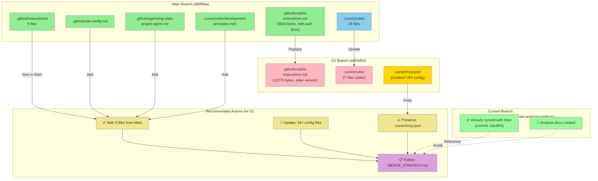
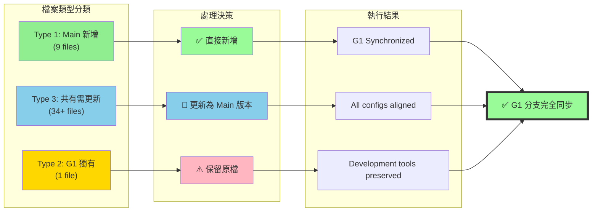
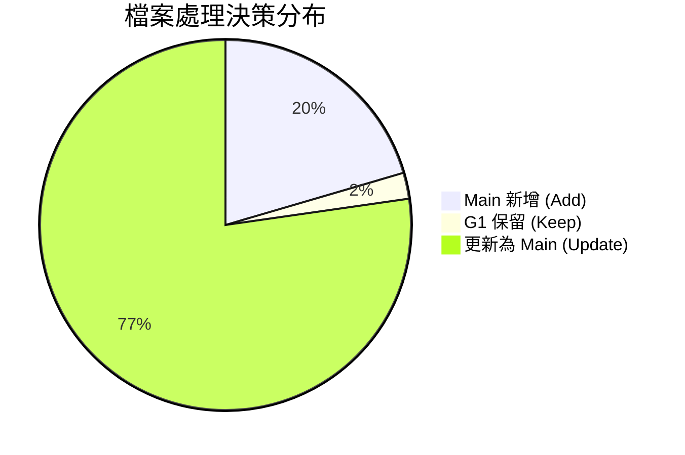
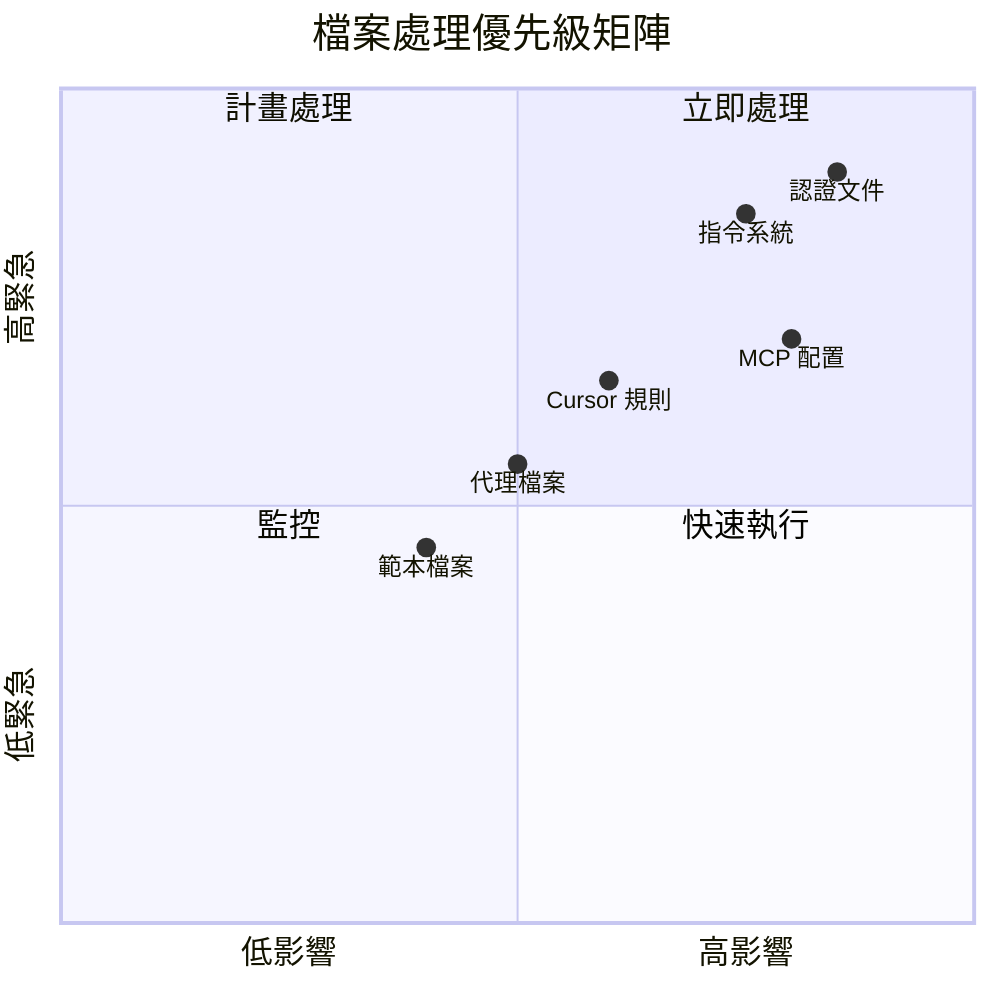
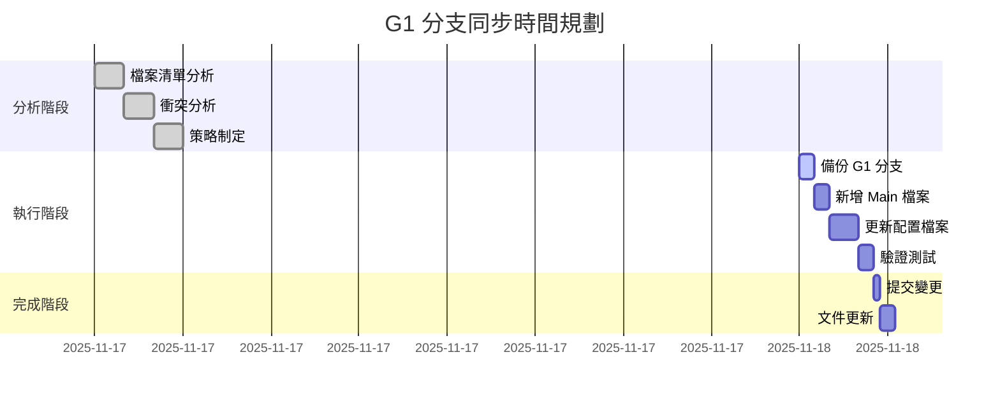
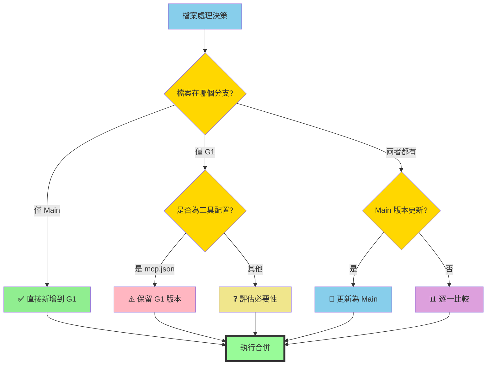

# 分支與檔案關係圖 (Branch and File Relationship Diagram)

## 圖例說明 (Legend)

| 顏色 | 意義 |
|------|------|
| 🟢 綠色 | Main 分支新增或更新的檔案 |
| 🔵 藍色 | Main 分支更新的規則檔案 |
| 🔴 粉紅 | G1 分支的舊版本檔案 |
| 🟡 金色 | G1 獨有需要保留的檔案 |
| 🟣 紫色 | 建議執行的動作 |

## 檔案流向圖 (File Flow Diagram)

## 34+ 檔案分類統計 (File Classification Statistics)

## 優先級矩陣 (Priority Matrix)

## 時間線圖 (Timeline)

## 決策樹 (Decision Tree)

---

**說明**:
- 此圖表檔案提供視覺化的分支關係和檔案處理決策
- 配合 `CONFLICT_ANALYSIS.md` 和 `MERGE_STRATEGY.md` 使用
- 適合用於團隊溝通和執行參考

**最後更新**: 2025-11-17
