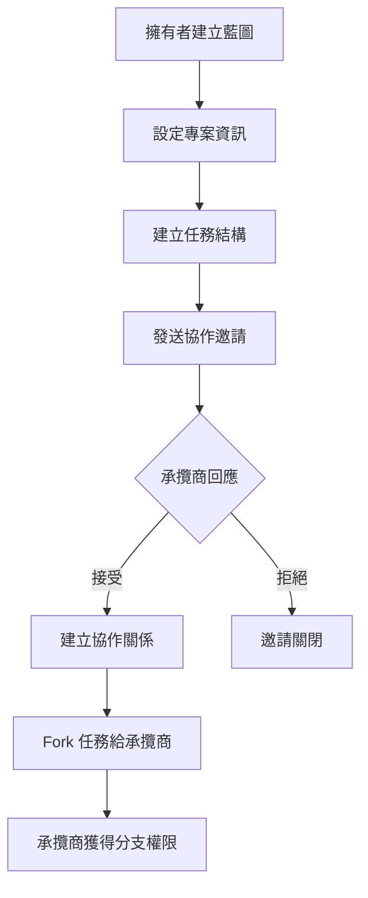
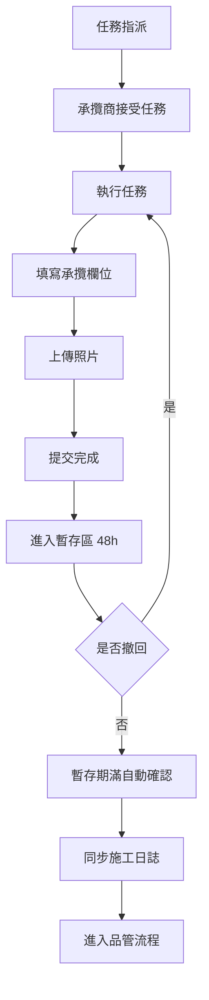
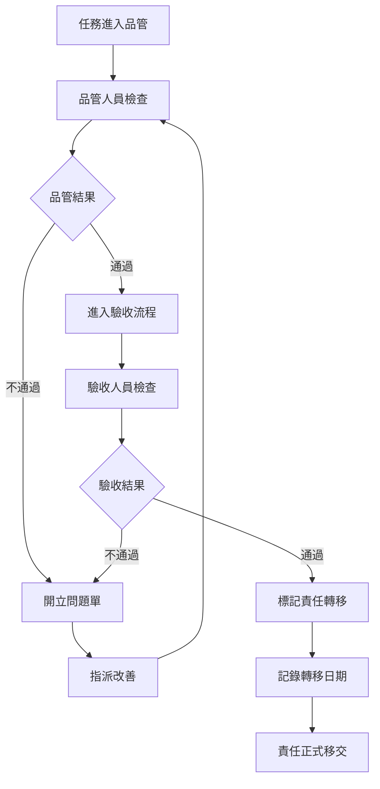
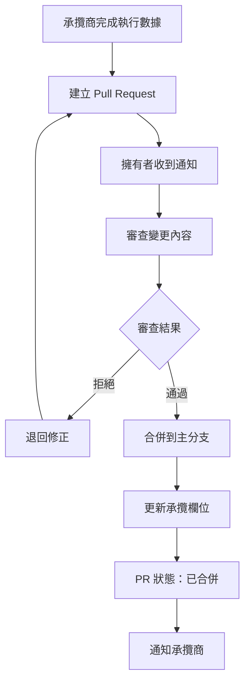
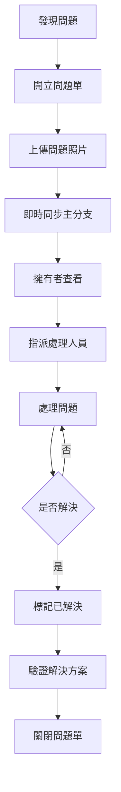

# 建築工程管理系統 PRD v2.1

## 📋 文件資訊

| 項目 | 內容 |
|------|------|
| **文件版本** | v2.1 |
| **最後更新** | 2025-01-15 |
| **產品名稱** | 建築工程管理系統 |
| **產品類型** | B2B SaaS 平台 |
| **目標市場** | 建築工程、營造業、承攬商 |

---

## 🎯 產品概述

### 產品定位
建築工程管理系統是一個基於 Git-like 分支模型的協作管理平台，專為建築工程行業設計，支援組織間的承攬關係管理、任務執行追蹤、品質驗收與責任切割。

### 核心價值主張
1. **Git-like 分支模型**：主分支（擁有者）與組織分支（承攬商）權限分離，確保結構控制權
2. **承攬關係管理**：1:1 組織協作關係，明確權責劃分
3. **責任切割機制**：透過暫存區、品管、驗收流程，明確責任轉移點
4. **跨組織協作**：支援多組織協同作業，數據即時同步至主分支
5. **視覺化追蹤**：進度儀表板、待辦中心、活動記錄全面掌控

---

## 📋 核心業務需求分析

### 1. 多組織協作管理需求

#### 問題背景
- **業主（建設公司）面臨的挑戰**：
  - 難以統一管理多家承攬商的工作進度
  - 缺乏統一的數據視圖，無法全局掌控專案狀況
  - 責任劃分不清，出現問題時難以追溯
  - 承攬商提交的數據格式不一致，審核成本高

#### 解決方案
- **Git-like 分支模型**：
  - 主分支（擁有者）完全控制任務結構，確保專案架構一致性
  - 組織分支（承攬商）只能填寫承攬欄位，無法修改任務結構
  - 權限分離架構，從資料庫層（RLS）到應用層雙重驗證

- **1:1 承攬關係管理**：
  - 明確的權責劃分，每個承攬商有獨立的協作關係
  - 協作類型管理（contractor/subcontractor/consultant/partner）
  - 合約期限與狀態追蹤

- **Pull Request 機制**：
  - 承攬商提交執行數據 → 擁有者審核 → 合併更新
  - 變更摘要與審核流程，確保數據品質
  - 審核歷史完整記錄，支援追溯

### 2. 任務執行與追蹤需求

#### 問題背景
- **任務管理面臨的挑戰**：
  - 任務執行流程複雜，缺乏統一標準
  - 數據散落各處，難以即時掌握狀況
  - 任務優先順序不明確，資源分配困難
  - 進度追蹤不準確，無法預測完工時間

#### 解決方案
- **樹狀任務結構**：
  - 無限層級嵌套，支援 Phase → Milestone → Task → Subtask
  - 使用 PostgreSQL ltree 實現快速查詢
  - 任務類型與狀態管理，清晰的工作流程

- **任務指派機制**：
  - 支援四種指派類型：個人、團隊、組織、承攬商
  - 任務列表按指派對象自動分類
  - 接受確認機制，確保任務被正確接收

- **暫存區機制（48小時可撤回）**：
  - 提交後進入 48 小時緩衝期，允許撤回修正
  - 過期後自動確認進入品管流程
  - 減少錯誤提交，提升數據品質

- **施工日誌自動同步**：
  - 每日施工記錄自動同步到主分支
  - 整合天氣資料（中央氣象局 API）
  - 照片附件與進度備註完整記錄

### 3. 品質驗收與責任切割需求

#### 問題背景
- **品質管理面臨的挑戰**：
  - 驗收流程不明確，責任轉移點不清晰
  - 品管記錄易遺失，照片管理困難
  - 缺失追蹤不完整，改善措施難以落實
  - 責任歸屬爭議，缺乏明確的責任切割點

#### 解決方案
- **品管檢查流程**：
  - 多種檢查類型（routine/milestone/final/spot_check）
  - 檢查項目、發現記錄、改善建議完整記錄
  - 照片附件與標註功能，視覺化問題說明
  - 品管記錄自動同步到主分支

- **驗收流程（責任切割）**：
  - 驗收類型管理（preliminary/final/warranty/handover）
  - 驗收項目、缺失記錄、矯正措施完整記錄
  - **責任轉移標記**：驗收通過後明確標記責任轉移
  - **轉移日期記錄**：記錄責任正式移交的時間點

- **責任切割流程**：
  ```
  品管通過
     ↓
  驗收檢查
     ↓
  驗收通過 → 責任轉移 = TRUE
     ↓
  記錄轉移日期
     ↓
  責任正式移交
  ```

### 4. 問題追蹤與異常處理需求

#### 問題背景
- **異常處理面臨的挑戰**：
  - 施工異常問題難以追蹤，跨組織溝通不順
  - 問題狀態不明確，處理進度無法掌握
  - 問題散落各分支，擁有者無法全局掌控
  - 問題解決方案缺乏記錄，類似問題重複發生

#### 解決方案
- **問題開立與追蹤**：
  - 問題類型管理（general/quality/safety/delay/resource/technical）
  - 嚴重程度與優先順序分級
  - 問題狀態追蹤（open/in_progress/resolved/closed/wont_fix）
  - 解決方案記錄，建立知識庫

- **即時同步至主分支**：
  - 所有分支問題即時同步至主分支
  - 擁有者可以查看全局問題，統一管理與協調
  - 同步類型記錄（create/update/resolve/close）
  - 問題同步歷史完整記錄

### 5. 協作溝通與待辦管理需求

#### 問題背景
- **協作溝通面臨的挑戰**：
  - 資訊散落各處，難以統一管理待辦事項
  - 通知機制不完善，重要訊息容易遺漏
  - 討論記錄不完整，決策過程難以追溯
  - 待辦事項狀態不明確，優先順序混亂

#### 解決方案
- **待辦中心（五種狀態分類）**：
  - 🟦 **待執行**：來自任務列表（task_lists）
  - 🟨 **暫存中**：來自暫存區（task_staging）
  - 🟧 **品管中**：來自品質管理（quality_checks）
  - 🟥 **驗收中**：來自驗收（inspections）
  - ⚠️ **問題追蹤**：來自異常處理（issues）
  - 優先順序排序與到期日提醒

- **通知系統**：
  - 多種通知類型（任務指派、問題建立、PR 狀態、deadline 提醒等）
  - 通知渠道（站內/Email/推播/SMS）
  - 通知規則自訂（頻率、靜音時段、訂閱層級）
  - 通知優先順序管理

- **討論與留言**：
  - 多種留言對象（task/issue/pull_request/inspection/quality_check）
  - 巢狀回覆與 @提及功能
  - 附件支援與編輯記錄

### 6. 數據分析與視覺化需求

#### 問題背景
- **數據分析面臨的挑戰**：
  - 缺乏統一的數據視圖和進度追蹤
  - 報表生成耗時，無法即時查看
  - 跨分支數據難以比對分析
  - 歷史數據查詢困難，趨勢分析不準確

#### 解決方案
- **進度追蹤儀表板**：
  - 主分支/分支/總覽三層報表系統
  - 任務統計（總數/已完成/進行中/待處理/逾期）
  - 完成百分比、進度落後天數、預算使用與差異
  - 品質分數與安全事故統計

- **活動記錄集中管理**：
  - 所有操作統一記錄至主分支
  - 擁有者全局掌控，支援審計追溯
  - 操作者追蹤、IP 與 User Agent 記錄
  - 操作詳情（JSON）完整記錄

- **數據分析快取**：
  - 預計算分析報表，支援多層級聚合
  - 快取類型（main_branch/single_branch/cross_branch/organization/global）
  - 聚合層級（hourly/daily/weekly/monthly）
  - 快取過期機制與自動更新排程

---

## 🎯 核心設計原則

### 1. 權限分離架構

#### 擁有者權限（藍圖擁有者/建設公司）
- ✅ 建立/修改任務結構
- ✅ Fork 任務給協作組織
- ✅ 審核/合併 PR
- ✅ 查看所有分支數據
- ✅ 全局進度掌控
- ✅ 問題統一管理

#### 協作組織權限（承攬商）
- ❌ **不能修改任務結構**
- ✅ 只能填寫承攬欄位（contractor_fields）
- ✅ 提交執行數據（PR）
- ✅ 查看自己分支數據
- ✅ 執行任務與記錄施工日誌
- ✅ 上傳品管照片

#### 查看者權限
- ✅ 唯讀所有資料
- ❌ 無法修改任何內容

### 2. 數據同步機制

#### 自動同步到主分支的數據
- **施工日誌**（daily_reports）：
  - 每日工作描述、人力/設備/材料記錄
  - 天氣資訊、進度備註、問題記錄
  - 照片附件自動同步

- **品管記錄**（quality_checks）：
  - 檢查項目、發現記錄、改善建議
  - 品管照片自動同步

- **問題追蹤**（issues）：
  - **即時同步**：所有分支問題即時同步至主分支
  - 問題狀態、指派、解決方案完整記錄
  - 問題照片自動同步

- **活動記錄**（activity_logs）：
  - **集中記錄**：所有操作統一記錄至主分支
  - 擁有者全局掌控，支援審計追溯
  - 所有分支活動同步

### 3. 責任切割機制

#### 暫存區設計（48小時緩衝期）
- **提交流程**：
  ```
  提交完成
     ↓
  進入暫存區（48h）
     ↓
  [可撤回修正] ←─┐
     ↓           │
  48h 到期      │
     ↓           │
  自動確認 ─────┘
     ↓
  進入品管
  ```

- **分階段確認**：
  - 提交 → 暫存 → 品管 → 驗收
  - 每個階段都有明確的責任轉移點

#### 責任轉移點（驗收通過後）
- **驗收通過標記**：
  - `responsibility_transferred = TRUE`
  - `transfer_date` 記錄責任正式移交日期
  - 責任正式移交，後續問題由驗收方負責

### 4. 待辦中心分類

#### 五種狀態分類
```
個人待辦中心 (personal_todos)
├── 🟦 待執行（task_lists）
│   └── 來自任務指派的待辦事項
├── 🟨 暫存中（task_staging）
│   └── 已提交但仍在 48h 緩衝期的任務
├── 🟧 品管中（quality_checks）
│   └── 等待品管檢查的任務
├── 🟥 驗收中（inspections）
│   └── 等待驗收的任務
└── ⚠️ 問題追蹤（issues）
    └── 需要處理的問題
```

### 5. Git-like 分支模型實作

#### 主分支（Main Branch）
- **控制權**：擁有者全權控制任務結構
- **數據來源**：主分支是數據的權威來源
- **審核權**：審核所有 PR，決定是否合併

#### 組織分支（Organization Branch）
- **Fork 機制**：1:1 承攬關係，每個任務可 Fork 給多個承攬商
- **權限限制**：只能填寫承攬欄位，不能修改任務結構
- **獨立執行環境**：每個分支有獨立的執行環境

#### Pull Request 流程
```
1. 協作組織提交 PR
   ↓
2. 擁有者審查變更
   ↓
3. 通過 → 合併到主分支（更新承攬欄位）
   拒絕 → 退回修正
```

---

## 💡 解決的核心問題總結

### 問題 1：多組織協作管理
- **問題**：難以管理多家承攬商、缺乏統一數據視圖、責任劃分不清
- **解決**：Git-like 分支模型、1:1 承攬關係、PR 機制

### 問題 2：任務執行與追蹤
- **問題**：任務執行流程複雜、數據散落、進度追蹤不準確
- **解決**：樹狀任務結構、暫存區機制、施工日誌自動同步

### 問題 3：品質驗收與責任切割
- **問題**：驗收流程不明確、責任轉移點不清晰、缺失追蹤不完整
- **解決**：品管檢查流程、驗收流程、責任轉移標記

### 問題 4：問題追蹤與異常處理
- **問題**：問題難以追蹤、跨組織溝通不順、無法全局掌控
- **解決**：問題開立與追蹤、即時同步至主分支

### 問題 5：協作溝通與待辦管理
- **問題**：資訊散落、通知機制不完善、待辦事項狀態不明確
- **解決**：待辦中心（五種狀態）、通知系統、討論與留言

### 問題 6：數據分析與視覺化
- **問題**：缺乏統一數據視圖、報表生成耗時、跨分支數據難以比對
- **解決**：進度追蹤儀表板、活動記錄集中管理、數據分析快取

---

## 🎯 核心價值總結

**讓擁有者保持對專案結構的控制權，同時讓承攬商能夠獨立執行任務並提交數據，最終通過 PR 機制實現數據統一和審核流程。**

**核心優勢**：
1. ✅ **權限邊界清晰**：分支系統完整受控，權限分離明確
2. ✅ **業務流程完整**：任務執行+暫存+品管+驗收，責任切割明確
3. ✅ **數據追溯性強**：活動記錄集中、版本控制、完整審計追蹤
4. ✅ **用戶體驗優秀**：待辦中心多狀態、通知規則完善、視覺化儀表板
5. ✅ **數據分析全面**：主分支/分支/總覽三層報表，全局掌控
6. ✅ **系統可擴展**：Bot 系統、文件系統、機器人系統皆可擴充

---

## 👥 目標用戶

### 主要用戶角色

#### 1. 藍圖擁有者（建設公司/業主組織）
- **需求**：全權控制專案結構、審核承攬商提交、掌握全局進度
- **痛點**：難以管理多家承攬商、缺乏統一數據視圖、責任劃分不清
- **使用場景**：建立藍圖、Fork 任務給承攬商、審核 PR、查看跨分支報表

#### 2. 承攬商組織（營造廠、專業包商）
- **需求**：執行承攬任務、記錄施工數據、提交完成證明
- **痛點**：無法修改任務結構、數據提交流程複雜、與業主溝通不順
- **使用場景**：填寫承攬欄位、提交施工日誌、上傳品管照片、建立 PR

#### 3. 專案經理
- **需求**：監控任務進度、協調資源分配、處理異常問題
- **痛點**：資訊散落各處、難以即時掌握狀況、協調成本高
- **使用場景**：指派任務、查看進度儀表板、處理問題追蹤、審核驗收

#### 4. 品管人員
- **需求**：執行品質檢查、記錄缺失、追蹤改善
- **痛點**：紙本記錄易遺失、照片管理困難、追蹤不完整
- **使用場景**：執行品管檢查、上傳檢查照片、開立問題單、追蹤改善狀態

#### 5. 現場工作人員
- **需求**：接收任務、記錄完成、回報問題
- **痛點**：不清楚任務優先順序、回報流程繁瑣、缺乏即時反饋
- **使用場景**：查看待辦事項、提交任務完成、上傳施工照片、回報異常

---

## 🏗️ 系統架構

### 技術棧

#### 前端
- **框架**：Angular 20.3.x
- **UI 庫**：NG-ZORRO (Ant Design) 20.3.x + NG-ALAIN 20.0.x
- **狀態管理**：RxJS 7.8.x
- **語言**：TypeScript 5.9.x
- **富文本編輯**：ngx-tinymce 20.0.0

#### 後端
- **平台**：Firebase + Supabase
- **數據庫**：PostgreSQL (Supabase)
- **認證**：Supabase Auth
- **存儲**：Supabase Storage

#### 開發工具
- **套件管理**：yarn
- **程式碼檢查**：ESLint 9.x + Prettier
- **測試框架**：Jasmine + Karma
- **Git hooks**：Husky + lint-staged

### 資料架構

系統共包含 **51 張資料表**，分為以下模組：

| 模組 | 表數量 | 核心表 |
|------|--------|--------|
| 🔐 帳戶與身份系統 | 4 張 | accounts, teams, team_members, organization_schedules |
| 🤝 組織協作系統 | 3 張 | organization_collaborations, collaboration_invitations, collaboration_members |
| 🔒 權限系統 | 5 張 | roles, user_roles, permissions, role_permissions, branch_permissions |
| 🎯 藍圖/專案系統 | 5 張 | blueprints, blueprint_configs, blueprint_branches, branch_forks, pull_requests |
| 📋 任務執行系統 | 9 張 | tasks, task_assignments, task_staging, daily_reports, weather_cache |
| ✅ 品質驗收系統 | 4 張 | quality_checks, qc_photos, inspections, inspection_photos |
| ⚠️ 問題追蹤系統 | 4 張 | issues, issue_assignments, issue_photos, issue_sync_logs |
| 💬 協作溝通系統 | 6 張 | comments, notifications, notification_rules, personal_todos |
| 📊 資料分析系統 | 6 張 | documents, document_versions, progress_tracking, activity_logs, analytics_cache |
| 🤖 機器人系統 | 3 張 | bots, bot_tasks, bot_execution_logs |
| ⚙️ 系統管理 | 2 張 | settings, feature_flags |

---

## 🎨 核心功能模組

### 1. 帳戶與身份系統

#### 1.1 統一身份抽象 (Account)
**功能說明**：  
支援三種帳戶類型的統一管理：User（個人用戶）、Bot（機器人）、Organization（組織）。

**核心特性**：
- ✅ 與 Supabase Auth 整合
- ✅ 支援用戶、機器人、組織三種類型
- ✅ 帳戶狀態管理（active/inactive/suspended）
- ✅ 自訂 metadata 擴充欄位

**資料表**：`accounts`

**使用場景**：
- 用戶註冊登入
- 組織帳戶建立
- 機器人帳戶配置

#### 1.2 團隊管理
**功能說明**：  
組織內部的團隊分組管理，支援團隊成員與角色配置。

**核心特性**：
- ✅ 組織內建立多個團隊
- ✅ 團隊成員管理（leader/member）
- ✅ 團隊頭像與描述
- ✅ 團隊層級任務指派

**資料表**：`teams`, `team_members`

**使用場景**：
- 建立施工團隊
- 指派團隊任務
- 團隊排班管理

#### 1.3 組織排班管理
**功能說明**：  
組織內部人員排班，可跨藍圖調派成員，整合天氣預報 API。

**核心特性**：
- ✅ 跨藍圖成員調派
- ✅ 個人/團隊排班
- ✅ 整合中央氣象局天氣 API
- ✅ 排班備註與記錄

**資料表**：`organization_schedules`, `weather_cache`

**使用場景**：
- 每週排班規劃
- 依天氣調整人力
- 查看歷史排班記錄

---

### 2. 組織協作系統

#### 2.1 跨組織協作關係
**功能說明**：  
管理 1:1 承攬關係，支援多種協作類型（承攬商、次承攬商、顧問、合作夥伴）。

**核心特性**：
- ✅ 1:1 組織協作關係
- ✅ 協作類型管理（contractor/subcontractor/consultant/partner）
- ✅ 合約期限設定
- ✅ 協作狀態追蹤（pending/active/suspended/ended）

**資料表**：`organization_collaborations`

**使用場景**：
- 建立承攬關係
- 管理協作組織
- 結束協作關係

#### 2.2 協作邀請管理
**功能說明**：  
組織間協作邀請的發送、接受、拒絕流程。

**核心特性**：
- ✅ 邀請訊息自訂
- ✅ 邀請有效期限
- ✅ 邀請狀態追蹤（pending/accepted/rejected/expired）
- ✅ 回應時間記錄

**資料表**：`collaboration_invitations`

**使用場景**：
- 邀請承攬商加入專案
- 接受/拒絕協作邀請
- 查看邀請歷史

#### 2.3 協作成員管理
**功能說明**：  
管理協作關係中的特定成員與權限。

**核心特性**：
- ✅ 成員角色配置
- ✅ 自訂權限設定
- ✅ 加入時間記錄

**資料表**：`collaboration_members`

**使用場景**：
- 指定協作窗口
- 設定成員權限
- 移除協作成員

---

### 3. 權限系統

#### 3.1 角色與權限管理
**功能說明**：  
基於角色的權限控制系統（RBAC），支援系統預設角色與自訂角色。

**核心特性**：
- ✅ 預設系統角色（blueprint_owner, project_manager, contractor, quality_inspector, viewer）
- ✅ 自訂角色建立
- ✅ 細粒度權限定義（resource + action）
- ✅ 角色權限多對多關聯

**資料表**：`roles`, `permissions`, `role_permissions`

**權限資源類型**：
- blueprint（藍圖）
- task（任務）
- pull_request（PR）
- issue（問題）
- document（文件）

**使用場景**：
- 建立自訂角色
- 配置角色權限
- 查看權限矩陣

#### 3.2 用戶角色指派
**功能說明**：  
在特定藍圖或分支中指派用戶角色。

**核心特性**：
- ✅ 藍圖層級角色
- ✅ 分支層級角色
- ✅ 角色授予記錄
- ✅ 角色授予者追蹤

**資料表**：`user_roles`

**使用場景**：
- 指派專案經理
- 授予承攬商權限
- 移除用戶角色

#### 3.3 分支權限控制
**功能說明**：  
分支層級的權限控制，確保權限隔離。

**核心特性**：
- ✅ 四級權限（owner/admin/write/read）
- ✅ 分支獨立權限配置
- ✅ 權限授予記錄

**資料表**：`branch_permissions`

**權限分離原則**：
```
擁有者（Owner）：
✅ 建立/修改任務結構
✅ Fork 任務給協作組織
✅ 審核/合併 PR
✅ 查看所有分支數據

協作組織（Contractor）：
❌ 不能修改任務結構
✅ 只能填寫承攬欄位
✅ 提交執行數據（PR）
✅ 查看自己分支數據

查看者（Viewer）：
✅ 唯讀所有資料
❌ 無法修改任何內容
```

---

### 4. 藍圖/專案系統（Git-like 分支模型）

#### 4.1 主分支（Main Branch）
**功能說明**：  
藍圖主分支，由擁有者組織完全控制任務結構。

**核心特性**：
- ✅ 專案基本資訊管理
- ✅ 任務結構完全控制
- ✅ 專案狀態管理（planning/active/on_hold/completed/archived）
- ✅ 預算與時程設定
- ✅ 專案代碼（project_code）

**資料表**：`blueprints`, `blueprint_configs`

**使用場景**：
- 建立新專案藍圖
- 設定專案範圍
- 修改任務結構
- 查看專案總覽

#### 4.2 組織分支（Branch）
**功能說明**：  
協作組織的 Fork 分支，只能操作承攬欄位，不能修改任務結構。

**核心特性**：
- ✅ Fork 自主分支
- ✅ 分支類型（contractor/subcontractor/consultant）
- ✅ 只能填寫承攬欄位（contractor_fields）
- ✅ 分支狀態管理（active/merged/closed）
- ✅ 最後同步時間記錄

**資料表**：`blueprint_branches`, `branch_forks`

**使用場景**：
- 承攬商接受任務 Fork
- 填寫執行數據
- 查看分支狀態
- 同步主分支更新

#### 4.3 Pull Request（執行數據提交）
**功能說明**：  
協作組織提交執行數據，擁有者審核後合併更新承攬欄位。

**核心特性**：
- ✅ 提交執行數據變更
- ✅ 變更摘要（changes_summary）
- ✅ 審核流程（open → reviewing → approved/rejected → merged）
- ✅ 審核者與合併者記錄
- ✅ 時間戳記（submitted_at, reviewed_at, merged_at）

**資料表**：`pull_requests`

**PR 流程**：
```
1. 協作組織提交 PR
   ↓
2. 擁有者審查變更
   ↓
3. 通過 → 合併到主分支（更新承攬欄位）
   拒絕 → 退回修正
```

**使用場景**：
- 承攬商提交完成數據
- 擁有者審核 PR
- 合併執行數據
- 查看 PR 歷史

---

### 5. 任務執行系統

#### 5.1 樹狀任務結構
**功能說明**：  
無層級限制的樹狀任務結構，支援 Phase → Milestone → Task → Subtask 多層嵌套。

**核心特性**：
- ✅ 無限層級嵌套
- ✅ 父子任務關聯
- ✅ 樹狀路徑（ltree）快速查詢
- ✅ 任務類型（milestone/phase/task/subtask）
- ✅ 任務狀態（pending/assigned/in_progress/staging/in_qa/in_inspection/completed/cancelled）
- ✅ 優先順序（low/medium/high/urgent）
- ✅ 計畫與實際時程
- ✅ 進度百分比
- ✅ 承攬欄位（contractor_fields）

**資料表**：`tasks`, `task_dependencies`

**使用場景**：
- 建立專案階段
- 拆解任務
- 建立子任務
- 設定任務依賴

#### 5.2 任務指派
**功能說明**：  
支援四種指派類型：個人、團隊、組織、承攬商。

**核心特性**：
- ✅ 個人指派（individual）
- ✅ 團隊指派（team）
- ✅ 組織指派（organization）
- ✅ 承攬商指派（contractor）
- ✅ 指派備註
- ✅ 接受確認機制

**資料表**：`task_assignments`, `task_lists`

**使用場景**：
- 指派任務給成員
- 指派任務給團隊
- Fork 任務給承攬商
- 查看任務列表

#### 5.3 暫存區（48小時撤回機制）
**功能說明**：  
任務提交後進入 48 小時暫存期，可撤回修正，過期後自動確認進入品管流程。

**核心特性**：
- ✅ 48 小時緩衝期
- ✅ 提交數據暫存
- ✅ 照片附件
- ✅ 可撤回標記
- ✅ 過期自動確認
- ✅ 撤回記錄

**資料表**：`task_staging`

**暫存區流程**：
```
提交完成
   ↓
進入暫存區（48h）
   ↓
[可撤回修正] ←─┐
   ↓           │
48h 到期      │
   ↓           │
自動確認 ─────┘
   ↓
進入品管
```

**使用場景**：
- 提交任務完成
- 撤回重新提交
- 查看暫存任務
- 確認進入品管

#### 5.4 施工日誌
**功能說明**：  
每日施工記錄，自動同步到主分支，整合天氣資料。

**核心特性**：
- ✅ 每日工作描述
- ✅ 人力/設備/材料記錄
- ✅ 天氣資訊（中央氣象局 API）
- ✅ 進度備註
- ✅ 問題記錄
- ✅ 照片附件
- ✅ 自動同步主分支

**資料表**：`daily_reports`, `report_photos`, `weather_cache`

**使用場景**：
- 每日填寫施工記錄
- 上傳施工照片
- 記錄材料使用
- 查看歷史日誌

#### 5.5 任務模板
**功能說明**：  
可重複使用的任務模板，提升建立效率。

**核心特性**：
- ✅ 組織專屬模板
- ✅ 公開共享模板
- ✅ 模板使用次數統計
- ✅ JSONB 儲存結構

**資料表**：`task_templates`

**使用場景**：
- 建立常用任務模板
- 套用模板快速建立
- 共享模板給其他組織

---

### 6. 品質驗收系統

#### 6.1 品質管理（QA）
**功能說明**：  
品管人員執行檢查，記錄發現與建議。

**核心特性**：
- ✅ 多種檢查類型（routine/milestone/final/spot_check）
- ✅ 檢查項目（check_items）
- ✅ 檢查狀態（pending/in_progress/passed/failed/conditional_pass）
- ✅ 發現記錄（findings）
- ✅ 改善建議（recommendations）
- ✅ 照片附件

**資料表**：`quality_checks`, `qc_photos`

**使用場景**：
- 執行品質檢查
- 記錄缺失
- 上傳檢查照片
- 追蹤改善狀態

#### 6.2 驗收管理（責任切割）
**功能說明**：  
最終驗收記錄，明確責任轉移點。

**核心特性**：
- ✅ 驗收類型（preliminary/final/warranty/handover）
- ✅ 驗收狀態（pending/in_progress/accepted/rejected/conditional_accept）
- ✅ 驗收項目（inspection_items）
- ✅ 缺失記錄（defects_found）
- ✅ 驗收標準（acceptance_criteria）
- ✅ 矯正措施（corrective_actions）
- ✅ 責任轉移標記（responsibility_transferred）
- ✅ 轉移日期（transfer_date）
- ✅ 照片附件

**資料表**：`inspections`, `inspection_photos`

**責任切割流程**：
```
品管通過
   ↓
驗收檢查
   ↓
驗收通過 → 責任轉移 = TRUE
   ↓
記錄轉移日期
   ↓
責任正式移交
```

**使用場景**：
- 執行最終驗收
- 記錄缺失
- 確認責任轉移
- 查看驗收歷史

---

### 7. 問題追蹤系統

#### 7.1 問題管理
**功能說明**：  
施工異常問題追蹤，所有分支問題即時同步至主分支。

**核心特性**：
- ✅ 問題類型（general/quality/safety/delay/resource/technical）
- ✅ 嚴重程度（low/medium/high/critical）
- ✅ 問題狀態（open/in_progress/resolved/closed/wont_fix）
- ✅ 優先順序（low/medium/high/urgent）
- ✅ 解決方案記錄
- ✅ 照片附件
- ✅ 即時同步主分支（synced_to_main）

**資料表**：`issues`, `issue_assignments`, `issue_photos`

**使用場景**：
- 開立問題單
- 指派處理人員
- 追蹤問題狀態
- 記錄解決方案

#### 7.2 問題同步機制
**功能說明**：  
跨分支問題即時同步至主分支，擁有者全局掌控。

**核心特性**：
- ✅ 分支問題自動同步
- ✅ 同步類型（create/update/resolve/close）
- ✅ 同步數據記錄
- ✅ 同步時間戳記

**資料表**：`issue_sync_logs`

**同步原則**：
```
分支問題建立/更新
   ↓
即時同步至主分支
   ↓
擁有者可查看所有分支問題
   ↓
統一管理與協調
```

**使用場景**：
- 分支開立問題自動同步
- 擁有者查看全局問題
- 問題同步歷史查詢

---

### 8. 協作溝通系統

#### 8.1 討論與留言
**功能說明**：  
任務、問題、PR、驗收、品管的討論留言。

**核心特性**：
- ✅ 多種留言對象（task/issue/pull_request/inspection/quality_check）
- ✅ 巢狀回覆（parent_comment_id）
- ✅ @提及功能（mentions）
- ✅ 附件支援
- ✅ 編輯記錄

**資料表**：`comments`

**使用場景**：
- 任務討論
- 問題溝通
- PR 審查留言
- 驗收意見回覆

#### 8.2 通知系統
**功能說明**：  
系統通知中心，支援多種通知類型與渠道。

**核心特性**：
- ✅ 多種通知類型（任務指派、問題建立、PR 狀態、deadline 提醒等）
- ✅ 通知優先順序（low/normal/high/urgent）
- ✅ 已讀/未讀狀態
- ✅ 相關資源連結
- ✅ 行動 URL

**資料表**：`notifications`

**通知類型**：
- task_assigned：任務指派
- task_submitted：任務提交
- issue_created：問題建立
- pr_reviewed：PR 審核
- deadline_reminder：期限提醒
- staging_expiring：暫存即將到期

**使用場景**：
- 接收任務指派通知
- 查看未讀通知
- 快速跳轉相關頁面

#### 8.3 通知規則自訂
**功能說明**：  
用戶自訂通知規則，包含渠道、頻率、靜音時段。

**核心特性**：
- ✅ 通知渠道（in_app/email/push/sms）
- ✅ 通知頻率（immediate/hourly/daily/weekly）
- ✅ 靜音時段設定
- ✅ 啟用/停用開關

**資料表**：`notification_rules`

**使用場景**：
- 設定通知偏好
- 關閉非必要通知
- 設定工作時間外靜音

#### 8.4 通知訂閱
**功能說明**：  
訂閱特定資源的通知。

**核心特性**：
- ✅ 訂閱層級（all/mentions_only/none）
- ✅ 訂閱對象（blueprint/task/issue/branch）

**資料表**：`notification_subscriptions`

**使用場景**：
- 訂閱重要專案
- 只接收 @提及通知
- 取消訂閱

#### 8.5 個人待辦中心
**功能說明**：  
聚合所有待辦事項，按狀態分類。

**核心特性**：
- ✅ 多種待辦類型（task/issue/review_pr/qa_check/inspection/custom）
- ✅ 狀態分類（待執行/暫存中/品管中/驗收中/問題追蹤）
- ✅ 優先順序排序
- ✅ 到期日提醒
- ✅ 狀態追蹤歷史

**資料表**：`personal_todos`, `todo_status_tracking`

**待辦分類**：
```
個人待辦中心
├── 🟦 待執行（task_lists）
├── 🟨 暫存中（task_staging）
├── 🟧 品管中（quality_checks）
├── 🟥 驗收中（inspections）
└── ⚠️ 問題追蹤（issues）
```

**使用場景**：
- 查看今日待辦
- 優先順序排序
- 標記完成
- 查看歷史記錄

---

### 9. 資料分析系統

#### 9.1 文件管理系統
**功能說明**：  
統一文件與圖片管理，支援版本控制與縮圖快取。

**核心特性**：
- ✅ 多種文件類型支援
- ✅ 文件元資料管理
- ✅ 版本控制
- ✅ 圖片縮圖自動生成（small/medium/large）
- ✅ 軟刪除機制（30 天保留期）
- ✅ 永久刪除排程
- ✅ Checksum 驗證

**資料表**：`documents`, `document_versions`, `document_thumbnails`

**使用場景**：
- 上傳施工照片
- 上傳設計圖檔
- 查看文件歷史版本
- 恢復軟刪除文件

#### 9.2 進度追蹤儀表板
**功能說明**：  
視覺化專案進度，支援主分支與各組織分支的數據追蹤。

**核心特性**：
- ✅ 任務統計（總數/已完成/進行中/待處理/逾期）
- ✅ 完成百分比
- ✅ 進度落後天數（schedule_variance_days）
- ✅ 預算使用與差異
- ✅ 品質分數
- ✅ 安全事故統計
- ✅ 每日數據快照

**資料表**：`progress_tracking`

**使用場景**：
- 查看專案總覽儀表板
- 比對計畫與實際進度
- 預算使用分析
- 生成進度報表

#### 9.3 活動記錄
**功能說明**：  
集中記錄所有操作，所有分支活動同步至主分支。

**核心特性**：
- ✅ 所有操作記錄（blueprint/branch/task/issue/pr/comment/document/inspection/qa）
- ✅ 操作者追蹤
- ✅ 操作詳情（JSON）
- ✅ IP 與 User Agent 記錄
- ✅ 時間戳記

**資料表**：`activity_logs`

**記錄範圍**：
```
所有分支操作
   ↓
統一記錄到主分支
   ↓
擁有者全局掌控
   ↓
完整審計追蹤
```

**使用場景**：
- 查看操作歷史
- 審計追蹤
- 問題溯源
- 責任歸屬確認

#### 9.4 數據分析快取
**功能說明**：  
預計算分析報表，支援多層級聚合（主分支/單一分支/跨分支/組織/全局）。

**核心特性**：
- ✅ 五種快取類型（main_branch/single_branch/cross_branch/organization/global）
- ✅ 多種聚合層級（hourly/daily/weekly/monthly）
- ✅ 快取過期機制
- ✅ 自動更新排程

**資料表**：`analytics_cache`

**使用場景**：
- 快速載入報表
- 跨分支數據比對
- 組織績效分析
- 全局趨勢分析

---

### 10. 機器人系統

#### 10.1 機器人定義
**功能說明**：  
系統機器人配置，支援定期報表、通知、備份等基礎功能。

**核心特性**：
- ✅ 機器人類型（report_generator/notifier/backup/data_sync/custom）
- ✅ 配置管理（JSON）
- ✅ 啟用/停用開關
- ✅ 建立者追蹤

**資料表**：`bots`

**預設機器人類型**：
- **定期報表機器人**：自動生成日報/週報/月報
- **通知機器人**：批次發送通知
- **備份機器人**：定期備份資料

**使用場景**：
- 設定定期報表機器人
- 配置通知機器人
- 建立自訂機器人

#### 10.2 機器人任務佇列
**功能說明**：  
機器人執行任務的佇列管理。

**核心特性**：
- ✅ 任務狀態（pending/running/completed/failed/cancelled）
- ✅ 優先順序
- ✅ 排程執行
- ✅ 重試機制（最多 3 次）
- ✅ 錯誤訊息記錄

**資料表**：`bot_tasks`

**使用場景**：
- 排程報表生成
- 查看執行佇列
- 手動觸發任務
- 取消待執行任務

#### 10.3 機器人執行日誌
**功能說明**：  
機器人執行歷史與結果記錄。

**核心特性**：
- ✅ 執行狀態（success/partial_success/failed）
- ✅ 執行詳情（JSON）
- ✅ 處理項目統計
- ✅ 執行時長
- ✅ 錯誤日誌

**資料表**：`bot_execution_logs`

**使用場景**：
- 查看執行歷史
- 分析失敗原因
- 效能監控
- 成功率統計

---

### 11. 系統管理

#### 11.1 系統設定
**功能說明**：  
全局系統設定管理，支援多層級配置（system/organization/blueprint/user）。

**核心特性**：
- ✅ 設定類型（system/organization/blueprint/user）
- ✅ JSON 格式儲存
- ✅ 公開/私有標記
- ✅ 範圍限定（scope_id）
- ✅ 更新者追蹤

**資料表**：`settings`

**使用場景**：
- 配置系統參數
- 組織專屬設定
- 藍圖層級設定
- 用戶偏好設定

#### 11.2 功能開關
**功能說明**：  
功能開關控制，支援灰度發布與 A/B 測試。

**核心特性**：
- ✅ 功能啟用/停用
- ✅ 推出百分比（rollout_percentage）
- ✅ 目標用戶/組織白名單
- ✅ 生效時間範圍
- ✅ 建立者追蹤

**資料表**：`feature_flags`

**使用場景**：
- 新功能灰度發布
- A/B 測試
- 緊急關閉功能
- 白名單測試

---

## 🔄 核心業務流程

### 流程 1：藍圖建立與協作邀請



### 流程 2：任務執行與數據提交



### 流程 3：品管驗收與責任切割



### 流程 4：PR 提交與合併



### 流程 5：問題追蹤與同步



---

## 📱 使用者介面設計

### UI/UX 設計原則

#### 1. 設計系統
- **UI 框架**：NG-ZORRO (Ant Design)
- **企業框架**：NG-ALAIN
- **設計語言**：Material Design + Ant Design
- **響應式設計**：支援桌面、平板、手機

#### 2. 頁面結構
```
頂部導航列
├── Logo
├── 專案切換器
├── 搜尋
├── 通知中心
└── 用戶選單

側邊選單
├── 儀表板
├── 藍圖管理
├── 任務中心
├── 待辦事項
├── 品管驗收
├── 問題追蹤
├── 文件管理
└── 系統設定

主要內容區
└── 動態路由內容
```

### 關鍵頁面設計

#### 1. 儀表板（Dashboard）
**功能**：專案總覽、進度儀表板、待辦事項、最新活動

**頁面元件**：
- 專案進度卡片（完成率、逾期任務、品質分數）
- 待辦事項列表（今日、本週、逾期）
- 進度圖表（甘特圖、燃盡圖）
- 最新活動時間軸
- 快速操作按鈕

**使用者角色視圖**：
- 擁有者：查看所有分支數據、跨分支比對
- 承攬商：查看自己分支數據、待處理任務
- 專案經理：查看負責專案進度、資源分配
- 現場人員：查看個人待辦、今日排班

#### 2. 藍圖管理（Blueprint Management）
**功能**：建立藍圖、任務結構管理、分支管理、PR 審核

**頁面元件**：
- 藍圖列表（卡片/列表切換）
- 任務樹狀結構視圖（可折疊/展開）
- 分支列表（狀態、最後同步時間）
- PR 佇列（待審核/已合併）
- 快速操作工具列

**互動設計**：
- 拖拽調整任務順序
- 右鍵選單快速操作
- 快捷鍵支援
- 批次操作

#### 3. 任務中心（Task Center）
**功能**：任務列表、任務詳情、任務編輯、任務指派

**頁面元件**：
- 任務列表（多種篩選/排序）
- 任務詳情側邊欄
- 任務編輯表單
- 指派選擇器（個人/團隊/組織）
- 附件上傳區
- 討論留言區

**視圖模式**：
- 列表視圖
- 看板視圖（Kanban）
- 甘特圖視圖
- 日曆視圖

#### 4. 待辦中心（Personal Todos）
**功能**：個人待辦聚合、狀態分類、優先順序管理

**頁面元件**：
- 狀態標籤分類（待執行/暫存中/品管中/驗收中/問題追蹤）
- 待辦卡片（標題、期限、優先順序、相關專案）
- 快速操作按鈕（標記完成、延期、查看詳情）
- 到期日提醒
- 過濾與排序

**互動設計**：
- 拖拽調整優先順序
- 滑動操作（完成/延期）
- 批次標記完成

#### 5. 品管驗收（QA & Inspection）
**功能**：品管檢查、驗收管理、照片上傳、缺失追蹤

**頁面元件**：
- 待檢查任務列表
- 檢查表單（檢查項目勾選）
- 照片上傳與標註
- 缺失記錄表單
- 改善建議輸入
- 通過/不通過決策按鈕

**互動設計**：
- 照片即時預覽
- 照片標註工具（箭頭、文字、框選）
- 範本套用
- 快速勾選

#### 6. 問題追蹤（Issue Tracking）
**功能**：問題列表、問題詳情、問題指派、狀態追蹤

**頁面元件**：
- 問題看板（Open/In Progress/Resolved/Closed）
- 問題詳情側邊欄
- 問題編輯表單
- 照片附件
- 討論留言區
- 狀態轉換按鈕

**視圖模式**：
- 看板視圖
- 列表視圖
- 時間軸視圖

#### 7. 文件管理（Document Management）
**功能**：文件上傳、文件瀏覽、版本控制、文件搜尋

**頁面元件**：
- 文件夾樹狀結構
- 文件卡片/列表視圖
- 文件預覽（圖片、PDF）
- 版本歷史
- 上傳進度條
- 搜尋與篩選

**互動設計**：
- 拖拽上傳
- 批次上傳
- 拖拽移動文件
- 右鍵選單操作

---

## 🔐 安全性設計

### 1. 身份認證
- **Supabase Auth**：電子郵件/密碼、OAuth（Google、Microsoft）
- **Multi-Factor Authentication (MFA)**：簡訊、TOTP
- **Session 管理**：JWT Token、Refresh Token

### 2. 權限控制
- **Row Level Security (RLS)**：資料庫層級權限控制
- **API 層權限驗證**：中介層權限檢查
- **前端路由守衛**：Angular Route Guards

### 3. 資料保護
- **傳輸加密**：HTTPS/TLS 1.3
- **資料庫加密**：PostgreSQL Transparent Data Encryption
- **敏感欄位加密**：AES-256
- **密碼雜湊**：bcrypt

### 4. 審計追蹤
- **所有操作記錄**：activity_logs 表
- **IP 與 User Agent 記錄**
- **敏感操作二次確認**
- **定期安全審計**

### 5. 備份與災難復原
- **每日自動備份**：Supabase 自動備份
- **Point-in-Time Recovery**：30 天內任意時間點還原
- **異地備份**：跨區域備份
- **災難復原計畫**：RTO 4小時、RPO 1小時

---

## 📊 效能指標

### 1. 系統效能目標

| 指標 | 目標值 | 備註 |
|------|--------|------|
| 頁面載入時間 | < 2 秒 | 首次載入 |
| API 回應時間 | < 500 ms | 95 百分位 |
| 資料庫查詢 | < 200 ms | 95 百分位 |
| 並發用戶數 | 10,000+ | 同時在線 |
| 上傳速度 | 5 MB/s | 平均速度 |
| 系統可用性 | 99.9% | 年停機時間 < 8.76 小時 |

### 2. 資料庫優化策略

#### 索引策略
- 所有外鍵建立索引
- 高頻查詢欄位建立複合索引
- JSONB 欄位使用 GIN 索引
- 時間序列查詢建立日期索引
- 軟刪除欄位使用部分索引

#### 查詢優化
- 使用 Connection Pooling
- 實作查詢快取（Redis）
- N+1 查詢優化
- 批次查詢合併
- 分頁查詢（Cursor-based）

#### 資料分區
- activity_logs 按月分區
- notifications 按月分區
- bot_execution_logs 按月分區

### 3. 前端效能優化

#### 載入優化
- Code Splitting（路由層級）
- Lazy Loading（模組層級）
- Tree Shaking（移除未使用程式碼）
- 圖片 Lazy Loading
- 使用 CDN 加速靜態資源

#### 渲染優化
- Virtual Scrolling（長列表）
- OnPush Change Detection
- TrackBy 函數（ngFor）
- 避免不必要的重新渲染
- Web Worker（大量計算）

#### 快取策略
- Service Worker（PWA）
- HTTP 快取（Cache-Control）
- 應用層快取（RxJS）
- IndexedDB（離線支援）

---

## 🚀 開發路線圖

### Phase 1：MVP（3個月）

#### Month 1：核心基礎建設
- ✅ 帳戶系統與身份認證
- ✅ 權限系統（RBAC）
- ✅ 藍圖主分支管理
- ✅ 基礎任務 CRUD

#### Month 2：協作與執行
- ✅ 組織協作系統
- ✅ 分支管理與 Fork
- ✅ 任務指派與執行
- ✅ 暫存區機制

#### Month 3：品質與通知
- ✅ 品管驗收流程
- ✅ 問題追蹤系統
- ✅ 通知系統
- ✅ 待辦中心

**MVP 交付物**：
- 可運行的 Beta 版本
- 核心功能完整
- 10 家試用客戶

### Phase 2：功能增強（3個月）

#### Month 4：資料分析
- ✅ 進度追蹤儀表板
- ✅ 活動記錄與審計
- ✅ 數據分析快取
- ✅ 報表生成

#### Month 5：文件與機器人
- ✅ 文件管理系統
- ✅ 版本控制
- ✅ 機器人系統
- ✅ 定期報表機器人

#### Month 6：整合與優化
- ✅ 天氣 API 整合
- ✅ 效能優化
- ✅ 行動端優化
- ✅ PWA 支援

**Phase 2 交付物**：
- 正式版 v1.0
- 完整功能集
- 50 家付費客戶

### Phase 3：規模化（6個月）

#### Month 7-8：進階功能
- ✅ 排班管理系統
- ✅ 任務模板
- ✅ 自訂欄位
- ✅ 批次操作

#### Month 9-10：整合生態
- ✅ Open API
- ✅ Webhook
- ✅ 第三方整合（會計系統、ERP）
- ✅ 行動 APP

#### Month 11-12：AI 與自動化
- ✅ AI 排班建議
- ✅ 異常預測
- ✅ 智能報表
- ✅ 自動化工作流程

**Phase 3 交付物**：
- v2.0 版本
- 企業級功能
- 200+ 付費客戶

---

## 💰 商業模式

### 定價策略

#### 方案 1：基礎版（Free）
- **價格**：免費
- **限制**：
  - 1 個組織
  - 3 個藍圖
  - 5 個成員
  - 1 GB 儲存空間
- **適用對象**：小型工作室、個人使用

#### 方案 2：專業版（Pro）
- **價格**：NT$ 3,000/月（年繳 NT$ 30,000）
- **功能**：
  - 無限組織
  - 無限藍圖
  - 50 個成員
  - 100 GB 儲存空間
  - 進階報表
  - 優先支援
- **適用對象**：中小型營造廠

#### 方案 3：企業版（Enterprise）
- **價格**：客製報價（約 NT$ 50,000/月起）
- **功能**：
  - 專業版所有功能
  - 無限成員
  - 無限儲存空間
  - 專屬客服
  - SLA 保證
  - 客製化開發
  - 私有部署選項
- **適用對象**：大型建設公司、集團企業

### 收費模式
- **訂閱制**：按月/年訂閱
- **增值服務**：額外儲存空間、進階功能模組
- **客製化開發**：專案制收費

---

## 📈 成功指標（KPI）

### 產品指標

| 指標 | 目標值 | 備註 |
|------|--------|------|
| 月活躍用戶（MAU） | 10,000+ | 6 個月內達成 |
| 日活躍用戶（DAU） | 3,000+ | 6 個月內達成 |
| DAU/MAU 比率 | > 30% | 用戶黏著度 |
| 新用戶註冊數 | 500+/月 | 成長指標 |
| 用戶留存率（30天） | > 60% | 留存指標 |
| 付費轉換率 | > 10% | Free → Pro |
| 客戶流失率（Churn） | < 5%/月 | 訂閱流失 |

### 業務指標

| 指標 | 目標值 | 備註 |
|------|--------|------|
| MRR（月度經常性收入） | NT$ 3,000,000 | 12 個月目標 |
| ARR（年度經常性收入） | NT$ 36,000,000 | 12 個月目標 |
| 客戶獲取成本（CAC） | < NT$ 10,000 | 行銷成本 |
| 客戶終身價值（LTV） | > NT$ 100,000 | LTV/CAC > 10 |
| 毛利率 | > 80% | SaaS 標準 |

### 使用指標

| 指標 | 目標值 | 備註 |
|------|--------|------|
| 每用戶平均藍圖數 | 5+ | 使用深度 |
| 每藍圖平均任務數 | 100+ | 使用廣度 |
| 平均 Session 時長 | 15+ 分鐘 | 參與度 |
| 每日平均操作數 | 50+ | 活躍度 |

---

## 🧪 測試策略

### 1. 單元測試
- **框架**：Jasmine + Karma
- **覆蓋率目標**：> 80%
- **測試範圍**：Services、Components、Utilities

### 2. 整合測試
- **框架**：Jasmine
- **測試範圍**：API 整合、資料庫操作、第三方服務

### 3. E2E 測試
- **框架**：Cypress
- **測試場景**：
  - 用戶註冊與登入
  - 建立藍圖與任務
  - 任務執行流程
  - PR 提交與審核
  - 品管驗收流程

### 4. 效能測試
- **工具**：Apache JMeter、k6
- **測試項目**：
  - 負載測試（10,000 並發）
  - 壓力測試（找出系統瓶頸）
  - 穩定性測試（長時間運行）

### 5. 安全測試
- **工具**：OWASP ZAP、Burp Suite
- **測試項目**：
  - SQL Injection
  - XSS 攻擊
  - CSRF 防護
  - 權限繞過測試

---

## 📚 技術文件

### 開發者文件
- **API 文件**：OpenAPI/Swagger
- **資料庫 Schema**：dbdocs.io
- **架構設計**：C4 Model
- **程式碼註解**：TSDoc

### 使用者文件
- **使用手冊**：分角色編寫
- **快速入門指南**：5 分鐘上手
- **影片教學**：功能演示
- **常見問題（FAQ）**

### 運維文件
- **部署指南**：Docker、Kubernetes
- **監控告警**：Prometheus、Grafana
- **災難復原**：備份與還原流程
- **擴展指南**：水平擴展策略

---

## 🎯 風險評估與應對

### 技術風險

| 風險 | 機率 | 影響 | 應對策略 |
|------|------|------|----------|
| 資料庫效能瓶頸 | 中 | 高 | 提前做效能測試、讀寫分離、快取策略 |
| 第三方服務中斷 | 低 | 中 | 備用方案、降級策略、監控告警 |
| 資料遺失 | 低 | 高 | 多重備份、異地備份、定期演練 |
| 安全漏洞 | 中 | 高 | 定期安全審計、滲透測試、Bug Bounty |

### 業務風險

| 風險 | 機率 | 影響 | 應對策略 |
|------|------|------|----------|
| 市場接受度低 | 中 | 高 | MVP 驗證、用戶訪談、快速迭代 |
| 競爭對手出現 | 高 | 中 | 差異化功能、品質優勢、客戶關係 |
| 法規變更 | 低 | 中 | 法務顧問、合規檢查、彈性架構 |
| 客戶流失 | 中 | 中 | 優質客服、持續改進、客戶成功團隊 |

### 團隊風險

| 風險 | 機率 | 影響 | 應對策略 |
|------|------|------|----------|
| 關鍵人員離職 | 中 | 高 | 文件完善、知識分享、人才儲備 |
| 技術債累積 | 高 | 中 | Code Review、重構排程、技術分享 |
| 溝通不暢 | 中 | 中 | 敏捷會議、協作工具、透明化管理 |

---

## 🛠️ 技術實作細節

### 前端架構設計

#### 1. 專案結構
```
src/
├── app/
│   ├── core/                    # 核心模組（單例）
│   │   ├── auth/               # 認證服務
│   │   ├── guards/             # 路由守衛
│   │   ├── interceptors/       # HTTP 攔截器
│   │   └── services/           # 全局服務
│   ├── shared/                 # 共享模組
│   │   ├── components/         # 共用元件
│   │   ├── directives/         # 指令
│   │   ├── pipes/              # 管道
│   │   └── models/             # 資料模型
│   ├── features/               # 功能模組
│   │   ├── dashboard/          # 儀表板
│   │   ├── blueprints/         # 藍圖管理
│   │   ├── tasks/              # 任務中心
│   │   ├── todos/              # 待辦中心
│   │   ├── qa-inspection/      # 品管驗收
│   │   ├── issues/             # 問題追蹤
│   │   └── documents/          # 文件管理
│   ├── layouts/                # 版面配置
│   └── app.component.ts        # 根元件
├── assets/                     # 靜態資源
├── environments/               # 環境設定
└── styles/                     # 全局樣式
```

#### 2. 狀態管理模式

使用 RxJS + Service 模式管理狀態：

```typescript
// blueprint.service.ts
@Injectable({ providedIn: 'root' })
export class BlueprintService {
  private blueprintsSubject = new BehaviorSubject<Blueprint[]>([]);
  private selectedBlueprintSubject = new BehaviorSubject<Blueprint | null>(null);
  
  blueprints$ = this.blueprintsSubject.asObservable();
  selectedBlueprint$ = this.selectedBlueprintSubject.asObservable();
  
  constructor(private supabase: SupabaseClient) {}
  
  async loadBlueprints(): Promise<void> {
    const { data, error } = await this.supabase
      .from('blueprints')
      .select('*');
    
    if (!error && data) {
      this.blueprintsSubject.next(data);
    }
  }
  
  selectBlueprint(id: string): void {
    const blueprint = this.blueprintsSubject.value.find(b => b.id === id);
    this.selectedBlueprintSubject.next(blueprint || null);
  }
}
```

#### 3. 路由結構

```typescript
const routes: Routes = [
  {
    path: '',
    component: LayoutComponent,
    canActivate: [AuthGuard],
    children: [
      {
        path: 'dashboard',
        loadChildren: () => import('./features/dashboard/dashboard.module')
          .then(m => m.DashboardModule)
      },
      {
        path: 'blueprints',
        loadChildren: () => import('./features/blueprints/blueprints.module')
          .then(m => m.BlueprintsModule),
        canActivate: [PermissionGuard],
        data: { permission: 'blueprint.read' }
      },
      {
        path: 'tasks',
        loadChildren: () => import('./features/tasks/tasks.module')
          .then(m => m.TasksModule)
      }
    ]
  }
];
```

#### 4. Angular 20 控制流語法

系統統一使用新版控制流語法：

```typescript
// ✅ 正確：使用 @if
@if (isLoading) {
  <nz-spin />
} @else if (error) {
  <nz-alert nzType="error" [nzMessage]="error" />
} @else {
  <app-content [data]="data" />
}

// ✅ 正確：使用 @for
@for (task of tasks; track task.id) {
  <app-task-card [task]="task" />
} @empty {
  <nz-empty nzNotFoundContent="暫無任務" />
}

// ✅ 正確：使用 @switch
@switch (status) {
  @case ('pending') {
    <nz-tag nzColor="default">待處理</nz-tag>
  }
  @case ('in_progress') {
    <nz-tag nzColor="processing">進行中</nz-tag>
  }
  @case ('completed') {
    <nz-tag nzColor="success">已完成</nz-tag>
  }
  @default {
    <nz-tag>未知</nz-tag>
  }
}

// ✅ 正確：使用 @defer 延遲載入
@defer (on viewport) {
  <app-heavy-component />
} @placeholder {
  <nz-skeleton />
} @loading {
  <nz-spin />
}

// ❌ 錯誤：禁止使用舊語法
<div *ngIf="condition">...</div>
<div *ngFor="let item of items">...</div>
<div *ngSwitch="value">...</div>
```

### 後端架構設計

#### 1. Supabase 設定

```typescript
// supabase.service.ts
import { createClient, SupabaseClient } from '@supabase/supabase-js';
import { environment } from '../environments/environment';

@Injectable({ providedIn: 'root' })
export class SupabaseService {
  private supabase: SupabaseClient;
  
  constructor() {
    this.supabase = createClient(
      environment.supabaseUrl,
      environment.supabaseKey
    );
  }
  
  get client(): SupabaseClient {
    return this.supabase;
  }
  
  // 認證相關
  async signIn(email: string, password: string) {
    return await this.supabase.auth.signInWithPassword({ email, password });
  }
  
  async signUp(email: string, password: string) {
    return await this.supabase.auth.signUp({ email, password });
  }
  
  async signOut() {
    return await this.supabase.auth.signOut();
  }
  
  // 即時訂閱
  subscribeToChannel(channel: string, callback: (payload: any) => void) {
    return this.supabase
      .channel(channel)
      .on('postgres_changes', { event: '*', schema: 'public' }, callback)
      .subscribe();
  }
}
```

#### 2. Row Level Security (RLS) 政策

```sql
-- 藍圖查看權限：只能查看自己組織擁有的或有協作關係的藍圖
CREATE POLICY "Users can view blueprints they have access to"
ON blueprints FOR SELECT
USING (
  owner_id = auth.uid() OR
  id IN (
    SELECT blueprint_id 
    FROM user_roles 
    WHERE account_id = auth.uid()
  )
);

-- 任務操作權限：擁有者可完全控制，承攬商只能填寫承攬欄位
CREATE POLICY "Task update based on role"
ON tasks FOR UPDATE
USING (
  -- 擁有者可更新所有欄位
  blueprint_id IN (
    SELECT id FROM blueprints WHERE owner_id = auth.uid()
  ) OR
  -- 承攬商只能更新 contractor_fields
  (
    branch_id IN (
      SELECT id FROM blueprint_branches 
      WHERE organization_id = auth.uid()
    )
  )
);

-- PR 提交權限：只有分支所屬組織可以建立 PR
CREATE POLICY "Branch organization can create PR"
ON pull_requests FOR INSERT
WITH CHECK (
  branch_id IN (
    SELECT id FROM blueprint_branches 
    WHERE organization_id = auth.uid()
  )
);

-- PR 審核權限：只有藍圖擁有者可以審核
CREATE POLICY "Blueprint owner can review PR"
ON pull_requests FOR UPDATE
USING (
  blueprint_id IN (
    SELECT id FROM blueprints WHERE owner_id = auth.uid()
  )
);
```

#### 3. 資料庫函數

```sql
-- 樹狀路徑自動更新函數
CREATE OR REPLACE FUNCTION update_task_tree_path()
RETURNS TRIGGER AS $
BEGIN
  IF NEW.parent_task_id IS NULL THEN
    NEW.tree_path = NEW.id::text::ltree;
    NEW.tree_level = 0;
  ELSE
    SELECT 
      parent.tree_path || NEW.id::text,
      parent.tree_level + 1
    INTO NEW.tree_path, NEW.tree_level
    FROM tasks parent
    WHERE parent.id = NEW.parent_task_id;
  END IF;
  
  RETURN NEW;
END;
$ LANGUAGE plpgsql;

CREATE TRIGGER task_tree_path_trigger
BEFORE INSERT OR UPDATE ON tasks
FOR EACH ROW
EXECUTE FUNCTION update_task_tree_path();

-- 暫存區過期自動確認函數
CREATE OR REPLACE FUNCTION confirm_expired_staging()
RETURNS void AS $
BEGIN
  UPDATE task_staging
  SET 
    confirmed_at = NOW(),
    can_withdraw = FALSE
  WHERE 
    expires_at <= NOW() AND
    confirmed_at IS NULL AND
    withdrawn_at IS NULL;
END;
$ LANGUAGE plpgsql;

-- 問題同步函數
CREATE OR REPLACE FUNCTION sync_issue_to_main()
RETURNS TRIGGER AS $
BEGIN
  INSERT INTO issue_sync_logs (
    issue_id,
    source_branch_id,
    target_blueprint_id,
    sync_type,
    sync_data
  ) VALUES (
    NEW.id,
    NEW.branch_id,
    NEW.blueprint_id,
    CASE 
      WHEN TG_OP = 'INSERT' THEN 'create'
      WHEN TG_OP = 'UPDATE' AND NEW.status = 'resolved' THEN 'resolve'
      WHEN TG_OP = 'UPDATE' AND NEW.status = 'closed' THEN 'close'
      ELSE 'update'
    END,
    to_jsonb(NEW)
  );
  
  RETURN NEW;
END;
$ LANGUAGE plpgsql;

CREATE TRIGGER issue_sync_trigger
AFTER INSERT OR UPDATE ON issues
FOR EACH ROW
WHEN (NEW.synced_to_main = TRUE)
EXECUTE FUNCTION sync_issue_to_main();
```

#### 4. 定期任務（Cron Jobs）

```sql
-- 使用 pg_cron 擴充建立定期任務

-- 每小時確認過期暫存
SELECT cron.schedule(
  'confirm-expired-staging',
  '0 * * * *',
  'SELECT confirm_expired_staging()'
);

-- 每日清理軟刪除檔案（超過 30 天）
SELECT cron.schedule(
  'cleanup-soft-deleted',
  '0 2 * * *',
  $
  DELETE FROM documents 
  WHERE permanent_delete_at <= NOW()
  $
);

-- 每日生成天氣快取
SELECT cron.schedule(
  'cache-weather-data',
  '0 6 * * *',
  'SELECT fetch_weather_forecast()'
);

-- 每日生成進度追蹤快照
SELECT cron.schedule(
  'daily-progress-snapshot',
  '0 1 * * *',
  'SELECT generate_progress_tracking()'
);
```

### API 設計規範

#### 1. RESTful API 端點

```
認證相關
POST   /auth/signup                   # 註冊
POST   /auth/login                    # 登入
POST   /auth/logout                   # 登出
POST   /auth/refresh                  # 刷新 Token

藍圖管理
GET    /blueprints                    # 列表
POST   /blueprints                    # 建立
GET    /blueprints/:id                # 詳情
PUT    /blueprints/:id                # 更新
DELETE /blueprints/:id                # 刪除
POST   /blueprints/:id/fork           # Fork 任務給協作組織

分支管理
GET    /blueprints/:id/branches       # 分支列表
GET    /branches/:id                  # 分支詳情
PUT    /branches/:id                  # 更新分支

任務管理
GET    /blueprints/:id/tasks          # 任務列表
POST   /blueprints/:id/tasks          # 建立任務
GET    /tasks/:id                     # 任務詳情
PUT    /tasks/:id                     # 更新任務
DELETE /tasks/:id                     # 刪除任務
POST   /tasks/:id/assign              # 指派任務
POST   /tasks/:id/submit              # 提交完成

暫存區
GET    /tasks/:id/staging             # 暫存詳情
POST   /tasks/:id/staging/withdraw    # 撤回提交
POST   /tasks/:id/staging/confirm     # 確認提交

Pull Request
GET    /branches/:id/prs              # PR 列表
POST   /branches/:id/prs              # 建立 PR
GET    /prs/:id                       # PR 詳情
PUT    /prs/:id/review                # 審核 PR
POST   /prs/:id/merge                 # 合併 PR

品管驗收
GET    /tasks/:id/qa                  # 品管記錄
POST   /tasks/:id/qa                  # 建立品管
PUT    /qa/:id                        # 更新品管
GET    /tasks/:id/inspection          # 驗收記錄
POST   /tasks/:id/inspection          # 建立驗收
PUT   /inspections/:id                # 更新驗收

問題追蹤
GET    /blueprints/:id/issues         # 問題列表
POST   /blueprints/:id/issues         # 建立問題
GET    /issues/:id                    # 問題詳情
PUT    /issues/:id                    # 更新問題
POST   /issues/:id/assign             # 指派問題

文件管理
POST   /documents/upload              # 上傳文件
GET    /documents/:id                 # 文件詳情
DELETE /documents/:id                 # 軟刪除
GET    /documents/:id/versions        # 版本列表
```

#### 2. API 回應格式

```typescript
// 成功回應
{
  "success": true,
  "data": {
    "id": "uuid",
    "name": "藍圖名稱",
    // ... 其他欄位
  },
  "meta": {
    "timestamp": "2025-01-15T10:30:00Z",
    "requestId": "req_123"
  }
}

// 列表回應（分頁）
{
  "success": true,
  "data": [
    { "id": "uuid1", ... },
    { "id": "uuid2", ... }
  ],
  "pagination": {
    "page": 1,
    "pageSize": 20,
    "totalCount": 100,
    "totalPages": 5,
    "hasNext": true,
    "hasPrevious": false
  },
  "meta": {
    "timestamp": "2025-01-15T10:30:00Z",
    "requestId": "req_123"
  }
}

// 錯誤回應
{
  "success": false,
  "error": {
    "code": "PERMISSION_DENIED",
    "message": "您沒有權限執行此操作",
    "details": {
      "required": "blueprint.update",
      "current": "blueprint.read"
    }
  },
  "meta": {
    "timestamp": "2025-01-15T10:30:00Z",
    "requestId": "req_123"
  }
}
```

#### 3. 錯誤碼定義

```typescript
enum ErrorCode {
  // 認證相關 (1000-1099)
  UNAUTHORIZED = 1000,
  TOKEN_EXPIRED = 1001,
  INVALID_CREDENTIALS = 1002,
  
  // 權限相關 (1100-1199)
  PERMISSION_DENIED = 1100,
  INSUFFICIENT_PERMISSIONS = 1101,
  
  // 資源相關 (1200-1299)
  RESOURCE_NOT_FOUND = 1200,
  RESOURCE_ALREADY_EXISTS = 1201,
  RESOURCE_CONFLICT = 1202,
  
  // 驗證相關 (1300-1399)
  VALIDATION_ERROR = 1300,
  INVALID_INPUT = 1301,
  MISSING_REQUIRED_FIELD = 1302,
  
  // 業務邏輯 (1400-1499)
  CANNOT_MODIFY_TASK_STRUCTURE = 1400,
  STAGING_PERIOD_EXPIRED = 1401,
  PR_ALREADY_MERGED = 1402,
  BRANCH_NOT_ACTIVE = 1403,
  
  // 系統錯誤 (9000-9999)
  INTERNAL_SERVER_ERROR = 9000,
  DATABASE_ERROR = 9001,
  EXTERNAL_SERVICE_ERROR = 9002
}
```

---

## 📱 行動端設計

### 行動端優先功能

#### 1. 待辦事項
- 今日待辦列表
- 快速標記完成
- 推播通知

#### 2. 施工記錄
- 快速拍照上傳
- 語音轉文字記錄
- 離線模式支援

#### 3. 品管檢查
- 現場拍照標註
- 檢查表快速勾選
- 立即提交報告

#### 4. 問題回報
- 一鍵開立問題
- 拍照附件
- 位置定位

### PWA 功能

```typescript
// service-worker.config.ts
{
  "appData": {
    "name": "建築工程管理系統",
    "short_name": "工程管理",
    "theme_color": "#1890ff",
    "background_color": "#ffffff",
    "display": "standalone",
    "scope": "/",
    "start_url": "/",
    "icons": [
      {
        "src": "assets/icons/icon-72x72.png",
        "sizes": "72x72",
        "type": "image/png"
      },
      {
        "src": "assets/icons/icon-192x192.png",
        "sizes": "192x192",
        "type": "image/png"
      },
      {
        "src": "assets/icons/icon-512x512.png",
        "sizes": "512x512",
        "type": "image/png"
      }
    ]
  },
  "dataGroups": [
    {
      "name": "api-cache",
      "urls": ["/api/**"],
      "cacheConfig": {
        "maxSize": 100,
        "maxAge": "6h",
        "strategy": "freshness"
      }
    }
  ]
}
```

---

## 🔍 監控與告警

### 1. 應用監控

#### 前端監控
- **工具**：Sentry、Google Analytics
- **指標**：
  - 錯誤率
  - 頁面載入時間
  - API 回應時間
  - 用戶行為追蹤

#### 後端監控
- **工具**：Supabase Dashboard、Prometheus
- **指標**：
  - API 回應時間
  - 資料庫查詢效能
  - 錯誤率
  - 系統資源使用率

### 2. 告警設定

```yaml
# 告警規則範例
alerts:
  - name: high_error_rate
    condition: error_rate > 5%
    duration: 5m
    severity: critical
    notification: ["email", "slack"]
    
  - name: slow_api_response
    condition: p95_response_time > 2s
    duration: 10m
    severity: warning
    notification: ["slack"]
    
  - name: database_connection_pool_full
    condition: connection_pool_usage > 90%
    duration: 5m
    severity: critical
    notification: ["email", "slack", "pagerduty"]
    
  - name: high_memory_usage
    condition: memory_usage > 85%
    duration: 15m
    severity: warning
    notification: ["slack"]
```

### 3. 日誌管理

```typescript
// logger.service.ts
@Injectable({ providedIn: 'root' })
export class LoggerService {
  private context = 'AppLogger';
  
  log(message: string, context?: string): void {
    console.log(`[${context || this.context}] ${message}`);
    this.sendToLogServer('info', message, context);
  }
  
  error(message: string, trace?: string, context?: string): void {
    console.error(`[${context || this.context}] ${message}`, trace);
    this.sendToLogServer('error', message, context, trace);
  }
  
  warn(message: string, context?: string): void {
    console.warn(`[${context || this.context}] ${message}`);
    this.sendToLogServer('warn', message, context);
  }
  
  private sendToLogServer(
    level: string, 
    message: string, 
    context?: string, 
    trace?: string
  ): void {
    // 發送到日誌收集服務（如 Sentry、LogRocket）
  }
}
```

---

## 📖 附錄

### A. 名詞解釋

| 名詞 | 英文 | 說明 |
|------|------|------|
| 藍圖 | Blueprint | 專案的主體結構，包含所有任務與設定 |
| 主分支 | Main Branch | 藍圖擁有者控制的主要分支 |
| 組織分支 | Organization Branch | 協作組織的 Fork 分支 |
| 承攬欄位 | Contractor Fields | 只有承攬商可以填寫的執行數據欄位 |
| Pull Request (PR) | Pull Request | 承攬商提交執行數據的請求 |
| 暫存區 | Staging Area | 48 小時可撤回的緩衝區 |
| 責任切割 | Responsibility Transfer | 驗收通過後的責任轉移點 |
| 施工日誌 | Daily Report | 每日施工記錄 |
| 品管 | Quality Assurance (QA) | 品質管理檢查 |
| 驗收 | Inspection | 最終驗收檢查 |

### B. 資料庫 ER 圖

```
[建議使用 dbdiagram.io 或類似工具生成視覺化 ER 圖]

核心關聯：
- accounts (1) → (N) blueprints
- blueprints (1) → (N) blueprint_branches
- blueprint_branches (1) → (N) pull_requests
- blueprints (1) → (N) tasks
- tasks (1) → (N) task_assignments
- tasks (1) → (1) task_staging
- task_staging (1) → (1) quality_checks
- quality_checks (1) → (1) inspections
```

### C. API 範例請求

#### 建立藍圖
```bash
POST /api/blueprints
Authorization: Bearer <token>
Content-Type: application/json

{
  "name": "大安區住宅新建工程",
  "description": "地上 15 層、地下 3 層",
  "project_code": "2025-DA-001",
  "start_date": "2025-03-01",
  "end_date": "2026-12-31",
  "location": "台北市大安區",
  "budget": 500000000
}
```

#### Fork 任務給承攬商
```bash
POST /api/blueprints/:blueprintId/fork
Authorization: Bearer <token>
Content-Type: application/json

{
  "organization_id": "uuid-of-contractor-org",
  "task_ids": ["task-uuid-1", "task-uuid-2"],
  "branch_name": "承攬商 A 分支",
  "notes": "負責 1-5 樓結構工程"
}
```

#### 建立 Pull Request
```bash
POST /api/branches/:branchId/prs
Authorization: Bearer <token>
Content-Type: application/json

{
  "title": "第一階段施工數據提交",
  "description": "1-3 樓結構完成，品管已通過",
  "changes_summary": {
    "completed_tasks": 15,
    "updated_fields": ["contractor_fields", "actual_hours"],
    "attachments": ["photo-1.jpg", "photo-2.jpg"]
  }
}
```

### D. 部署檢查清單

#### 環境準備
- [ ] Supabase 專案建立
- [ ] Firebase 專案設定
- [ ] 網域名稱註冊
- [ ] SSL 憑證申請
- [ ] CDN 設定

#### 資料庫初始化
- [ ] 執行所有資料表建立 SQL
- [ ] 設定 Row Level Security 政策
- [ ] 建立資料庫函數與觸發器
- [ ] 設定 Cron Jobs
- [ ] 插入預設資料（角色、權限）

#### 應用部署
- [ ] 環境變數設定
- [ ] 建置生產版本
- [ ] 部署到主機
- [ ] 設定反向代理（Nginx）
- [ ] 配置 HTTPS

#### 監控設定
- [ ] Sentry 錯誤追蹤
- [ ] Google Analytics
- [ ] Supabase 監控
- [ ] 告警規則設定
- [ ] 日誌收集

#### 安全檢查
- [ ] OWASP Top 10 檢查
- [ ] API 權限測試
- [ ] RLS 政策驗證
- [ ] 密碼政策確認
- [ ] 備份機制測試

---

## 📞 聯絡資訊

### 產品團隊
- **產品經理**：[姓名]
- **技術架構師**：[姓名]
- **UI/UX 設計師**：[姓名]
- **專案經理**：[姓名]

### 技術支援
- **Email**：support@example.com
- **文件**：https://docs.example.com
- **狀態頁**：https://status.example.com
- **社群**：https://community.example.com

---

## 📄 版本歷史

| 版本 | 日期 | 異動內容 | 作者 |
|------|------|----------|------|
| v2.1 | 2025-01-15 | 新增核心業務需求分析章節，細化問題背景與解決方案，補充核心設計原則詳細說明 | 系統架構團隊 |
| v2.0 | 2025-01-15 | 完整 PRD 初版，包含系統架構、功能模組、技術實作細節 | 系統架構團隊 |

---

## ✅ 審核與批准

| 角色 | 姓名 | 簽名 | 日期 |
|------|------|------|------|
| 產品經理 | | | |
| 技術負責人 | | | |
| 業務負責人 | | | |
| 執行長 | | | |

---

**文件結束**

本 PRD 為建築工程管理系統的完整產品需求文件，涵蓋系統架構、功能模組、技術實作、開發路線圖等所有面向。文件將隨著產品開發持續更新維護。