# 路由结构可视化图

```mermaid
graph TB
    Root["/"]
    
    %% Issues Module
    Issues["/issues"]
    IssueList["/issues/list<br/>问题列表"]
    IssueCreate["/issues/create<br/>新建问题"]
    IssueAssign["/issues/assignments<br/>问题分配"]
    IssueSyncLogs["/issues/sync-logs<br/>同步日志 ⭐"]
    
    %% Communication Module
    Comm["/communication"]
    CommDiscuss["/communication/discussions<br/>讨论区"]
    CommComment["/communication/comments<br/>评论列表"]
    CommCommentCreate["/communication/comments/create<br/>发表评论"]
    CommTodo["/communication/todos<br/>待办中心"]
    
    %% Analytics Module
    Analytics["/analytics"]
    AnalyStats["/analytics/statistics<br/>统计总览"]
    AnalyProgress["/analytics/progress<br/>进度跟踪"]
    AnalyProgressUpdate["/analytics/progress-update<br/>进度更新"]
    AnalyMainReports["/analytics/main-reports<br/>主分支报告"]
    AnalyBranchReports["/analytics/branch-reports<br/>分支报告"]
    AnalyCrossBranch["/analytics/cross-branch<br/>跨分支分析"]
    AnalyActivityLogs["/analytics/activity-logs<br/>活动日志"]
    AnalyReports["/analytics/reports<br/>数据报告"]
    AnalyExport["/analytics/export<br/>数据导出"]
    AnalyCharts["/analytics/charts<br/>图表中心"]
    
    %% Documents Module
    Docs["/documents"]
    DocsList["/documents/list<br/>文档列表"]
    DocsUpload["/documents/upload<br/>上传文档"]
    DocsBrowser["/documents/browser<br/>文档浏览器"]
    DocsPreview["/documents/preview<br/>文档预览"]
    DocsDrawings["/documents/drawings<br/>图纸查看"]
    DocsMetadata["/documents/metadata<br/>元数据管理"]
    DocsVersions["/documents/versions<br/>版本控制"]
    DocsPermissions["/documents/permissions<br/>权限管理"]
    
    %% Connections
    Root --> Issues
    Root --> Comm
    Root --> Analytics
    Root --> Docs
    
    Issues --> IssueList
    Issues --> IssueCreate
    Issues --> IssueAssign
    Issues --> IssueSyncLogs
    
    Comm --> CommDiscuss
    Comm --> CommComment
    Comm --> CommCommentCreate
    Comm --> CommTodo
    
    Analytics --> AnalyStats
    Analytics --> AnalyProgress
    Analytics --> AnalyProgressUpdate
    Analytics --> AnalyMainReports
    Analytics --> AnalyBranchReports
    Analytics --> AnalyCrossBranch
    Analytics --> AnalyActivityLogs
    Analytics --> AnalyReports
    Analytics --> AnalyExport
    Analytics --> AnalyCharts
    
    Docs --> DocsList
    Docs --> DocsUpload
    Docs --> DocsBrowser
    Docs --> DocsPreview
    Docs --> DocsDrawings
    Docs --> DocsMetadata
    Docs --> DocsVersions
    Docs --> DocsPermissions
    
    %% Styling
    classDef moduleStyle fill:#e1f5ff,stroke:#01579b,stroke-width:2px
    classDef routeStyle fill:#f3e5f5,stroke:#4a148c,stroke-width:1px
    classDef updatedStyle fill:#c8e6c9,stroke:#2e7d32,stroke-width:2px
    
    class Issues,Comm,Analytics,Docs moduleStyle
    class IssueList,IssueCreate,IssueAssign,CommDiscuss,CommComment,CommCommentCreate,CommTodo,AnalyStats,AnalyProgress,AnalyProgressUpdate,AnalyMainReports,AnalyBranchReports,AnalyCrossBranch,AnalyActivityLogs,AnalyReports,AnalyExport,AnalyCharts,DocsList,DocsUpload,DocsBrowser,DocsPreview,DocsDrawings,DocsMetadata,DocsVersions,DocsPermissions routeStyle
    class IssueSyncLogs updatedStyle
```

## 说明

- 🔵 **蓝色框**：模块根路由
- 🟣 **紫色框**：功能路由
- 🟢 **绿色框**（⭐）：本次更新的路由

## 统计

| 模块 | 路由数量 | 状态 |
|------|---------|------|
| Issues | 4 | ✅ 完成（1 个更新） |
| Communication | 4 | ✅ 完成 |
| Analytics | 10 | ✅ 完成 |
| Documents | 8 | ✅ 完成 |
| **总计** | **30** | **✅ 全部完成** |

## 企业标准特性

所有路由组件都具备：

1. ✅ **Standalone Component**
2. ✅ **OnPush Change Detection**
3. ✅ **SHARED_IMPORTS Pattern**
4. ✅ **ng-zorro-antd Components**
5. ✅ **@delon Components**
6. ✅ **TypeScript Strict Mode**
7. ✅ **Signal-Ready Architecture**

## 扩展路径

