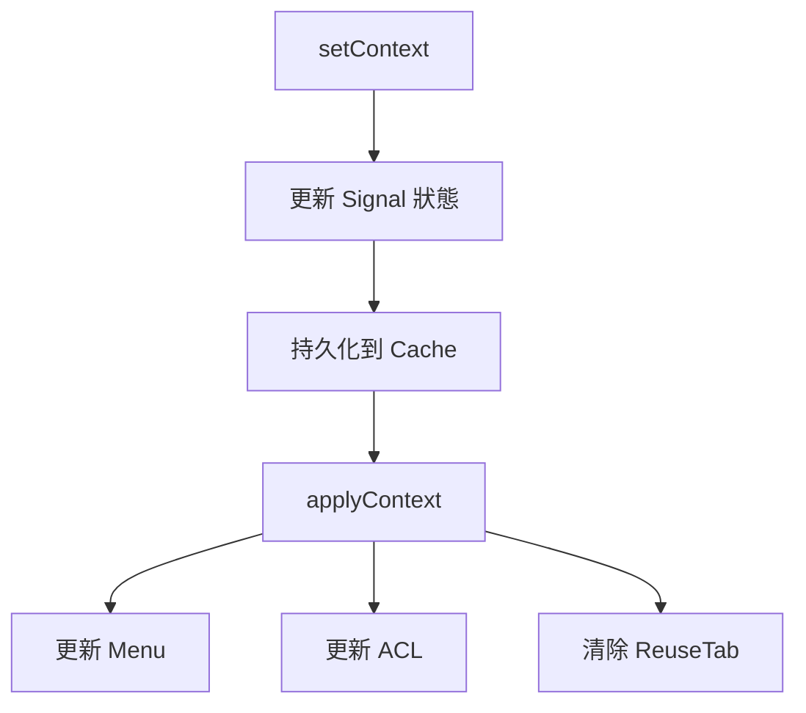

# Context Service 使用指南

## 概述

`ContextService` 是一個全局上下文服務，用於管理應用的上下文狀態（個人/組織/團隊）。它整合了 `MenuService`、`ACLService`、`ReuseTabService` 和 `CacheService`，提供統一的上下文切換功能。

## 功能特性

- ✅ **Signals 狀態管理**：使用 Angular 20 Signals API 提供響應式狀態
- ✅ **持久化支援**：使用 `@delon/cache` 持久化上下文，重新整理頁面後保持狀態
- ✅ **自動同步**：上下文切換時自動同步 Menu、ACL、ReuseTab
- ✅ **動態 ID 處理**：自動替換菜單連結中的 `:id` 佔位符
- ✅ **階層式導航**：支援「組織 → 團隊」的階層式上下文切換

## 基本用法

### 注入服務

```typescript
import { inject } from '@angular/core';
import { ContextService } from '@core';

export class MyComponent {
  private contextService = inject(ContextService);
}
```

### 訂閱上下文變化

```typescript
import { effect } from '@angular/core';

constructor() {
  effect(() => {
    const context = this.contextService.context();
    console.log('Current context:', context);
  });
}
```

### 切換上下文

#### 切換到個人視角

```typescript
this.contextService.switchToPersonal();
```

#### 切換到組織視角

```typescript
const organizationId = 'org-123';
const organizationName = '123組織';
this.contextService.switchToOrganization(organizationId, organizationName);
```

#### 切換到團隊視角

```typescript
const teamId = 'team-456';
const teamName = '456團隊';
const organizationId = 'org-123'; // 可選，團隊所屬的組織 ID
this.contextService.switchToTeam(teamId, teamName, organizationId);
```

### 獲取當前上下文

```typescript
// 使用 Signal（響應式）
const context = this.contextService.context();

// 使用快照（非響應式）
const snapshot = this.contextService.snapshot;
```

### 使用 Computed Signals

```typescript
// 檢查上下文類型
const isPersonal = this.contextService.isPersonal();
const isOrganization = this.contextService.isOrganization();
const isTeam = this.contextService.isTeam();

// 獲取上下文資訊
const contextType = this.contextService.contextType(); // 'personal' | 'organization' | 'team'
const contextId = this.contextService.contextId(); // string | null | undefined
const contextName = this.contextService.contextName(); // string | undefined
```

## 進階用法

### 初始化菜單資料

在 `StartupService` 或 `MenuContextService` 中初始化菜單資料：

```typescript
this.contextService.initializeMenuData({
  personalMenu: personalMenuData,
  organizationMenu: organizationMenuData,
  teamMenu: teamMenuData
});
```

### 自定義上下文切換

如果需要更細粒度的控制，可以直接使用 `setContext` 方法：

```typescript
this.contextService.setContext({
  type: 'team',
  id: 'team-456',
  name: '456團隊',
  data: {
    organizationId: 'org-123',
    customField: 'customValue'
  }
});
```

## 架構設計

### 上下文類型定義

```typescript
export type AppContextType = 'personal' | 'organization' | 'team';

export interface AppContext {
  type: AppContextType;
  id?: string | null;
  name?: string;
  data?: Record<string, unknown>;
}
```

### 服務整合

`ContextService` 整合了以下服務：

1. **MenuService**：動態更新左側選單
2. **ACLService**：同步權限控制
3. **ReuseTabService**：清除路由快取
4. **CacheService**：持久化上下文狀態

### 上下文切換流程



## 與 HeaderContextSwitcherComponent 整合

`HeaderContextSwitcherComponent` 是左側欄位的上下文切換器，已經整合了 `ContextService`：

### UI 結構

```
個人視角
─────────────
組織A
├── 組織A（組織）
├── ─────────────
├── 團隊1（團隊）
└── 團隊2（團隊）

組織B
├── 組織B（組織）
├── ─────────────
├── 團隊3（團隊）
└── 團隊4（團隊）
```

### 功能實作

- 點擊「個人視角」：切換到個人上下文
- 點擊「組織A（組織）」：切換到組織A的上下文
- 點擊「團隊1（團隊）」：切換到團隊1的上下文

所有切換都會自動更新菜單、ACL 和 ReuseTab。

## 菜單資料檔案

上下文菜單資料存放在 `src/assets/tmp/` 目錄：

- `user-data.json` - 個人視角菜單
- `organization-data.json` - 組織視角菜單
- `team-data.json` - 團隊視角菜單

### 動態 ID 替換

菜單連結中的 `:id` 佔位符會自動替換為當前上下文的 ID：

```json
{
  "text": "Team Members",
  "link": "/org/teams/:id/members"
}
```

當切換到 `team-456` 時，連結會自動變為：

```
/org/teams/team-456/members
```

## 權限管理

### 預設權限設定

- **個人模式**：`setFull(true)` - 全權限（開發階段）
- **組織模式**：`setRole(['org-admin'])` - 組織管理員角色
- **團隊模式**：`setRole(['team-member'])` - 團隊成員角色

### 自訂權限

如需自訂權限，可以修改 `ContextService.applyACL()` 方法：

```typescript
private applyACL(ctx: AppContext): void {
  switch (ctx.type) {
    case 'personal':
      // 根據用戶實際角色設定權限
      this.acl.setRole(this.getUserRoles());
      break;
    // ...
  }
}
```

## 注意事項

1. **上下文持久化**：上下文會持久化到 `localStorage`（透過 `CacheService`），重新整理頁面後會自動恢復
2. **路由快取清除**：每次切換上下文時會清除 `ReuseTab`，確保不同上下文的資料不會互相污染
3. **菜單資料初始化**：必須在 `StartupService` 中初始化菜單資料，否則上下文切換時無法載入正確的菜單
4. **權限同步**：ACL 權限會在上下文切換時自動同步，無需手動更新

## 測試建議

1. 測試個人 → 組織切換
2. 測試組織 → 團隊切換
3. 測試團隊 → 個人切換
4. 驗證 Menu、ACL、ReuseTab 是否正確更新
5. 驗證重新整理頁面後上下文是否正確恢復
6. 驗證資料檔案正確載入

## 相關檔案

- `src/app/core/services/context.service.ts` - ContextService 實作
- `src/app/core/services/context.model.ts` - 型別定義
- `src/app/core/services/context-menus.ts` - 菜單配置
- `src/app/core/menu-context/menu-context.service.ts` - MenuContextService 整合
- `src/app/layout/basic/widgets/context-switcher.component.ts` - UI 元件
