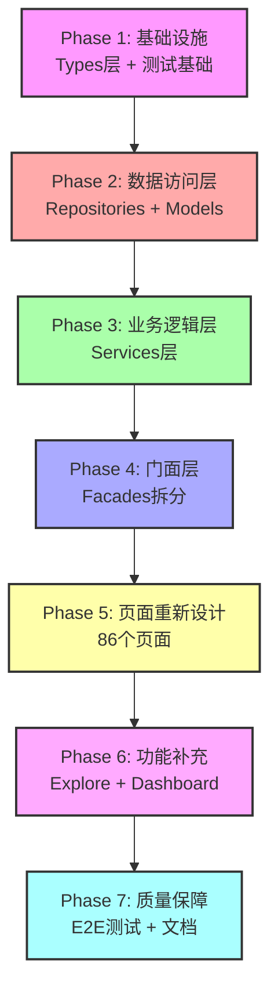

# Workspace 系统完整实施主计划

> **文档版本**: v1.0  
> **创建日期**: 2025-11-21  
> **文档类型**: 企业级项目管理文档  
> **状态**: 📋 执行中

---

## 📋 执行摘要

### 项目概述

本计划整合了 `docs/workspace/` 目录下所有工作文档，提供系统化的实施路线图，确保 ng-alain-gighub 项目的 Workspace Context Manager 系统达到企业级生产就绪状态。

### 关键统计

| 类别 | 工作项数量 | 预估工时 | 优先级分布 |
|------|-----------|---------|-----------|
| 页面重新设计 | 86个 | 6周 | P0:35, P1:28, P2:22 |
| 额外工作项 | 47个 | 184天 | P0:14, P1:19, P2:14 |
| 五层架构增强 | 48个模块 | 38-55天 | P0:20, P1:28 |
| Facades增强 | 10个Facade | 20-31天 | P0 |
| **总计** | **191项** | **20-43周** | - |

### 项目目标

1. ✅ **完整性**: 所有层级具备完整的基础方法和类型定义
2. ✅ **一致性**: 遵循统一的命名规范和架构模式
3. ✅ **可维护性**: 避免单一文件过度肥大，采用模块化设计
4. ✅ **企业标准**: 符合 SOLID 原则、测试覆蓋率 >80%、文档完整
5. ✅ **生产就绪**: 安全加固、性能优化、完整的用户和开发者文档

---

## 📖 目录

1. [项目范围](#项目范围)
2. [架构概览](#架构概览)
3. [七阶段实施计划](#七阶段实施计划)
4. [依赖关系与关键路径](#依赖关系与关键路径)
5. [资源需求](#资源需求)
6. [风险管理](#风险管理)
7. [质量保障](#质量保障)
8. [参考文档索引](#参考文档索引)

---

## 🎯 项目范围

### 1. 页面重新设计 (86个)

**详细文档**: [pages-requiring-redesign.md](./pages-requiring-redesign.md)

#### P0 - 立即实施 (35个页面)
- **任务管理模块** (12个): task-list, task-calendar, task-board, task-tree 等
- **蓝图管理模块** (11个): blueprint-list, blueprint-detail, branch-management 等
- **问题追踪模块** (8个): issue-list, issue-form, issue-detail 等
- **文档管理模块** (4个): document-list, document-upload, document-preview 等

#### P1 - 短期实施 (28个页面)
- **品质管理模块** (7个): quality-checks, quality-inspections 等
- **沟通协作模块** (9个): discussion-list, comment-list, notification-center 等
- **其他模块** (12个): account, collaboration, system 等

#### P2 - 长期实施 (22个页面)
- **机器人管理** (5个)
- **系统管理** (4个)
- **分析报表** (13个)

**关键设计原则**:
1. 移除 URL 参数依赖，改用 `WorkspaceContextFacade`
2. 所有页面显示上下文指示器
3. 数据加载基于当前上下文自动过滤
4. 支持上下文快速切换

---

### 2. 额外工作项 (47个)

**详细文档**: [workspace-missing-work-items-analysis.md](./workspace-missing-work-items-analysis.md)

#### 7大类别

| 类别 | 工作项 | 优先级 | 预估工时 |
|------|--------|--------|---------|
| 遗漏的功能模块 | 5 | P0:2, P1:2, P2:1 | 9天 |
| 基础设施工作 | 12 | P0:3, P1:5, P2:4 | 79天 |
| 代码技术债务 | 8 | P0:2, P1:4, P2:2 | 19天 |
| 服务层整合 | 6 | P0:3, P1:2, P2:1 | 19天 |
| 共享组件整合 | 7 | P0:1, P1:3, P2:3 | 11天 |
| 路由与导航改进 | 4 | P0:2, P1:1, P2:1 | 12天 |
| 数据层优化 | 5 | P0:1, P1:2, P2:2 | 17天 |

**关键发现**:
- **测试覆盖率极低**: 37个测试 vs 226个组件 (~16%)
- **技术债务严重**: 50+ 处 TODO/FIXME 标记
- **Explore 和 Dashboard 模块**: 完全未纳入 workspace 文档
- **服务层适配不足**: 20+ 个服务需要适配 workspace context

---

### 3. 五层架构增强 (48个模块)

**详细文档**: [five-layer-architecture-enhancement-plan.md](./five-layer-architecture-enhancement-plan.md)

#### 开发顺序（严格遵守）

```
Types 层 (P1, 2-3天)
  ↓ 定义枚举和基础类型
Repositories 层 (P0, 5-7天)
  ↓ 数据访问层
Models 层 (P1, 3-4天)
  ↓ 业务模型定义
Services 层 (P0, 8-10天)
  ↓ 业务逻辑层
Facades 层 (P0, 20-31天)
  ↓ 对外门面层
```

#### 各层详细检查清单

1. **Types 层**: [types-layer-enhancement-checklist.md](./types-layer-enhancement-checklist.md)
   - 补充10个枚举定义
   - 统一3处重复定义
   - 确保所有枚举值使用小写字符串

2. **Repositories 层**: [repositories-layer-enhancement-checklist.md](./repositories-layer-enhancement-checklist.md)
   - 10个Repository补充搜索方法
   - 统一错误处理和日志记录

3. **Models 层**: [models-layer-enhancement-checklist.md](./models-layer-enhancement-checklist.md)
   - 8个模块枚举重新导出
   - 4个扩展接口移动到Models层
   - 3处重复定义删除

4. **Services 层**: [services-layer-enhancement-checklist.md](./services-layer-enhancement-checklist.md)
   - 9个Service补充50+个方法
   - 添加20+个Signals状态管理
   - 10个Service添加reset()方法

5. **Facades 层**: [facades-layer-enhancement-checklist.md](./facades-layer-enhancement-checklist.md)
   - 10个Facade拆分与增强
   - 建立25+个子Facade
   - 参考Blueprint Facade标准实现

---

### 4. Facades 增强计划

**详细文档**: [facades-repositories-enhancement-plan.md](./facades-repositories-enhancement-plan.md)

#### Phase 1: 规划与分析 ✅ 已完成
- ✅ 完成Facades分析报告
- ✅ 建立实施指南和检查清单
- ✅ 参考标准确立 (Blueprint Facade)

#### Phase 2-7: 实施 (20-31天)
- **Week 5**: Task Facade 拆分与增强
- **Week 6**: Issue Facade 拆分与增强
- **Week 7**: Quality Facade 拆分与增强
- **Week 8**: Document Facade 增强
- **Week 9**: 其他Facades增强

**关键文档**:
- [facades-getting-started.md](./facades-getting-started.md) - 5分钟快速开始
- [facades-quick-reference.md](./facades-quick-reference.md) - 代码模板和常用命令
- [facades-implementation-guide.md](./facades-implementation-guide.md) - 7步骤实施流程
- [facades-project-summary.md](./facades-project-summary.md) - 项目总结
- [facades-enhancement-progress-history.md](./facades-enhancement-progress-history.md) - 进度历程

---

## 🏗️ 架构概览

### Workspace Context Manager 核心架构

```typescript
┌─────────────────────────────────────────────────────────┐
│                   Components Layer                       │
│  (86个页面需要重新设计，基于WorkspaceContextFacade)      │
└────────────────────┬────────────────────────────────────┘
                     │
┌────────────────────▼────────────────────────────────────┐
│                   Facades Layer                          │
│  (10个Facade需要拆分，25+个子Facade需要建立)            │
│  - WorkspaceContextFacade (核心)                        │
│  - Task/Issue/Quality/Document/Blueprint Facades        │
└────────────────────┬────────────────────────────────────┘
                     │
┌────────────────────▼────────────────────────────────────┐
│                   Services Layer                         │
│  (9个Service需要补充50+个方法，20+个Signals)            │
│  - Workspace Context Service                            │
│  - Business Logic Services                              │
└────────────────────┬────────────────────────────────────┘
                     │
┌────────────────────▼────────────────────────────────────┐
│                   Models Layer                           │
│  (8个模块需要枚举重新导出，4个接口需要移动)             │
│  - Entity Types & Interfaces                            │
│  - Extended Models                                       │
└────────────────────┬────────────────────────────────────┘
                     │
┌────────────────────▼────────────────────────────────────┐
│                 Repositories Layer                       │
│  (10个Repository需要补充搜索方法)                       │
│  - Data Access Layer                                     │
│  - Supabase Integration                                  │
└────────────────────┬────────────────────────────────────┘
                     │
┌────────────────────▼────────────────────────────────────┐
│                    Types Layer                           │
│  (10个枚举需要补充，3处重复需要统一)                    │
│  - Enums & Base Types                                    │
└─────────────────────────────────────────────────────────┘
```

### 上下文层级结构

```
个人上下文 (User Context)
    ↓ 加入
团队上下文 (Team Context)
    ↓ 隶属
组织上下文 (Organization Context)
    ↓ 建立
项目上下文 (Project Context)
```

---

## 🚀 七阶段实施计划

### Phase 1: 基础设施强化 (Week 1-2)

#### 目标
建立坚实的测试基础设施和类型系统，为后续开发提供保障。

#### 工作项

| # | 工作项 | 优先级 | 工时 | 负责人 | 状态 |
|---|--------|--------|------|--------|------|
| 1.1 | Workspace Context 核心服务测试 | P0 | 3天 | 测试工程师 | 📋 待开始 |
| 1.2 | 已整合页面测试补充 (4个页面) | P0 | 2天 | 测试工程师 | 📋 待开始 |
| 1.3 | 测试工具与辅助函数 | P1 | 2天 | 测试工程师 | 📋 待开始 |
| 1.4 | Types层增强 (10个枚举) | P1 | 2-3天 | 前端开发 | 📋 待开始 |
| 1.5 | RLS策略完整性审查 | P0 | 3天 | 后端工程师 | 📋 待开始 |
| 1.6 | 上下文权限验证 | P0 | 2天 | 后端工程师 | 📋 待开始 |

**交付物**:
- ✅ Workspace Context 测试覆盖率 > 80%
- ✅ Types层枚举定义完整
- ✅ RLS策略审查报告
- ✅ 测试工具库建立

**里程碑**: M1 - 基础设施就绪

---

### Phase 2: 数据访问层完善 (Week 3-4)

#### 目标
完成Repositories和Models层的增强，确保数据访问层的完整性和一致性。

#### 工作项

| # | 工作项 | 优先级 | 工时 | 负责人 | 状态 |
|---|--------|--------|------|--------|------|
| 2.1 | Repositories层搜索方法补充 | P0 | 5-7天 | 前端开发×2 | 📋 待开始 |
| 2.2 | Models层枚举重新导出 | P1 | 3-4天 | 前端开发 | 📋 待开始 |
| 2.3 | Repository单元测试 | P0 | 3天 | 测试工程师 | 📋 待开始 |
| 2.4 | Models层接口移动 | P1 | 1天 | 前端开发 | 📋 待开始 |

**关键Repository** (优先级排序):
1. Task Repository - 补充 `search()`
2. Issue Repository - 补充 `search()`
3. Document Repository - 补充 `search()`, `findByBlueprintId()`
4. QualityCheck Repository - 补充 `search()`, `findByBlueprintId()`
5. Inspection Repository - 补充 `search()`, `findByBlueprintId()`

**交付物**:
- ✅ 10个Repository搜索方法完成
- ✅ 8个模块枚举重新导出完成
- ✅ Repository测试覆盖率 > 80%
- ✅ 重复定义清理完成

**里程碑**: M2 - 数据访问层完善

---

### Phase 3: 业务逻辑层增强 (Week 5-6)

#### 目标
完成Services层的方法补充和Signals状态管理，建立完整的业务逻辑层。

#### 工作项

| # | 工作项 | 优先级 | 工时 | 负责人 | 状态 |
|---|--------|--------|------|--------|------|
| 3.1 | Task Service 方法补充 | P0 | 2天 | 前端开发 | 📋 待开始 |
| 3.2 | Issue Service 方法补充 | P0 | 2天 | 前端开发 | 📋 待开始 |
| 3.3 | Quality Check Service 增强 | P0 | 2天 | 前端开发 | 📋 待开始 |
| 3.4 | Document Service 增强 | P0 | 2天 | 前端开发 | 📋 待开始 |
| 3.5 | 其他Services增强 | P1 | 3天 | 前端开发×2 | 📋 待开始 |
| 3.6 | Service单元测试 | P0 | 3天 | 测试工程师 | 📋 待开始 |

**关键Service** (优先级排序):
1. Task Service - 6个方法 + Signals
2. Issue Service - 7个方法 + Signals
3. Quality Check Service - 8个方法 + Signals
4. Inspection Service - 6个方法 + Signals
5. Document Service - 5个方法 + Signals

**交付物**:
- ✅ 50+个基础CRUD方法完成
- ✅ 20+个Signals状态管理添加
- ✅ 10个Service reset()方法完成
- ✅ Service测试覆盖率 > 80%

**里程碑**: M3 - 业务逻辑层完善

---

### Phase 4: 门面层重构 (Week 7-12)

#### 目标
拆分过大的Facade文件，建立子Facade，完成门面层的企业级重构。

#### 工作项

| # | 工作项 | 优先级 | 工时 | 负责人 | 状态 |
|---|--------|--------|------|--------|------|
| 4.1 | Task Facade 拆分与增强 | P0 | 5天 | 前端架构师 | 📋 待开始 |
| 4.2 | Issue Facade 拆分与增强 | P0 | 5天 | 前端架构师 | 📋 待开始 |
| 4.3 | Quality Facade 拆分与增强 | P0 | 7天 | 前端开发×2 | 📋 待开始 |
| 4.4 | Document Facade 增强 | P0 | 4天 | 前端开发 | 📋 待开始 |
| 4.5 | Account Facade 增强 | P1 | 3天 | 前端开发 | 📋 待开始 |
| 4.6 | Collaboration Facade 增强 | P1 | 3天 | 前端开发 | 📋 待开始 |
| 4.7 | Communication Facade 增强 | P1 | 3天 | 前端开发 | 📋 待开始 |
| 4.8 | Bot Facade 增强 | P2 | 2天 | 前端开发 | 📋 待开始 |
| 4.9 | Analytics Facade 增强 | P2 | 2天 | 前端开发 | 📋 待开始 |
| 4.10 | System Facade 增强 | P2 | 2天 | 前端开发 | 📋 待开始 |
| 4.11 | Facade单元测试 | P0 | 5天 | 测试工程师 | 📋 待开始 |

**拆分模式** (参考Blueprint Facade):
```
facade/
├── {name}.facade.ts              # 主协调器
├── {name}-crud.facade.ts         # CRUD操作
├── {name}-{domain}.facade.ts     # 特定功能域
└── index.ts                      # 统一导出
```

**交付物**:
- ✅ 10个Facade拆分完成
- ✅ 25+个子Facade建立完成
- ✅ 50+个方法补充完成
- ✅ 所有Facade遵循协调器模式
- ✅ Facade测试覆盖率 > 80%

**里程碑**: M4 - 门面层重构完成

---

### Phase 5: 页面重新设计 (Week 13-21)

#### 目标
完成86个页面的Workspace Context Manager整合。

#### P0 页面整合 (Week 13-14, 35个)

| 模块 | 页面数 | 工时 | 负责人 | 状态 |
|------|--------|------|--------|------|
| 任务管理 | 12 | 3天 | 前端开发×2 | 📋 待开始 |
| 蓝图管理 | 11 | 3天 | 前端开发×2 | 📋 待开始 |
| 问题追踪 | 8 | 2天 | 前端开发 | 📋 待开始 |
| 文档管理 | 4 | 2天 | 前端开发 | 📋 待开始 |

**关键设计要求**:
1. 移除 `ActivatedRoute` 的 URL 参数依赖
2. 注入 `WorkspaceContextFacade`
3. 使用 `contextType()` 和 `contextId()` signals
4. 添加上下文指示器组件
5. 实现上下文切换响应

#### P1 页面整合 (Week 15-16, 28个)

| 模块 | 页面数 | 工时 | 负责人 | 状态 |
|------|--------|------|--------|------|
| 品质管理 | 7 | 2天 | 前端开发 | 📋 待开始 |
| 沟通协作 | 9 | 2天 | 前端开发 | 📋 待开始 |
| 帐户管理 | 6 | 2天 | 前端开发 | 📋 待开始 |
| 其他模块 | 6 | 2天 | 前端开发 | 📋 待开始 |

#### P2 页面整合 (Week 17-21, 22个)

| 模块 | 页面数 | 工时 | 负责人 | 状态 |
|------|--------|------|--------|------|
| 机器人管理 | 5 | 2天 | 前端开发 | 📋 待开始 |
| 系统管理 | 4 | 1天 | 前端开发 | 📋 待开始 |
| 分析报表 | 13 | 5天 | 前端开发×2 | 📋 待开始 |

**交付物**:
- ✅ 86个页面Workspace Context整合完成
- ✅ 所有页面单元测试覆盖率 > 70%
- ✅ 上下文切换流畅性验证
- ✅ 用户体验测试通过

**里程碑**: M5 - P0/P1页面整合完成

---

### Phase 6: 功能模块补充与技术债务清理 (Week 22-23)

#### 目标
完成遗漏的功能模块整合和技术债务清理。

#### 工作项

| # | 工作项 | 优先级 | 工时 | 负责人 | 状态 |
|---|--------|--------|------|--------|------|
| 6.1 | Explore模块整合 | P0 | 3天 | 前端开发 | 📋 待开始 |
| 6.2 | Dashboard模块整合 | P0 | 3天 | 前端开发 | 📋 待开始 |
| 6.3 | Issues模块TODO清理 | P0 | 3天 | 前端开发 | 📋 待开始 |
| 6.4 | Documents模块TODO清理 | P0 | 5天 | 前端开发×2 | 📋 待开始 |
| 6.5 | Blueprints模块TODO清理 | P1 | 3天 | 前端开发 | 📋 待开始 |
| 6.6 | URL结构优化 | P0 | 3天 | 前端架构师 | 📋 待开始 |
| 6.7 | 导航守卫增强 | P1 | 2天 | 前端开发 | 📋 待开始 |

**关键功能模块**:

1. **Explore模块** (全局搜索)
   - 添加上下文过滤模式
   - 搜索结果显示上下文标记
   - 提供快速切换功能

2. **Dashboard模块** (仪表板)
   - Workplace: 根据上下文显示不同数据
   - Analysis: 限制仅组织上下文可访问
   - Monitor: 系统管理员专用

3. **技术债务清理**
   - Issues模块: 10+ 处TODO
   - Documents模块: 20+ 处TODO
   - Blueprints模块: 10+ 处TODO

**交付物**:
- ✅ Explore和Dashboard模块整合完成
- ✅ 50+ 处TODO/FIXME清理完成
- ✅ URL结构优化完成
- ✅ 导航守卫测试通过

---

### Phase 7: 质量保障与文档完善 (Week 24-25)

#### 目标
建立完整的测试体系和文档，确保系统生产就绪。

#### 工作项

| # | 工作项 | 优先级 | 工时 | 负责人 | 状态 |
|---|--------|--------|------|--------|------|
| 7.1 | 核心流程E2E测试 | P0 | 5天 | 测试工程师 | 📋 待开始 |
| 7.2 | 上下文切换E2E测试 | P1 | 3天 | 测试工程师 | 📋 待开始 |
| 7.3 | 权限系统E2E测试 | P1 | 3天 | 测试工程师 | 📋 待开始 |
| 7.4 | Bundle大小分析与优化 | P1 | 3天 | 前端架构师 | 📋 待开始 |
| 7.5 | 虚拟滚动实施 | P1 | 5天 | 前端开发×2 | 📋 待开始 |
| 7.6 | Workspace Context完整使用指南 | P1 | 2天 | 技术文档工程师 | 📋 待开始 |
| 7.7 | 页面迁移逐步手册 | P1 | 2天 | 技术文档工程师 | 📋 待开始 |
| 7.8 | 故障排查指南 | P1 | 1天 | 技术文档工程师 | 📋 待开始 |
| 7.9 | 用户文档与视频教程 | P2 | 3天 | 技术文档工程师 | 📋 待开始 |

**测试目标**:
- ✅ 单元测试覆盖率: > 80%
- ✅ E2E测试覆盖核心流程: 100%
- ✅ 上下文切换测试: 所有场景
- ✅ 权限测试: 所有角色×所有上下文

**文档目标**:
- ✅ API完整参考文档
- ✅ 页面迁移教程（含代码示例）
- ✅ 常见问题解答（FAQ）
- ✅ 最佳实践指南
- ✅ 故障排查指南
- ✅ 用户使用指南

**交付物**:
- ✅ 完整的E2E测试套件
- ✅ 性能优化达标
- ✅ 开发者文档完善
- ✅ 用户文档完善
- ✅ 系统生产就绪

**里程碑**: M6 - 项目完成，系统生产就绪

---

## 🔗 依赖关系与关键路径

### 层级依赖关系



### 关键路径分析

**串行路径** (不可并行):
1. Types层 → Repositories层 → Models层 → Services层 → Facades层
   - 原因: 下层为上层提供基础
   - 工时: 2+7+4+10+31 = 54天

2. Facades层 → 页面重新设计
   - 原因: 页面依赖Facades提供的接口
   - 工时: 31+42 = 73天

**并行机会**:
1. 测试工作可与开发并行
2. P0/P1/P2页面可部分并行开发
3. 文档编写可提前开始

---

## 👥 资源需求

### 人力配置 (建议)

| 角色 | 人数 | 职责 | 关键技能 | 工作阶段 |
|------|------|------|---------|---------|
| 前端架构师 | 1 | 整体设计、技术决策、Code Review | Angular专家、架构设计 | Phase 1-7 |
| 前端开发工程师 | 3-4 | 页面重新设计、组件开发 | Angular、TypeScript、NG-ZORRO | Phase 2-6 |
| 测试工程师 | 1-2 | 单元测试、E2E测试、测试工具开发 | Jasmine、Playwright、测试策略 | Phase 1-7 |
| 后端工程师 | 1 | RLS策略、数据层优化 | Supabase、PostgreSQL、安全性 | Phase 1, 6 |
| 技术文档工程师 | 1 | 文档撰写、教程制作 | 技术写作、视频制作 | Phase 6-7 |
| **总计** | **7-9** | | | |

### 工时估算

| 阶段 | 乐观 | 现实 | 保守 |
|------|------|------|------|
| Phase 1: 基础设施 | 1.5周 | 2周 | 3周 |
| Phase 2: 数据访问层 | 1周 | 1.5周 | 2周 |
| Phase 3: 业务逻辑层 | 1.5周 | 2周 | 3周 |
| Phase 4: 门面层 | 4周 | 5周 | 6周 |
| Phase 5: 页面重新设计 | 6周 | 8周 | 10周 |
| Phase 6: 功能补充 | 1.5周 | 2周 | 3周 |
| Phase 7: 质量保障 | 2周 | 2.5周 | 3周 |
| **总计** | **17.5周** | **23周** | **30周** |

---

## ⚠️ 风险管理

### 高风险项 (需要特别关注)

| 风险 | 影响 | 可能性 | 应对措施 | 负责人 |
|------|------|--------|---------|--------|
| 测试覆盖率提升时间超出预期 | 高 | 高 | 优先核心功能测试，次要功能可延后 | 测试工程师 |
| Facades拆分复杂度超出预期 | 高 | 中 | 提前进行技术预研，参考Blueprint实现 | 前端架构师 |
| 页面重新设计数量庞大导致延期 | 高 | 中 | P0/P1优先，P2可延后；采用批量处理 | 项目经理 |
| 技术债务比预估更多 | 中 | 高 | 设定清理上限，部分债务延后处理 | 前端架构师 |
| 团队成员对workspace概念理解不足 | 高 | 中 | 提前进行培训，建立知识库 | 前端架构师 |
| RLS策略修改影响现有功能 | 高 | 低 | 充分测试，采用逐步迁移策略 | 后端工程师 |
| 性能优化效果不明显 | 中 | 中 | 进行性能基准测试，有数据支撑 | 前端架构师 |
| 用户抗拒新的上下文切换方式 | 中 | 低 | 提供完整的用户指南，收集反馈 | 产品经理 |

### 风险缓解策略

1. **早期识别**: 每周进行风险回顾，及时发现潜在问题
2. **备选方案**: 为高风险项准备Plan B
3. **缓冲时间**: 预留20%的缓冲时间处理意外情况
4. **知识分享**: 定期技术分享会，提升团队整体能力
5. **持续沟通**: 与利益相关者保持紧密沟通

---

## ✅ 质量保障

### 代码质量标准

#### 开发规范
- ✅ TypeScript strict mode 强制
- ✅ 遵循项目命名规范
- ✅ 添加适当的 JSDoc 注释
- ✅ 错误处理完善
- ✅ Signals 使用正确
- ✅ 依赖注入正确
- ✅ 无 any 类型使用
- ✅ 无 console.log 残留

#### 测试标准
- ✅ 单元测试覆盖率 > 80%
- ✅ 所有 CRUD 方法有测试
- ✅ 错误处理有测试
- ✅ Signals 状态变化有测试
- ✅ 边界条件有测试
- ✅ E2E 测试覆盖核心流程 100%

#### 性能标准
- ✅ 首次渲染时间 < 2秒
- ✅ API 响应时间 < 500ms
- ✅ 内存使用 < 100MB
- ✅ Bundle 大小增长 < 5%
- ✅ 无不必要的 API 调用
- ✅ 正确使用 OnPush 策略
- ✅ 避免嵌套订阅
- ✅ 使用 takeUntilDestroyed 清理订阅

### 审查流程

#### Code Review 检查清单
- [ ] 代码符合开发规范
- [ ] 单元测试通过且覆盖率达标
- [ ] 无 Lint 错误
- [ ] 无 Type 错误
- [ ] 性能指标达标
- [ ] 安全性检查通过
- [ ] 文档更新完整

#### PR 合并标准
- [ ] 至少1名架构师审核通过
- [ ] 所有CI检查通过
- [ ] 测试覆盖率 > 80%
- [ ] 无未解决的评论
- [ ] 相关文档已更新

### 持续集成

#### CI/CD Pipeline
1. **代码检查**
   - ESLint
   - Prettier
   - TypeScript Compiler
   
2. **测试**
   - 单元测试 (Jasmine/Karma)
   - E2E测试 (Playwright)
   - 测试覆盖率报告

3. **构建**
   - 生产构建
   - Bundle大小分析
   
4. **部署**
   - 预发布环境
   - 生产环境

---

## 📚 参考文档索引

### 核心规划文档

| 文档 | 描述 | 优先级 |
|------|------|--------|
| [README.md](./README.md) | Workspace系统文档总览 | ⭐⭐⭐⭐⭐ |
| [five-layer-architecture-enhancement-plan.md](./five-layer-architecture-enhancement-plan.md) | 五层架构增强总计划 | ⭐⭐⭐⭐⭐ |
| [workspace-missing-work-items-analysis.md](./workspace-missing-work-items-analysis.md) | 遗漏工作项分析 | ⭐⭐⭐⭐⭐ |
| [pages-requiring-redesign.md](./pages-requiring-redesign.md) | 86个页面清单 | ⭐⭐⭐⭐⭐ |
| [facades-repositories-enhancement-plan.md](./facades-repositories-enhancement-plan.md) | Facades增强计划 | ⭐⭐⭐⭐⭐ |

### 层级检查清单

| 文档 | 描述 | 优先级 |
|------|------|--------|
| [types-layer-enhancement-checklist.md](./types-layer-enhancement-checklist.md) | Types层检查清单 | ⭐⭐⭐⭐ |
| [repositories-layer-enhancement-checklist.md](./repositories-layer-enhancement-checklist.md) | Repositories层检查清单 | ⭐⭐⭐⭐ |
| [models-layer-enhancement-checklist.md](./models-layer-enhancement-checklist.md) | Models层检查清单 | ⭐⭐⭐⭐ |
| [services-layer-enhancement-checklist.md](./services-layer-enhancement-checklist.md) | Services层检查清单 | ⭐⭐⭐⭐ |
| [facades-layer-enhancement-checklist.md](./facades-layer-enhancement-checklist.md) | Facades层检查清单 | ⭐⭐⭐⭐ |

### Facades实施指南

| 文档 | 描述 | 优先级 |
|------|------|--------|
| [facades-getting-started.md](./facades-getting-started.md) | 5分钟快速开始 | ⭐⭐⭐⭐⭐ |
| [facades-quick-reference.md](./facades-quick-reference.md) | 快速参考 | ⭐⭐⭐⭐ |
| [facades-implementation-guide.md](./facades-implementation-guide.md) | 7步骤实施流程 | ⭐⭐⭐⭐ |
| [facades-enhancement-checklist.md](./facades-enhancement-checklist.md) | 详细检查清单 | ⭐⭐⭐⭐ |
| [facades-project-summary.md](./facades-project-summary.md) | 项目总结 | ⭐⭐⭐⭐⭐ |
| [facades-enhancement-progress-history.md](./facades-enhancement-progress-history.md) | 进度历程 | ⭐⭐⭐⭐⭐ |
| [facades-implementation-record.md](./facades-implementation-record.md) | 实施记录 | ⭐⭐⭐⭐⭐ |

### Workspace Context文档

| 文档 | 描述 | 优先级 |
|------|------|--------|
| [workspace-context-overview.md](./workspace-context-overview.md) | 功能总览 | ⭐⭐⭐⭐ |
| [workspace-context-usage-guide.md](./workspace-context-usage-guide.md) | 使用指南 | ⭐⭐⭐⭐ |
| [workspace-system-quick-reference.md](./workspace-system-quick-reference.md) | 快速参考 | ⭐⭐⭐ |
| [workspace-context-architecture-review.md](./workspace-context-architecture-review.md) | 架构审查 | ⭐⭐⭐⭐ |
| [workspace-context-switch-flowchart.mermaid.md](./workspace-context-switch-flowchart.mermaid.md) | 切换流程图 | ⭐⭐⭐⭐ |
| [workspace-context-migration-plan.md](./workspace-context-migration-plan.md) | 迁移计划 | ⭐⭐⭐⭐⭐ |

### 上下文菜单文档

| 文档 | 描述 | 优先级 |
|------|------|--------|
| [user-context-menu-documentation.md](./user-context-menu-documentation.md) | 个人上下文菜单 | ⭐⭐⭐ |
| [team-context-menu-documentation.md](./team-context-menu-documentation.md) | 团队上下文菜单 | ⭐⭐⭐ |
| [organization-context-menu-documentation.md](./organization-context-menu-documentation.md) | 组织上下文菜单 | ⭐⭐⭐ |

### 参考实现

| 位置 | 描述 | 作用 |
|------|------|------|
| `src/app/core/facades/blueprint/` | Blueprint Facade (已拆分) | 参考标准 ⭐⭐⭐⭐⭐ |
| `src/app/core/infra/types/blueprint/` | Blueprint Types | Types层参考 |
| `src/app/core/infra/repositories/blueprint/` | Blueprint Repository | Repositories层参考 |
| `src/app/shared/models/blueprint/` | Blueprint Models | Models层参考 |
| `src/app/shared/services/blueprint/` | Blueprint Service | Services层参考 |

---

## 📊 进度跟踪

### 整体进度

| 阶段 | 计划开始 | 计划结束 | 实际开始 | 实际结束 | 进度 | 状态 |
|------|---------|---------|---------|---------|------|------|
| Phase 1 | 待定 | 待定 | - | - | 0% | 📋 待开始 |
| Phase 2 | 待定 | 待定 | - | - | 0% | 📋 待开始 |
| Phase 3 | 待定 | 待定 | - | - | 0% | 📋 待开始 |
| Phase 4 | 待定 | 待定 | - | - | 0% | 📋 待开始 |
| Phase 5 | 待定 | 待定 | - | - | 0% | 📋 待开始 |
| Phase 6 | 待定 | 待定 | - | - | 0% | 📋 待开始 |
| Phase 7 | 待定 | 待定 | - | - | 0% | 📋 待开始 |

### 里程碑跟踪

| 里程碑 | 描述 | 计划日期 | 实际日期 | 状态 |
|--------|------|---------|---------|------|
| M1 | 基础设施就绪 | 待定 | - | 📋 待开始 |
| M2 | 数据访问层完善 | 待定 | - | 📋 待开始 |
| M3 | 业务逻辑层完善 | 待定 | - | 📋 待开始 |
| M4 | 门面层重构完成 | 待定 | - | 📋 待开始 |
| M5 | P0/P1页面整合完成 | 待定 | - | 📋 待开始 |
| M6 | 项目完成，生产就绪 | 待定 | - | 📋 待开始 |

---

## 📝 变更记录

| 日期 | 版本 | 变更内容 | 作者 |
|------|------|---------|------|
| 2025-11-21 | 1.0.0 | 初始版本创建，整合所有workspace文档 | AI Agent |

---

## 🎯 下一步行动

### 立即执行 (本周)
1. [ ] 召开项目启动会议，确认团队成员和资源
2. [ ] 建立项目跟踪看板 (Jira/GitHub Projects)
3. [ ] 设置每周进度审查会议时间
4. [ ] 创建项目专用Slack/Teams频道
5. [ ] 分配Phase 1工作任务

### 短期准备 (下周)
1. [ ] 完成开发环境设置和工具配置
2. [ ] 进行Workspace Context培训 (2小时)
3. [ ] 进行五层架构培训 (2小时)
4. [ ] 建立测试基础设施
5. [ ] 开始Types层增强

### 中期目标 (1个月内)
1. [ ] 完成Phase 1和Phase 2
2. [ ] 达到M2里程碑
3. [ ] 建立CI/CD Pipeline
4. [ ] 完成第一次代码审查

---

**最后更新**: 2025-11-21  
**维护者**: 项目管理团队  
**审查周期**: 每周  
**状态**: 📋 执行中
