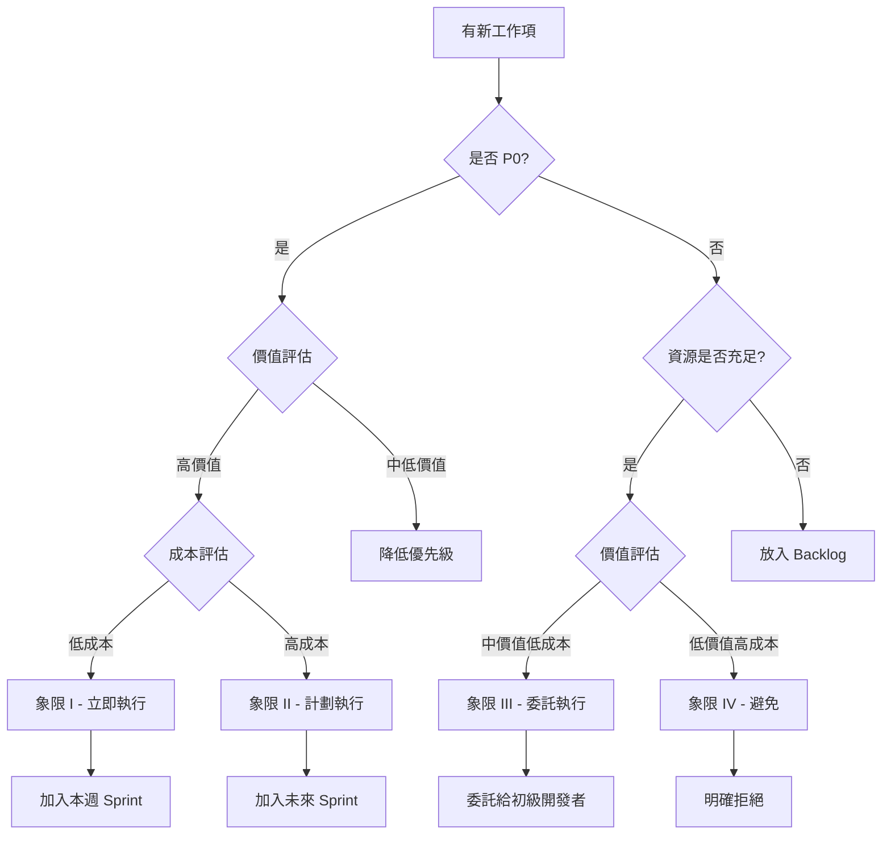

# 優先級決策矩陣

> **目的**: 幫助快速決定下一步應該做什麼  
> **使用者**: 架構師、開發團隊 Leader、專案經理  
> **更新頻率**: 每週五更新

---

## 🎯 決策矩陣使用指南

### 如何使用此矩陣

1. **查看當前階段**: 確認專案目前在哪個階段
2. **選擇優先級**: 根據時間和資源限制選擇 P0/P1/P2
3. **查看象限**: 使用四象限矩陣快速定位工作項
4. **做出決策**: 基於矩陣建議執行工作

### 四象限定義

```
  高價值
    ↑
    │  象限 I        │  象限 II
    │  立即執行      │  計劃執行
    │  (Quick Wins)  │  (Strategic)
────┼─────────────────┼────────→ 低成本
    │  象限 III      │  象限 IV
    │  委託他人      │  避免浪費
    │  (Delegate)    │  (Eliminate)
    ↓
  低價值
```

---

## 📊 當前階段：快速勝利階段（Week 1）

### 立即執行（本週內）

#### 象限 I：高價值 + 低成本 = 立即執行 ⭐⭐⭐⭐⭐

| 工作項 | 價值 | 成本 | 風險 | 預估時間 | 負責人 |
|--------|------|------|------|---------|--------|
| 技術債務快速清理 | 🟢 高 | 🟢 低 | 🟢 低 | 1 天 | Developer 1 |
| Types 層枚舉補充 | 🟢 高 | 🟢 低 | 🟢 低 | 1 天 | Developer 2 |
| Repository 搜索方法 (3個) | 🟢 高 | 🟢 低 | 🟢 低 | 2 天 | Developer 3-5 |
| 文檔快速改善 | 🟡 中 | 🟢 低 | 🟢 低 | 0.5 天 | Developer 3 |

**總計**: 4.5 天工作量，預期 5 人並行完成，實際 1 週

**立即行動建議**: ✅ 立即開始，這些是典型的 Quick Wins

#### 象限 II：高價值 + 高成本 = 計劃執行 ⭐⭐⭐⭐

| 工作項 | 價值 | 成本 | 風險 | 預估時間 | 開始時間 |
|--------|------|------|------|---------|---------|
| Facades 層重構 | 🟢 高 | 🔴 高 | 🟡 中 | 20-31 天 | Week 5 |
| 核心頁面重設計 (35個) | 🟢 高 | 🔴 高 | 🟡 中 | 14-21 天 | Week 11 |
| 測試覆蓋率大提升 | 🟢 高 | 🔴 高 | 🟡 中 | 30-40 天 | Week 17 |
| 安全性審查 (RLS) | 🟢 高 | 🟡 中 | 🟡 中 | 10-14 天 | Week 22 |

**計劃建議**: ⏰ 安排在未來階段，需要充分準備

#### 象限 III：低價值 + 低成本 = 委託/延後 ⭐⭐

| 工作項 | 價值 | 成本 | 風險 | 預估時間 | 建議 |
|--------|------|------|------|---------|------|
| P2 頁面重設計 (22個) | 🟡 中 | 🟡 中 | 🟢 低 | 14-21 天 | 延後至 Phase 3+ |
| 次要文檔完善 | 🟡 中 | 🟢 低 | 🟢 低 | 5-10 天 | 可委託給初級開發者 |
| 代碼註解補充 | 🟡 中 | 🟢 低 | 🟢 低 | 2 天 | 可在空檔時間進行 |

**建議**: ⏸️ 資源充足時再做，或委託給初級開發者

#### 象限 IV：低價值 + 高成本 = 避免 ⭐

| 工作項 | 價值 | 成本 | 風險 | 建議 |
|--------|------|------|------|------|
| 過度設計的抽象層 | 🔴 低 | 🔴 高 | 🔴 高 | ❌ 避免 |
| 非必要的技術遷移 | 🔴 低 | 🔴 高 | 🔴 高 | ❌ 避免 |
| 實驗性功能開發 | 🔴 低 | 🔴 高 | 🔴 高 | ❌ 延後 |

**建議**: 🚫 明確拒絕，專注高價值工作

---

## 📈 價值評估標準

### 高價值 (🟢)
- 直接影響核心功能
- 阻塞其他工作
- 企業標準必需項
- 測試覆蓋率提升
- 技術債務清理（高影響）

### 中價值 (🟡)
- 改善用戶體驗
- 提升開發效率
- 非核心功能
- 文檔完善
- 技術債務清理（低影響）

### 低價值 (🔴)
- Nice to have 功能
- 錦上添花的改進
- 實驗性探索
- 過度優化

---

## 💰 成本評估標準

### 低成本 (🟢)
- 工時 < 3 天
- 單人可完成
- 無依賴
- 風險低
- 可重複利用經驗

### 中成本 (🟡)
- 工時 3-10 天
- 需要 2-3 人協作
- 有部分依賴
- 風險中等
- 需要新技能學習

### 高成本 (🔴)
- 工時 > 10 天
- 需要團隊協作
- 複雜依賴關係
- 風險高
- 需要大量新知識

---

## 🎯 各階段優先工作項

### Week 1: 快速勝利階段
**目標**: 建立信心，見效快

| 排序 | 工作項 | 象限 | 優先級 |
|------|--------|------|--------|
| 1 | 技術債務快速清理 | I | P0 |
| 2 | Types 層枚舉補充 | I | P0 |
| 3 | Repository 搜索方法 | I | P0 |
| 4 | 文檔快速改善 | I | P1 |

**決策**: ✅ 全部立即執行

### Week 2-4: 基礎強化階段
**目標**: 完成五層架構前三層

| 排序 | 工作項 | 象限 | 優先級 |
|------|--------|------|--------|
| 1 | Repositories 層完善 | II | P0 |
| 2 | Models 層完善 | II | P0 |
| 3 | Services 層增強 | II | P0 |
| 4 | Repository 單元測試 | II | P0 |

**決策**: ✅ 按順序執行，不可跳過

### Week 5-10: Facades 重構階段
**目標**: 門面層模組化

| 排序 | 工作項 | 象限 | 優先級 |
|------|--------|------|--------|
| 1 | Task Facade | II | P0 |
| 2 | Issue Facade | II | P0 |
| 3 | Quality Facade | II | P0 |
| 4 | Document Facade | II | P0 |
| 5 | 其他 Facades | II | P1 |

**決策**: ✅ P0 必須完成，P1 視時間決定

### Week 11-14: 核心頁面階段
**目標**: P0 頁面 workspace 整合

| 排序 | 工作項 | 象限 | 優先級 |
|------|--------|------|--------|
| 1 | 任務管理模組 (12頁) | II | P0 |
| 2 | 藍圖管理模組 (11頁) | II | P0 |
| 3 | 問題追蹤模組 (8頁) | II | P0 |
| 4 | 文檔管理模組 (4頁) | II | P0 |

**決策**: ✅ P0 頁面全力完成

### Week 15-16: 功能模組補充
**目標**: 補充遺漏模組

| 排序 | 工作項 | 象限 | 優先級 |
|------|--------|------|--------|
| 1 | Explore 模組 | I | P0 |
| 2 | Dashboard 模組 | I | P0 |
| 3 | Passport 模組 | II | P1 |
| 4 | Profile & Settings | III | P2 |

**決策**: ✅ P0 立即，P1 盡力，P2 可延後

### Week 17-21: 測試大提升階段
**目標**: 測試覆蓋率 >80%

| 排序 | 工作項 | 象限 | 優先級 |
|------|--------|------|--------|
| 1 | Service 層測試 | II | P0 |
| 2 | Component 層測試 | II | P0 |
| 3 | 整合測試 | II | P0 |
| 4 | E2E 測試 | II | P0 |

**決策**: ✅ 不可妥協，必須達標

### Week 22-24: 安全與性能
**目標**: 達成企業級標準

| 排序 | 工作項 | 象限 | 優先級 |
|------|--------|------|--------|
| 1 | RLS 策略審查 | II | P0 |
| 2 | 安全漏洞掃描 | II | P0 |
| 3 | Lazy Loading | II | P1 |
| 4 | Bundle 優化 | II | P1 |
| 5 | 緩存策略 | II | P1 |

**決策**: ✅ P0 必須，P1 盡力

### Week 25-27: 文檔與收尾
**目標**: 生產就緒

| 排序 | 工作項 | 象限 | 優先級 |
|------|--------|------|--------|
| 1 | Workspace 使用指南 | II | P0 |
| 2 | 頁面遷移手冊 | II | P1 |
| 3 | API 文檔 | II | P1 |
| 4 | 用戶手冊 | III | P2 |

**決策**: ✅ P0 必須，P1 盡力，P2 視時間

---

## 🚦 決策流程圖



---

## 🎲 快速決策檢查清單

### 當不確定是否做某個工作時，問自己：

#### ✅ 符合以下條件 → 立即做
- [ ] 這是 P0 工作項？
- [ ] 阻塞其他重要工作？
- [ ] 企業標準必需項？
- [ ] 可在 3 天內完成？
- [ ] 風險低？

#### ⏰ 符合以下條件 → 計劃做
- [ ] 這是 P0-P1 工作項？
- [ ] 價值高但成本也高？
- [ ] 需要團隊協作？
- [ ] 有明確交付時間？

#### 🔄 符合以下條件 → 委託做
- [ ] 這是 P1-P2 工作項？
- [ ] 價值中等成本低？
- [ ] 可以由初級開發者完成？
- [ ] 不阻塞其他工作？

#### ❌ 符合以下條件 → 不要做
- [ ] 這是 P2 或更低？
- [ ] 價值低成本高？
- [ ] 實驗性質？
- [ ] Nice to have？
- [ ] 會增加技術債務？

---

## 📊 本週決策建議（Week 1）

### ✅ 立即執行（象限 I）
1. 技術債務快速清理
2. Types 層枚舉補充
3. Repository 搜索方法
4. 文檔快速改善

**理由**: 所有都是低成本高價值，典型 Quick Wins

### ⏸️ 本週不做
- ❌ Facades 重構（高成本，需要先完成基礎層）
- ❌ 頁面重設計（高成本，需要先完成 Facades）
- ❌ E2E 測試（高成本，需要先有功能）
- ❌ 性能優化（中等價值，非當前優先）

**理由**: 不符合快速勝利目標，且有依賴未完成

---

## 🔄 持續改進

### 每週回顧時更新

1. **評估本週工作項**: 哪些進入了錯誤象限？
2. **調整優先級**: 根據實際情況重新評估
3. **識別新的 Quick Wins**: 持續尋找低成本高價值工作
4. **移除阻礙**: 識別並解決阻塞工作的因素

### 每月回顧時更新

1. **重新評估所有工作項**: 價值和成本可能變化
2. **調整整體策略**: 根據進度調整計畫
3. **更新風險評估**: 新的風險可能出現

---

## 📚 相關文檔

- [剩餘工作全面分析](./REMAINING_WORK_ANALYSIS.md) - 完整工作項清單
- [執行摘要](./EXECUTIVE_SUMMARY.md) - 管理層總覽
- [第一週行動計畫](./WEEK1_ACTION_PLAN.md) - 詳細執行步驟
- [進度追蹤儀表板](./PROGRESS_TRACKING_DASHBOARD.md) - 實時進度

---

**最後更新**: 2025-11-22  
**下次更新**: 每週五  
**維護者**: 架構師
