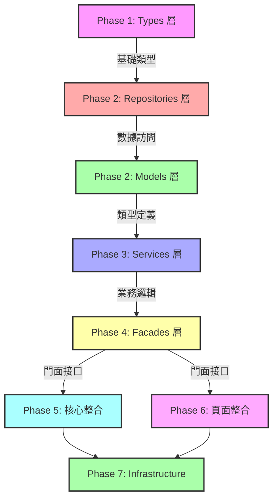

# Workspace System - Master Implementation Roadmap 🗺️

> **文檔類型**: 企業級主計劃  
> **建立日期**: 2025-01-21  
> **分析工具**: Sequential Thinking + Software Planning Tool  
> **狀態**: ✅ 分析完成，待執行

---

## 📊 Executive Summary (執行摘要)

### 真實規模

**原始預估**: 86 個頁面重新設計 = 6 週  
**實際規模**: **181 個工作項** = **19-26 週** ⚠️

| 類別 | 工作項數量 | 預估工時 | 說明 |
|------|-----------|---------|------|
| 頁面重新設計 | 86 個 | 6 週 | Workspace Context 整合 |
| 基礎設施與技術債務 | 47 個 | 20-37 週 | 測試、安全、性能、文檔 |
| 五層架構增強 | 48 個 | 38-55 天 | Types→Repos→Models→Services→Facades |
| **總計** | **181 個** | **19-26 週** | **現實評估（部分並行）** |

### 為什麼需要這麼久？

1. **五層架構必須按順序完成**（不能並行）:
   ```
   Types (2-3天) → Repositories (5-7天) → Models (3-4天) 
   → Services (8-10天) → Facades (20-31天)
   ```
   **理由**: 每層依賴下層，必須完成下層才能開始上層

2. **測試覆蓋率極低**（16% vs 目標 70%+）:
   - 37 個測試 vs 226 個組件
   - 需要 43 天建立完整測試體系
   - 無測試保護的重構風險極高

3. **技術債務累積**:
   - 50+ 處 TODO/FIXME 標記
   - 20+ 個服務需要適配 workspace context
   - 7 個共享組件需要增強

4. **安全與性能基線缺失**:
   - RLS 策略需要全面審查（51 張表）
   - Bundle 大小優化
   - 數據庫查詢優化

---

## 🎯 Seven-Phase Master Plan (七階段主計劃)

### Phase 1: Foundation & Planning (Week 1-2) 🏗️

**目標**: 建立堅實基礎，避免後續返工

**關鍵交付物**:
- ✅ 測試基礎設施運行
- ✅ Types 層完成（10 個枚舉）
- ✅ 遷移工具就緒
- ✅ RLS 審查報告

**為什麼這麼重要?**
- 測試基礎設施是質量保證的基石
- Types 層是整個架構的基礎（所有層都依賴它）
- 沒有遷移工具，86 個頁面改造會充滿錯誤
- RLS 審查提前發現安全漏洞

**詳細計劃**: [Implementation Plan - Phase 1](#)

---

### Phase 2: Data Access Layer (Week 3-4) 💾

**目標**: 完成數據訪問層，為上層提供可靠數據接口

**關鍵交付物**:
- ✅ 10 個 Repository 搜索方法完成
- ✅ Models 層枚舉重新導出（8 個模組）
- ✅ Repository 測試覆蓋率 >80%

**依賴**: Phase 1 完成（Types 層）

**為什麼不能跳過?**
- Services 層需要 Repositories 提供數據
- 搜索功能是核心用戶體驗
- 測試覆蓋率保證重構安全

**詳細計劃**: [Implementation Plan - Phase 2](#)

---

### Phase 3: Business Logic Foundation (Week 5-7) 🧠

**目標**: 建立完整的業務邏輯層，清理技術債務

**關鍵交付物**:
- ✅ 10 個 Service 完全增強（50+ 方法，20+ Signals）
- ✅ Issues 模組 TODO 清理（10+ 處）
- ✅ Documents 模組 TODO 清理（20+ 處）
- ✅ Services 測試覆蓋率 >80%

**依賴**: Phase 2 完成（Repositories + Models）

**為什麼這是關鍵?**
- Services 是業務邏輯的核心
- Signals 狀態管理是 Angular 最佳實踐
- TODO 清理避免功能不完整

**詳細計劃**: [Implementation Plan - Phase 3](#)

---

### Phase 4: Facade Layer Enhancement (Week 8-13) 🎭

**目標**: 拆分與增強所有 Facades，建立標準模式

**關鍵交付物**:
- ✅ 10 個 Facade 拆分完成
- ✅ 25+ 子 Facade 建立
- ✅ 50+ 方法補充
- ✅ Blueprint & Tasks TODO 清理

**依賴**: Phase 3 完成（Services）

**最複雜階段**:
- Quality Facade 需要 7 天（6 個子 Facade）
- 需要建立 Coordinator 模式
- Blueprint Facade 作為參考標準

**詳細計劃**: [Implementation Plan - Phase 4](#)

---

### Phase 5: Dashboard & Core Integration (Week 14-15) 🎛️

**目標**: 核心模組與 Workspace Context 整合

**關鍵交付物**:
- ✅ Dashboard 模組整合（Workplace, Analysis, Monitor）
- ✅ Passport 模組整合（登錄、註冊流程）
- ✅ 3 個共享組件增強
- ✅ Explore 模組整合（全局搜索）

**依賴**: Phase 4 完成（Facades）

**用戶體驗關鍵**:
- Dashboard 是用戶首頁，必須完美
- 登錄流程決定第一印象
- Explore 是核心功能入口

**詳細計劃**: [Implementation Plan - Phase 5](#)

---

### Phase 6: Page Integration (Week 16-21) - 86 Pages 📄

**目標**: 所有頁面完成 Workspace Context 整合

**按優先級分批**:
- **Week 16-17**: P0 頁面（35 個）- 核心功能
- **Week 18-19**: P1 頁面（28 個）- 重要功能
- **Week 20-21**: P2 頁面（22 個）- 次要功能

**依賴**: Phase 4-5 完成（Facades + 核心模組）

**實施模式**（每個頁面）:
1. 移除 ActivatedRoute，注入 WorkspaceContextFacade
2. 替換 route.params 為 facade.contextId()
3. 添加上下文指示器
4. 更新數據加載邏輯
5. 添加單元測試
6. 手動測試

**品質保證**:
- 每批 5-10 個頁面
- 批次完成後集成測試
- 回歸測試確保無破壞

**詳細計劃**: [Implementation Plan - Phase 6](#)

---

### Phase 7: Infrastructure & Polish (Week 22-26) 🏅

**目標**: 系統級優化，確保生產就緒

**關鍵交付物**:

**Week 22**: 測試完善
- ✅ 核心流程 E2E 測試
- ✅ 單元測試覆蓋率 >70%

**Week 23**: 安全加固
- ✅ 所有 RLS 策略實施
- ✅ 安全審計通過

**Week 24**: 性能優化
- ✅ Bundle 大小減少 >10%
- ✅ 首次加載 <2s
- ✅ 上下文切換 <500ms

**Week 25**: 路由與架構優化
- ✅ 新 URL 結構實施
- ✅ 導航守衛增強
- ✅ Repository Pattern 完善

**Week 26**: 文檔與發布
- ✅ 完整開發者文檔
- ✅ 用戶指南
- ✅ 最終驗證
- ✅ 生產發布

**詳細計劃**: [Implementation Plan - Phase 7](#)

---

## 👥 Resource Requirements (資源需求)

### 推薦團隊配置（7-9 人）

| 角色 | 人數 | 時間投入 | 關鍵職責 |
|------|------|---------|---------|
| **前端架構師** | 1 | 100% | 技術決策、Code Review、解決阻塞 |
| **前端開發工程師** | 3-4 | 100% | 實施開發、單元測試 |
| **測試工程師** | 1-2 | 100% | 測試基礎設施、E2E 測試 |
| **後端工程師** | 1 | 50% | RLS 策略、數據庫優化 |
| **技術文檔工程師** | 1 | 50% | 文檔、教程、視頻 |

**總人力**: ~7.5-9 FTE (Full-Time Equivalent)

### 並行工作策略

**Week 1-2**: 
- Dev A: Types 層
- QA: 測試基礎設施
- Backend: RLS 審查

**Week 3-7**:
- Dev A: Repositories → Models
- Dev B: Services P0
- Dev C: Services P1

**Week 8-13**:
- Dev B: Task/Issue Facades
- Dev C: Quality/Document Facades
- Dev A: 其他 Facades

**Week 16-21**:
- All 4 Devs: 並行處理頁面（每人 20-22 個頁面）

**Week 22-26**:
- All: Infrastructure & Polish（各有分工）

---

## ⚠️ Critical Dependencies (關鍵依賴)

### 不可打破的順序依賴



**為什麼不能跳過或打亂順序？**

1. **Types → Repositories**: Repositories 使用 Types 定義的枚舉
2. **Repositories → Models**: Models 重新導出 Types，依賴 Repositories 提供數據
3. **Models → Services**: Services 使用 Models 的類型定義
4. **Services → Facades**: Facades 調用 Services 的方法
5. **Facades → Pages**: Pages 通過 Facades 訪問功能

**違反順序的後果**:
- ❌ 編譯錯誤（缺少類型定義）
- ❌ 循環依賴
- ❌ 大量返工
- ❌ 集成問題

---

## 🎯 Success Criteria (成功標準)

### 量化指標

| 類別 | 目標 | 測量方式 |
|------|------|---------|
| **功能完整性** | 100% | 所有 181 個工作項完成 |
| **測試覆蓋率** | >70% | Jest/Karma 覆蓋率報告 |
| **安全性** | 0 漏洞 | 安全審計 + RLS 測試 |
| **性能** | 首次加載 <2s | Lighthouse |
| **代碼質量** | 0 Lint 錯誤 | ESLint |
| **文檔完整性** | 100% | 所有文檔就位 |

### 定性標準

- ✅ 用戶可以流暢切換上下文
- ✅ 數據正確隔離（看不到不該看的）
- ✅ 開發者理解如何添加新頁面
- ✅ 代碼結構清晰，易於維護
- ✅ 無 console.log 殘留
- ✅ 無 TODO 殘留（除非有 Issue 追蹤）

---

## 🚨 Risk Management (風險管理)

### 高風險項目

| 風險 | 概率 | 影響 | 緩解措施 |
|------|------|------|---------|
| **測試時間超預期** | 高 | 高 | Week 1 立即建立測試基礎設施 |
| **Facade 拆分複雜度** | 中 | 高 | 使用 Blueprint Facade 作為參考 |
| **頁面整合破壞功能** | 中 | 高 | 小批次遷移 + 回歸測試 |
| **性能下降** | 低 | 中 | Week 24 專項優化 |
| **團隊理解不一致** | 中 | 高 | Week 0/1 培訓 + 文檔先行 |
| **RLS 策略過於寬鬆** | 中 | 致命 | Week 1 審查 + Week 23 實施 + 滲透測試 |

### 快速失敗點（建議提前決定是否繼續）

**Week 2 結束**:
- ❓ 測試基礎設施是否順利建立？
- ❓ Types 層是否無阻塞完成？
- ❓ 團隊是否理解五層架構？

**Week 7 結束**:
- ❓ Services 層是否按時完成？
- ❓ 技術債務清理是否可控？
- ❓ 測試覆蓋率是否達標？

**Week 13 結束**:
- ❓ Facades 拆分是否成功？
- ❓ 是否有太多返工？
- ❓ 團隊士氣如何？

---

## 📚 Documentation Map (文檔地圖)

### 核心規劃文檔（必讀）

1. **本文檔** - 主實施路線圖（你在這裡）
2. [五層架構增強總計劃](./five-layer-architecture-enhancement-plan.md) ⭐⭐⭐⭐⭐
   - 38-55 天工作量
   - 按層級詳細規劃
3. [Workspace 遺漏工作項分析](./workspace-missing-work-items-analysis.md) ⭐⭐⭐⭐⭐
   - 47 個額外工作項
   - 7 大類別詳細分析

### 分層檢查清單（實施參考）

4. [Types 層增強檢查清單](./types-layer-enhancement-checklist.md)
5. [Repositories 層增強檢查清單](./repositories-layer-enhancement-checklist.md)
6. [Models 層增強檢查清單](./models-layer-enhancement-checklist.md)
7. [Services 層增強檢查清單](./services-layer-enhancement-checklist.md)
8. [Facades 層增強檢查清單](./facades-layer-enhancement-checklist.md)

### Facades 專項文檔

9. [Facades 增強總計劃](./facades-repositories-enhancement-plan.md)
10. [Facades 實施指南](./facades-implementation-guide.md)
11. [Facades 快速參考](./facades-quick-reference.md)
12. [Facades 開始指南](./facades-getting-started.md)

### 頁面整合文檔

13. [需要重新設計的頁面清單](./pages-requiring-redesign.md) - 86 個頁面
14. [Workspace Context 遷移計劃](./workspace-context-migration-plan.md)

### 使用指南

15. [Workspace Context 總覽](./workspace-context-overview.md)
16. [Workspace Context 使用指南](./workspace-context-usage-guide.md)
17. [Workspace 系統快速參考](./workspace-system-quick-reference.md)

---

## 🚀 Quick Start (如何開始？)

### 選項 A: 全面實施（推薦給有充足資源的團隊）

```bash
# Step 1: 組建團隊（7-9 人）
# Step 2: Week 0 - 培訓與準備
#   - 閱讀所有核心文檔
#   - 理解五層架構
#   - 設置開發環境
# Step 3: Week 1 - Phase 1 開始
#   - 建立測試基礎設施
#   - Types 層開發
#   - RLS 審查
# Step 4: 按 Phase 順序執行
```

**優點**: 最完整、最穩固  
**缺點**: 需要 6-9 人、19-26 週  
**適用**: 企業級項目、有充足預算

---

### 選項 B: MVP 優先（適合資源受限團隊）

**縮減版計劃（10-12 週，3-4 人）**:

**Phase 1: 基礎 (2 週)**
- Types 層完成
- 測試基礎設施（簡化版）
- 僅 P0 的 RLS 審查

**Phase 2-3: 數據與服務 (3 週)**
- 僅 P0 Repositories（5 個）
- Models 層核心（Issue, Task, Quality, Document）
- 僅 P0 Services（4 個）

**Phase 4: 核心 Facades (2 週)**
- Task Facade（簡化版，不拆分）
- Issue Facade（簡化版）
- 暫時跳過 Quality, Document Facades

**Phase 5: P0 頁面整合 (2 週)**
- 僅整合 35 個 P0 頁面
- P1/P2 頁面延後

**Phase 6: 基本測試與優化 (1 週)**
- 核心流程 E2E 測試
- 基本性能優化

**優點**: 更快看到成果  
**缺點**: 功能不完整、技術債務累積  
**風險**: 後續補齊成本可能更高

---

### 選項 C: 混合策略（平衡版）

**中等規模（14-16 週，5-6 人）**:

- 完整執行 Phase 1-3（基礎、數據、服務）
- Phase 4 Facades 僅拆分 Task, Issue（跳過 Quality）
- Phase 5-6 整合 P0 + P1 頁面（63 個）
- Phase 7 基本 Infrastructure（跳過部分優化）

**優點**: 核心功能完整、時程可控  
**缺點**: 部分功能延後  
**適用**: 中型團隊、有一定時程壓力

---

## 💡 Decision Making Guide (決策指南)

### 我應該選擇哪個選項？

回答以下問題：

1. **團隊規模如何？**
   - <3 人 → 考慮 MVP 或分階段
   - 3-5 人 → 混合策略
   - 5-9 人 → 全面實施

2. **時程壓力多大？**
   - 必須 3 個月內 → MVP（但風險高）
   - 4-5 個月可接受 → 混合策略
   - 6 個月以上 → 全面實施

3. **技術債務容忍度？**
   - 不能有債務（企業級） → 全面實施
   - 可接受適量債務 → 混合策略
   - 追求速度優先 → MVP

4. **測試覆蓋率要求？**
   - 必須 >70% → 全面實施
   - 核心功能有測試即可 → 混合策略
   - 先上線再補測試 → MVP（不推薦）

5. **預算充足嗎？**
   - 充足 → 全面實施
   - 適中 → 混合策略
   - 緊張 → MVP 或分階段

### 推薦決策

**對於 ng-alain-gighub 項目**，基於以下考量：

- ✅ 這是企業級資源中心
- ✅ 安全性至關重要（51 張表 RLS）
- ✅ 用戶體驗要求高
- ✅ 技術債務已經累積（50+ TODO）

**建議**: **全面實施（選項 A）**

**理由**:
1. 技術債務必須清理，否則後續維護困難
2. 安全性不能妥協
3. 測試覆蓋率是長期質量保證
4. 五層架構是項目的核心設計，必須完整

**如果資源不足**:
- 寧可延後項目啟動時間，也不要倉促開始
- 或者降低初期功能範圍（僅做 Blueprint + Task 模組）
- 但不建議降低質量標準

---

## 📞 Contact & Support

### 問題與反饋

- **技術問題**: 聯繫前端架構師
- **進度問題**: 查看項目管理看板
- **文檔問題**: 提交文檔 Issue

### 持續更新

本文檔會隨項目進展持續更新：
- 每週五更新進度
- 每個 Phase 結束更新經驗教訓
- 重大決策更新決策記錄

---

## 📝 Change Log

| 日期 | 版本 | 變更內容 | 作者 |
|------|------|---------|------|
| 2025-01-21 | 1.0.0 | 初始版本創建，基於 Sequential Thinking + Software Planning Tool 分析 | AI Agent |

---

## 結論

ng-alain-gighub Workspace Context 系統的完整實施是一個 **19-26 週、181 個工作項、7 個階段** 的大型項目。成功的關鍵在於：

1. ✅ **嚴格遵循五層架構依賴順序**（Types → Repositories → Models → Services → Facades）
2. ✅ **從第一天就建立測試文化**（Week 1 測試基礎設施）
3. ✅ **持續集成與驗證**（小批次、快速反饋）
4. ✅ **強大的架構指導**（架構師 Code Review、設計評審）
5. ✅ **全程文檔跟進**（知識不流失）

**這不是一個 6 週的小項目，而是一個需要謹慎規劃、嚴格執行的企業級系統工程。**

選擇正確的策略、組建合適的團隊、遵循最佳實踐，我們可以在 19-26 週內交付一個生產就緒、企業標準的 Workspace Context 系統。

---

**最後更新**: 2025-01-21  
**維護者**: 前端架構團隊  
**審查週期**: 每週五  
**狀態**: ✅ 分析完成，等待啟動決策
