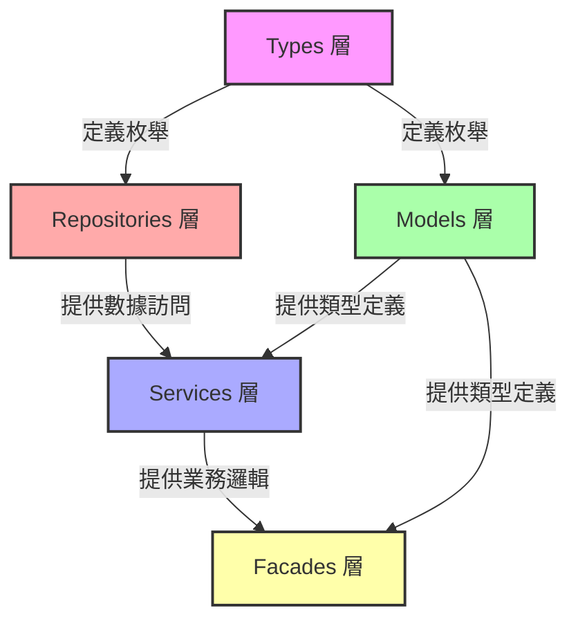

# 五層架構增強總計劃

> **建立日期**: 2025-11-21  
> **文檔類型**: 企業級工作計劃  
> **狀態**: 規劃中

---

## 📋 目的 (Purpose)

本文檔整合了五層架構（Types、Repositories、Models、Services、Facades）的完整性分析結果，提供系統性的增強計劃，確保各層級的基礎方法完整、一致且符合企業標準。

## 👥 目標讀者 (Audience)

- 前端開發者
- 架構師
- 技術負責人
- AI Agents

---

## 📖 目錄

1. [總覽](#總覽)
2. [五層架構開發順序](#五層架構開發順序)
3. [各層增強優先級](#各層增強優先級)
4. [時程規劃](#時程規劃)
5. [依賴關係](#依賴關係)
6. [實施指南](#實施指南)
7. [成功指標](#成功指標)
8. [參考文檔](#參考文檔)

---

## 🎯 總覽

### 背景

基於對專案五層架構的完整性分析，發現各層級存在以下主要問題：

1. **Types 層**: 枚舉定義不完整、重複定義、缺少重新導出
2. **Repositories 層**: 缺少搜索方法、按條件查詢方法
3. **Models 層**: 枚舉重新導出缺失、擴展接口位置不當
4. **Services 層**: 缺少基礎 CRUD 方法、Signals 不完整
5. **Facades 層**: 缺少基礎方法、單一文件過於肥大

### 目標

1. **完整性**: 所有層級具備完整的基礎方法和類型定義
2. **一致性**: 遵循統一的命名規範和結構模式
3. **可維護性**: 避免單一文件過度肥大，採用模組化拆分
4. **企業標準**: 符合 SOLID 原則和最佳實踐

### 統計摘要

| 層級 | 需要增強的模組 | 預估工作量 | 優先級 |
|------|--------------|----------|--------|
| Types | 10 個模組 | 2-3 天 | P1 |
| Repositories | 10 個 Repository | 5-7 天 | P0 |
| Models | 8 個模組 | 3-4 天 | P1 |
| Services | 10 個 Service | 8-10 天 | P0 |
| Facades | 10 個 Facade | 20-31 天 | P0 |
| **總計** | **48 個模組** | **38-55 天** | - |

---

## 📐 五層架構開發順序

根據 `docs/archive/00-順序.md` 的五層架構開發順序，增強工作應按以下順序進行：

```
1. Types 層 (core/infra/types/)
   ↓ 定義枚舉和基礎類型
   
2. Repositories 層 (core/infra/repositories/)
   ↓ 數據訪問層
   
3. Models 層 (shared/models/)
   ↓ 業務模型定義
   
4. Services 層 (shared/services/)
   ↓ 業務邏輯層
   
5. Facades 層 (core/facades/)
   ↓ 對外門面層
```

**原因**: 下層為上層提供基礎，必須先完成下層才能保證上層的正確性。

---

## 🔴 各層增強優先級

### 1️⃣ Types 層 (P1 - 2-3 天)

**優先級**: 🟡 中優先級（基礎設施）

**主要工作**:
- 補充缺失的枚舉定義（10+ 個枚舉）
- 統一重複定義的枚舉（3 處重複）
- 確保所有枚舉值使用小寫字符串
- 添加清晰的 JSDoc 註釋

**詳細文檔**: [types-layer-enhancement-checklist.md](./types-layer-enhancement-checklist.md)

**關鍵模組**:
- Quality Types: `InspectionStatus`, `InspectionType`
- Document Types: `DocumentUploadSource`
- Bot Types: `BotType`

---

### 2️⃣ Repositories 層 (P0 - 5-7 天)

**優先級**: 🔴 高優先級（數據訪問層）

**主要工作**:
- 補充搜索方法（10 個 Repository）
- 補充按條件查詢方法（5 個 Repository）
- 統一錯誤處理和日誌記錄

**詳細文檔**: [repositories-layer-enhancement-checklist.md](./repositories-layer-enhancement-checklist.md)

**關鍵模組** (優先級排序):
1. Task Repository - 缺少 `search()`
2. Issue Repository - 缺少 `search()`
3. Document Repository - 缺少 `search()`, `findByBlueprintId()`
4. QualityCheck Repository - 缺少 `search()`, `findByBlueprintId()`
5. Inspection Repository - 缺少 `search()`, `findByBlueprintId()`

---

### 3️⃣ Models 層 (P1 - 3-4 天)

**優先級**: 🟡 中優先級（類型定義層）

**主要工作**:
- 重新導出缺失的枚舉（8 個模組）
- 移動擴展接口到 Models 層（4 個接口）
- 刪除重複定義的枚舉（3 處）
- 補充缺失的實體類型（1 個）

**詳細文檔**: [models-layer-enhancement-checklist.md](./models-layer-enhancement-checklist.md)

**關鍵模組**:
- Issue Models: 缺少枚舉重新導出
- Bot Models: 缺少枚舉重新導出
- Communication Models: 缺少枚舉重新導出
- Quality Models: 需要移動 `InspectionDetail`

---

### 4️⃣ Services 層 (P0 - 8-10 天)

**優先級**: 🔴 高優先級（業務邏輯層）

**主要工作**:
- 補充基礎 CRUD 方法（50+ 個方法）
- 補充搜索方法（10 個 Service）
- 添加 Signals 狀態管理（20+ 個 Signals）
- 添加 `reset()` 方法（8 個 Service）
- 添加選擇方法（10 個 Service）

**詳細文檔**: [services-layer-enhancement-checklist.md](./services-layer-enhancement-checklist.md)

**關鍵模組** (優先級排序):
1. Task Service - 缺少 6 個方法
2. Issue Service - 缺少 7 個方法
3. Quality Check Service - 缺少 8 個方法 + Signals
4. Inspection Service - 缺少 6 個方法

---

### 5️⃣ Facades 層 (P0 - 20-31 天)

**優先級**: 🔴 高優先級（對外門面層）

**主要工作**:
- 拆分過大的 Facade 文件（10 個 Facade）
- 補充基礎方法（50+ 個方法）
- 建立子 Facade（25+ 個子 Facade）
- 重構主 Facade 為協調器模式

**詳細文檔**: [facades-layer-enhancement-checklist.md](./facades-layer-enhancement-checklist.md)

**關鍵模組** (優先級排序):
1. Task Facade - 拆分 + 補充 5 個方法
2. Issue Facade - 拆分 + 補充 6 個方法
3. Quality Facade - 拆分 + 補充 12 個方法
4. Document Facade - 拆分 + 補充 3 個方法

**已完成**: Blueprint Facade（參考標準）

---

## 📅 時程規劃

### 總體時程

| 階段 | 層級 | 工作量 | 開始日期 | 結束日期 | 狀態 |
|------|------|--------|---------|---------|------|
| Phase 1 | Types 層 | 2-3 天 | 待定 | 待定 | 📋 規劃中 |
| Phase 2 | Repositories 層 | 5-7 天 | 待定 | 待定 | 📋 規劃中 |
| Phase 3 | Models 層 | 3-4 天 | 待定 | 待定 | 📋 規劃中 |
| Phase 4 | Services 層 | 8-10 天 | 待定 | 待定 | 📋 規劃中 |
| Phase 5 | Facades 層 | 20-31 天 | 待定 | 待定 | 📋 規劃中 |
| **總計** | - | **38-55 天** | - | - | - |

### 詳細階段規劃

#### Phase 1: Types 層增強 (2-3 天)

**Week 1**:
- Day 1: Quality Types、Document Types 枚舉補充
- Day 2: Bot Types、統一重複定義枚舉
- Day 3: 驗證、測試、文檔更新

**交付物**:
- ✅ 10 個枚舉定義補充完成
- ✅ 3 處重複定義統一完成
- ✅ 所有枚舉添加 JSDoc 註釋

---

#### Phase 2: Repositories 層增強 (5-7 天)

**Week 1-2**:
- Day 1-2: Task、Issue Repository 搜索方法
- Day 3-4: Document、QualityCheck Repository 搜索方法
- Day 5: Inspection、Comment Repository 搜索方法
- Day 6: Bot、OrganizationCollaboration Repository 方法補充
- Day 7: 驗證、測試、文檔更新

**交付物**:
- ✅ 10 個 Repository 搜索方法完成
- ✅ 5 個 Repository 按條件查詢方法完成
- ✅ 單元測試覆蓋率 > 80%

---

#### Phase 3: Models 層增強 (3-4 天)

**Week 2-3**:
- Day 1: Issue、Bot、Communication Models 枚舉重新導出
- Day 2: Collaboration、System、Explore Models 枚舉重新導出
- Day 3: 移動擴展接口、刪除重複定義
- Day 4: 驗證、測試、文檔更新

**交付物**:
- ✅ 8 個模組枚舉重新導出完成
- ✅ 4 個擴展接口移動到 Models 層
- ✅ 3 處重複定義刪除完成

---

#### Phase 4: Services 層增強 (8-10 天)

**Week 3-4**:
- Day 1-2: Task Service 方法補充
- Day 3-4: Issue Service 方法補充
- Day 5-6: Quality Check、Inspection Service 方法補充
- Day 7: Account、Document Service 方法補充
- Day 8: Comment、Bot Service 方法補充
- Day 9: Collaboration Service 方法補充
- Day 10: 驗證、測試、文檔更新

**交付物**:
- ✅ 50+ 個方法補充完成
- ✅ 20+ 個 Signals 添加完成
- ✅ 10 個 Service `reset()` 方法完成
- ✅ 單元測試覆蓋率 > 80%

---

#### Phase 5: Facades 層增強 (20-31 天)

**Week 5-9** (參考 [facades-repositories-enhancement-plan.md](./facades-repositories-enhancement-plan.md)):

- **Week 5**: Task Facade 拆分與增強（5 天）
- **Week 6**: Issue Facade 拆分與增強（5 天）
- **Week 7**: Quality Facade 拆分與增強（7 天）
- **Week 8**: Document Facade 增強（4 天）
- **Week 9**: 其他 Facades 增強（5-10 天）

**交付物**:
- ✅ 10 個 Facade 拆分完成
- ✅ 25+ 個子 Facade 建立完成
- ✅ 50+ 個方法補充完成
- ✅ 所有 Facade 遵循協調器模式
- ✅ 單元測試覆蓋率 > 80%

---

## 🔗 依賴關係

### 層級依賴關係圖



### 模組間依賴關係

#### Types 層
- **無依賴**: Types 層是最底層，不依賴其他層
- **被依賴**: 所有其他層都依賴 Types 層的枚舉定義

#### Repositories 層
- **依賴**: Types 層（枚舉）、Database 類型
- **被依賴**: Services 層、Facades 層

#### Models 層
- **依賴**: Types 層（枚舉重新導出）、Database 類型
- **被依賴**: Services 層、Facades 層

#### Services 層
- **依賴**: Repositories 層、Models 層、Types 層
- **被依賴**: Facades 層、Components 層

#### Facades 層
- **依賴**: Services 層、Models 層
- **被依賴**: Components 層（頁面和組件）

---

## 📋 實施指南

### 開始前檢查清單

- [ ] 確認已閱讀五層架構開發順序文檔（`docs/archive/00-順序.md`）
- [ ] 確認已閱讀參考標準（Blueprint 實現）
- [ ] 確認開發環境已設置完成
- [ ] 確認已安裝所有依賴（`yarn install`）
- [ ] 確認代碼可以成功建構（`yarn build`）
- [ ] 確認測試可以成功運行（`yarn test`）

### 實施步驟

#### 1. Types 層增強

**步驟**:
1. 識別缺失的枚舉定義
2. 在 `core/infra/types/` 對應模組中補充枚舉
3. 確保枚舉值使用小寫字符串
4. 添加 JSDoc 註釋
5. 更新 `index.ts` 匯出
6. 驗證編譯無錯誤

**代碼示例**:
```typescript
/**
 * 檢查類型枚舉
 * 
 * @description 定義檢查的類型分類
 */
export enum InspectionType {
  /** 現場檢查 */
  SITE = 'site',
  /** 文件檢查 */
  DOCUMENT = 'document',
  /** 進度檢查 */
  PROGRESS = 'progress'
}
```

**檢查清單**:
- [ ] 枚舉定義完成
- [ ] JSDoc 註釋添加
- [ ] 匯出更新
- [ ] 編譯無錯誤
- [ ] Lint 檢查通過

---

#### 2. Repositories 層增強

**步驟**:
1. 在對應 Repository 中補充搜索方法
2. 參考 `BlueprintRepository.search()` 實現
3. 添加單元測試
4. 更新文檔註釋
5. 驗證編譯和測試

**代碼示例**:
```typescript
/**
 * 搜索任務（支持模糊查詢）
 *
 * @param query 搜索關鍵詞
 * @param options 查詢選項
 * @returns Observable<Task[]>
 */
search(query: string, options?: QueryOptions): Observable<Task[]> {
  if (!query || query.trim().length === 0) {
    return of([]);
  }

  const trimmedQuery = query.trim();
  let searchQuery = this.supabase
    .from(this.tableName as any)
    .select(options?.select || '*')
    .or(`title.ilike.%${trimmedQuery}%,description.ilike.%${trimmedQuery}%`);

  // 應用排序和分頁...
  
  return from(searchQuery as unknown as Promise<PostgrestResponse<any>>).pipe(
    map((response: PostgrestResponse<any>) => {
      const data = handleSupabaseResponse(response, `${this.constructor.name}.search`);
      return Array.isArray(data) ? data.map(item => toCamelCaseData<Task>(item)) : [];
    })
  );
}
```

**檢查清單**:
- [ ] 搜索方法實現
- [ ] 單元測試添加
- [ ] 文檔註釋更新
- [ ] 編譯無錯誤
- [ ] 測試通過
- [ ] Lint 檢查通過

---

#### 3. Models 層增強

**步驟**:
1. 在 Models 層重新導出 Types 層的枚舉
2. 移動 Service 層的擴展接口到 Models 層
3. 刪除 Models 層重複定義的枚舉
4. 更新 `index.ts` 匯出
5. 更新 Service 層的導入路徑

**代碼示例**:
```typescript
// issue/issue.models.ts

// 重新導出枚舉
export { 
  IssueStatus, 
  IssuePriority, 
  IssueSeverity, 
  IssuePhotoType, 
  IssueSyncStatus 
} from '@core';

// 實體類型定義
export type Issue = Database['public']['Tables']['issues']['Row'];
export type IssueInsert = Database['public']['Tables']['issues']['Insert'];
export type IssueUpdate = Database['public']['Tables']['issues']['Update'];

// 擴展接口（從 Service 層移動過來）
export interface IssueDetail extends Issue {
  assignedTo?: Account;
  reportedBy?: Account;
  photos?: IssuePhoto[];
  syncLogs?: IssueSyncLog[];
}
```

**檢查清單**:
- [ ] 枚舉重新導出完成
- [ ] 擴展接口移動完成
- [ ] 重複定義刪除
- [ ] 匯出更新
- [ ] 導入路徑更新
- [ ] 編譯無錯誤

---

#### 4. Services 層增強

**步驟**:
1. 補充基礎 CRUD 方法
2. 添加 Signals 狀態管理
3. 添加搜索方法
4. 添加選擇方法
5. 添加 `reset()` 方法
6. 添加單元測試

**代碼示例**:
```typescript
@Injectable({ providedIn: 'root' })
export class TaskService {
  // 1. Dependencies
  private readonly repository = inject(TaskRepository);
  
  // 2. Private signals
  private readonly tasksState = signal<Task[]>([]);
  private readonly selectedTaskState = signal<Task | null>(null);
  private readonly loadingState = signal<boolean>(false);
  private readonly errorState = signal<string | null>(null);
  
  // 3. Public readonly signals
  readonly tasks = this.tasksState.asReadonly();
  readonly selectedTask = this.selectedTaskState.asReadonly();
  readonly loading = this.loadingState.asReadonly();
  readonly error = this.errorState.asReadonly();
  
  // 4. Computed signals
  readonly pendingTasks = computed(() => 
    this.tasks().filter(t => t.status === TaskStatus.PENDING)
  );
  
  // 5. CRUD methods
  async loadTasks(): Promise<void> {
    this.loadingState.set(true);
    this.errorState.set(null);
    try {
      const tasks = await firstValueFrom(this.repository.findAll());
      this.tasksState.set(tasks);
    } catch (error) {
      this.errorState.set(error instanceof Error ? error.message : '加載失敗');
      throw error;
    } finally {
      this.loadingState.set(false);
    }
  }
  
  // 6. Search method
  async searchTasks(query: string, options?: QueryOptions): Promise<Task[]> {
    // Implementation...
  }
  
  // 7. Selection method
  selectTask(task: Task | null): void {
    this.selectedTaskState.set(task);
  }
  
  // 8. Reset method
  reset(): void {
    this.tasksState.set([]);
    this.selectedTaskState.set(null);
    this.errorState.set(null);
  }
}
```

**檢查清單**:
- [ ] CRUD 方法實現
- [ ] Signals 添加
- [ ] 搜索方法實現
- [ ] 選擇方法實現
- [ ] reset() 方法實現
- [ ] 單元測試添加
- [ ] 文檔註釋更新
- [ ] 編譯無錯誤
- [ ] 測試通過

---

#### 5. Facades 層增強

**步驟**:
1. 分析 Facade 文件大小和職責
2. 按功能域拆分子 Facade
3. 建立子 Facade 文件
4. 遷移方法到子 Facade
5. 重構主 Facade 為協調器
6. 補充缺失方法
7. 更新 `index.ts` 匯出
8. 添加單元測試

**代碼示例**:

**子 Facade**:
```typescript
// task/task-crud.facade.ts
@Injectable({ providedIn: 'root' })
export class TaskCrudFacade {
  private readonly service = inject(TaskService);
  
  // Expose signals
  readonly tasks = this.service.tasks;
  readonly loading = this.service.loading;
  
  // CRUD methods
  async loadTasks(): Promise<void> {
    return this.service.loadTasks();
  }
  
  async searchTasks(query: string, options?: QueryOptions): Promise<Task[]> {
    return this.service.searchTasks(query, options);
  }
  
  // ... other methods
}
```

**主 Facade（協調器）**:
```typescript
// task/task.facade.ts
@Injectable({ providedIn: 'root' })
export class TaskFacade implements OnDestroy {
  // Inject sub-facades
  readonly crud = inject(TaskCrudFacade);
  readonly assignment = inject(TaskAssignmentFacade);
  readonly list = inject(TaskListFacade);
  
  // Expose sub-facade signals
  readonly tasks = this.crud.tasks;
  readonly loading = this.crud.loading;
  
  // Delegate to sub-facades
  async loadTasks(): Promise<void> {
    return this.crud.loadTasks();
  }
  
  async assignTask(taskId: string, assigneeId: string): Promise<void> {
    return this.assignment.assignTask(taskId, assigneeId);
  }
}
```

**檢查清單**:
- [ ] Facade 拆分分析完成
- [ ] 子 Facade 建立
- [ ] 方法遷移完成
- [ ] 主 Facade 重構為協調器
- [ ] 缺失方法補充
- [ ] 匯出更新
- [ ] 單元測試添加
- [ ] 編譯無錯誤
- [ ] 測試通過

---

### 質量保證

#### 代碼審查檢查清單

- [ ] 代碼符合 TypeScript strict mode
- [ ] 遵循專案命名規範
- [ ] 添加適當的 JSDoc 註釋
- [ ] 錯誤處理完善
- [ ] Signals 使用正確
- [ ] 依賴注入正確
- [ ] 無 any 類型使用
- [ ] 無 console.log 殘留

#### 測試檢查清單

- [ ] 單元測試覆蓋率 > 80%
- [ ] 所有 CRUD 方法有測試
- [ ] 錯誤處理有測試
- [ ] Signals 狀態變化有測試
- [ ] 邊界條件有測試

#### 性能檢查清單

- [ ] 無不必要的 API 調用
- [ ] 正確使用 OnPush 策略
- [ ] 避免嵌套訂閱
- [ ] 使用 takeUntilDestroyed 清理訂閱
- [ ] 大列表使用虛擬滾動

---

## ✅ 成功指標

### 完整性指標

- ✅ Types 層: 所有枚舉定義完整（100%）
- ✅ Repositories 層: 所有主表 Repository 具備搜索方法（100%）
- ✅ Models 層: 所有枚舉正確重新導出（100%）
- ✅ Services 層: 所有 Service 具備基礎 CRUD 方法（100%）
- ✅ Facades 層: 所有 Facade 具備基礎方法（100%）

### 一致性指標

- ✅ 命名規範一致性: 100%
- ✅ 結構模式一致性: 100%
- ✅ 錯誤處理一致性: 100%
- ✅ Signals 使用一致性: 100%

### 可維護性指標

- ✅ 單一文件行數 < 800 行: 100%
- ✅ 方法行數 < 50 行: > 95%
- ✅ 職責分離清晰: 100%
- ✅ 註釋完整度: > 90%

### 測試指標

- ✅ 單元測試覆蓋率: > 80%
- ✅ 關鍵路徑測試覆蓋率: 100%
- ✅ 測試通過率: 100%

### 性能指標

- ✅ 首次渲染時間: < 2 秒
- ✅ API 響應時間: < 500ms
- ✅ 內存使用: < 100MB
- ✅ Bundle 大小增長: < 5%

---

## 📚 參考文檔

### 分析報告（已歸檔）

- [Types 層基礎方法完整性分析報告](../archive/types-analysis-report.md)
- [Repositories 層基礎方法完整性分析報告](../archive/repositories-analysis-report.md)
- [Models 層基礎方法完整性分析報告](../archive/models-analysis-report.md)
- [Services 層基礎方法完整性分析報告](../archive/services-analysis-report.md)
- [Facades 層基礎方法完整性分析報告](../archive/facades-analysis-report.md)

### 工作文檔（當前）

- [Types 層增強檢查清單](./types-layer-enhancement-checklist.md)
- [Repositories 層增強檢查清單](./repositories-layer-enhancement-checklist.md)
- [Models 層增強檢查清單](./models-layer-enhancement-checklist.md)
- [Services 層增強檢查清單](./services-layer-enhancement-checklist.md)
- [Facades 層增強檢查清單](./facades-layer-enhancement-checklist.md)

### 參考實現

- Blueprint Types: `src/app/core/infra/types/blueprint/`
- Blueprint Repository: `src/app/core/infra/repositories/blueprint/blueprint.repository.ts`
- Blueprint Models: `src/app/shared/models/blueprint/`
- Blueprint Service: `src/app/shared/services/blueprint/blueprint.service.ts`
- Blueprint Facade: `src/app/core/facades/blueprint/`（已拆分，作為參考標準）

### 架構文檔

- [五層架構開發順序](../archive/00-順序.md)
- [完整架構流程圖](../architecture/20-完整架構流程圖.mermaid.md)
- [架構審查報告](../architecture/21-架構審查報告.md)
- [SQL 表結構定義](../reference/22-完整SQL表結構定義.md)

### 開發規範

- [開發最佳實踐指南](../guides/development-best-practices-guide.md)
- [SHARED_IMPORTS 使用指南](../guides/SHARED_IMPORTS-guide.md)
- [前端狀態管理指南](../guides/frontend-state-management-guide.md)
- [代碼質量規範](.cursor/rules/01-core-development-standards.mdc)

---

## 📝 變更記錄

| 日期 | 版本 | 變更內容 | 作者 |
|------|------|---------|------|
| 2025-01-15 | 1.0.0 | 初始版本創建 | 開發團隊 |
| 2025-11-21 | 1.1.0 | 整合五層架構分析報告，創建企業標準工作計劃 | AI Agent |

---

**最後更新**: 2025-11-21  
**維護者**: 前端團隊  
**審查週期**: 每週  
**狀態**: 📋 規劃中
