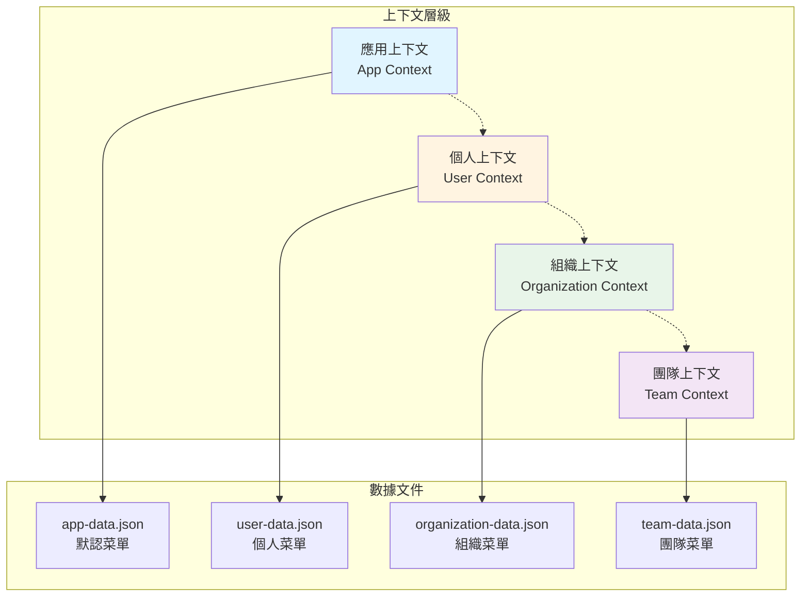
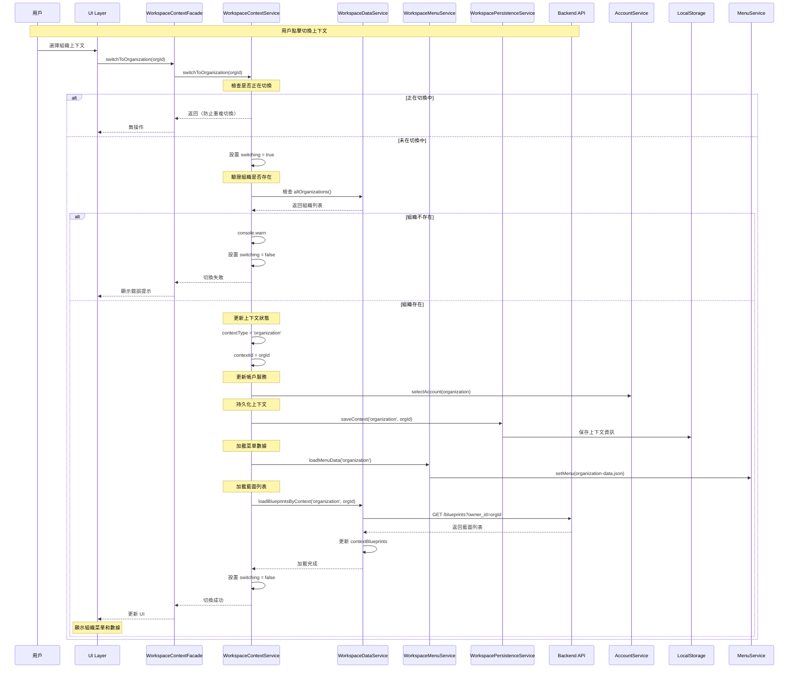
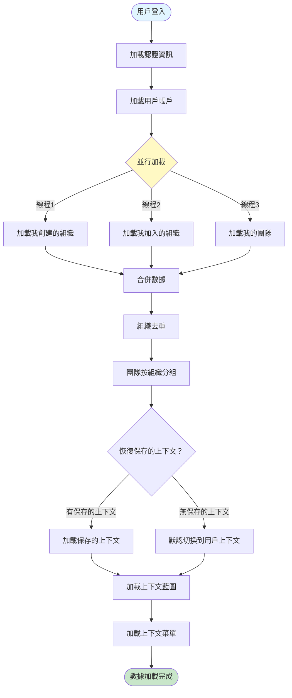
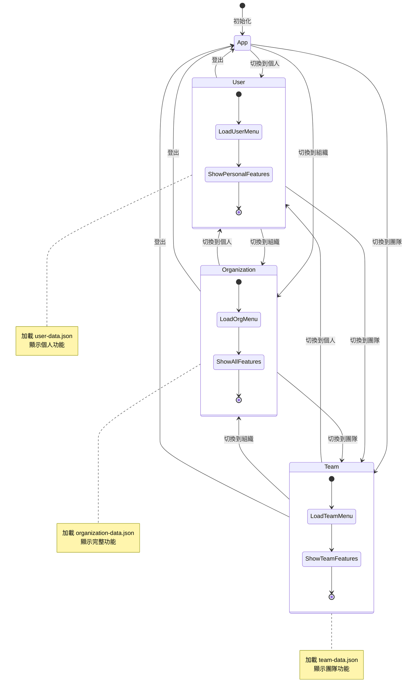
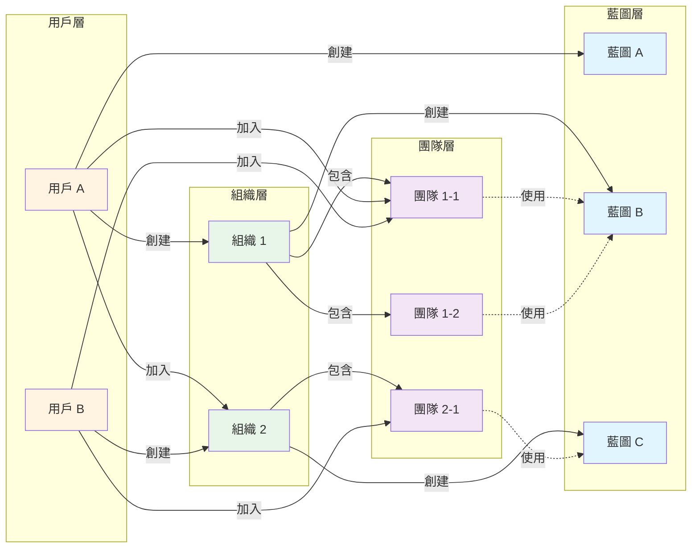
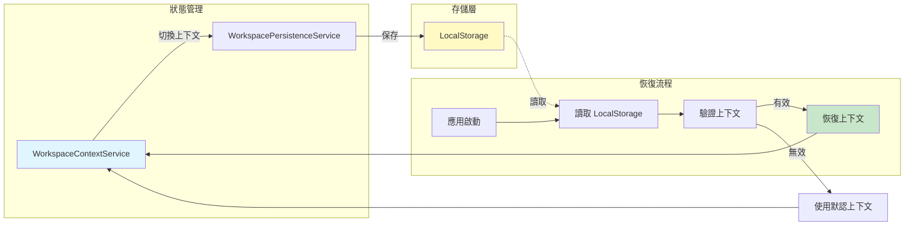
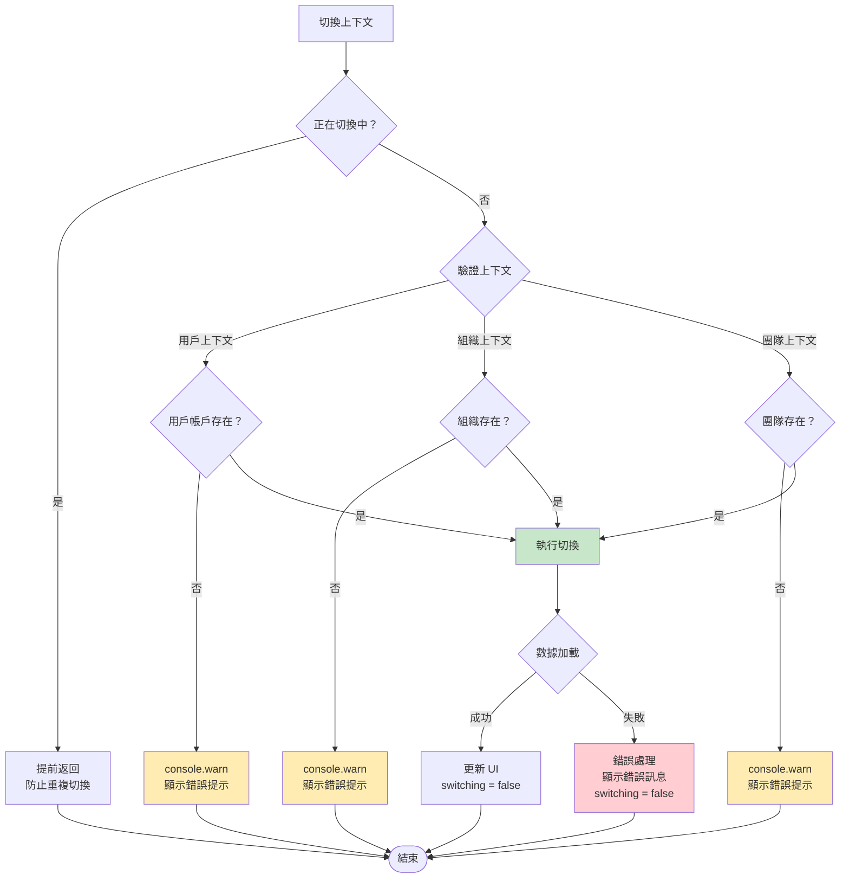
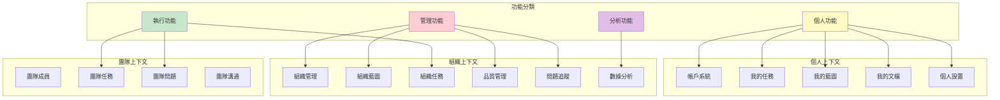
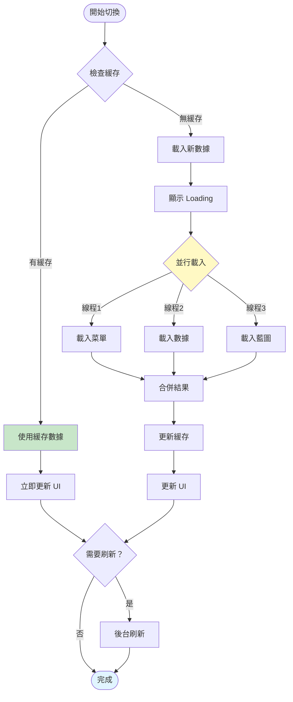
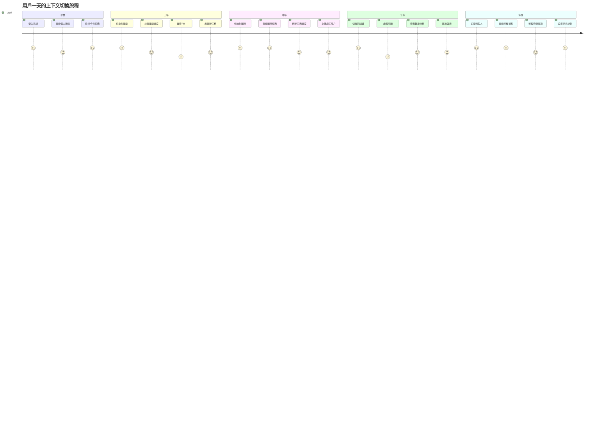

# 工作區上下文切換流程圖

## 📑 目錄

- [1. 上下文層級關係圖](#1-上下文層級關係圖)
- [2. 上下文切換完整流程](#2-上下文切換完整流程)
- [3. 數據加載流程](#3-數據加載流程)
- [4. 菜單更新流程](#4-菜單更新流程)
- [5. 上下文與數據關係圖](#5-上下文與數據關係圖)
- [6. 狀態持久化流程](#6-狀態持久化流程)
- [7. 錯誤處理流程](#7-錯誤處理流程)
- [8. 功能可用性對照](#8-功能可用性對照)
- [9. 上下文切換性能優化](#9-上下文切換性能優化)
- [10. 用戶旅程圖](#10-用戶旅程圖)
- [說明](#說明)
  - [圖表索引](#圖表索引)
  - [使用建議](#使用建議)
  - [相關資源](#相關資源)

---

> 📊 **目的**：視覺化展示工作區上下文切換的完整流程，包含數據加載、菜單更新和狀態管理

**最後更新**：2025-11-20
**相關文檔**：
- [工作區上下文使用與規劃指南](./工作區上下文使用與規劃指南.md) - 完整使用指南
- [工作區上下文系統架構審查](./工作區上下文系統架構審查.md) - 技術架構審查
- [工作區系統快速參考指南](./工作區系統-快速參考指南.md) - 開發者快速參考

- --

## 1. 上下文層級關係圖

## 2. 上下文切換完整流程

## 3. 數據加載流程

## 4. 菜單更新流程

## 5. 上下文與數據關係圖

## 6. 狀態持久化流程

## 7. 錯誤處理流程

## 8. 功能可用性對照

## 9. 上下文切換性能優化

## 10. 用戶旅程圖

- --

## 說明

### 圖表索引

1. **上下文層級關係圖**：展示四種上下文類型及其對應的數據文件
2. **上下文切換完整流程**：詳細的時序圖，展示切換過程中各組件的交互
3. **數據加載流程**：展示用戶登入後的數據加載步驟
4. **菜單更新流程**：狀態圖展示不同上下文間的切換關係
5. **上下文與數據關係圖**：展示用戶、組織、團隊、藍圖的關係
6. **狀態持久化流程**：展示上下文狀態如何保存和恢復
7. **錯誤處理流程**：展示切換過程中的錯誤處理機制
8. **功能可用性對照**：展示不同功能在各上下文的分佈
9. **上下文切換性能優化**：展示緩存和並行載入的優化策略
10. **用戶旅程圖**：展示用戶一天內的上下文使用場景

### 使用建議

- 開發者應參考**上下文切換完整流程**理解實現細節
- 產品經理應參考**功能可用性對照**規劃功能放置
- UI/UX 設計師應參考**用戶旅程圖**優化用戶體驗
- 架構師應參考**性能優化流程**進行系統優化

### 相關資源

- [工作區上下文使用與規劃指南](./工作區上下文使用與規劃指南.md) - 完整的功能說明和最佳實踐
- [工作區上下文系統架構審查](./工作區上下文系統架構審查.md) - 技術架構詳細審查
- [工作區系統快速參考指南](./工作區系統-快速參考指南.md) - 開發者快速參考手冊

- --

**文檔維護者**：開發團隊
**最後更新**：2025-11-20
