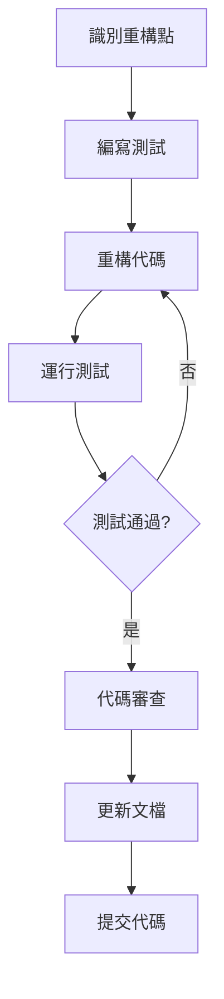

# 企業化標準審查與重構建議

> 📋 **目的**：分析現有專案代碼，提供企業化標準改進建議和重構方案，確保代碼符合 docs 規範和企業級開發標準

**最後更新**：2025-11-20  
**審查範圍**：工作區上下文系統及相關模組  
**審查標準**：
- [開發作業指引](./00-開發作業指引.md) - 開發規範
- [代碼質量規範](./.cursor/rules/06-code-quality.md) - 代碼質量標準
- [核心開發原則](./.cursor/rules/core-principles.md) - 四大核心原則

---

## 🎯 企業化標準定義

### 四大核心原則

根據專案的核心開發原則，企業化標準包含：

1. **常見做法 (Common Practices)**
   - 遵循 Angular 官方最佳實踐
   - 使用業界標準設計模式
   - 參考 NG-ZORRO 和 ng-alain 官方範例

2. **企業標準 (Enterprise Standards)**
   - 代碼結構清晰、職責分離明確
   - 完善的錯誤處理和日誌記錄
   - 規範的狀態管理（Signals）
   - 完整的 TypeScript 類型定義

3. **符合邏輯 (Logical)**
   - 數據流清晰、命名語義化
   - 條件判斷合理、邏輯簡潔
   - 組件初始化順序正確

4. **符合常理 (Common Sense)**
   - 功能真正可用、用戶體驗優先
   - 避免過度設計、及時驗證
   - 性能考量、安全意識

### 企業化標準檢查清單

#### 1. 代碼架構標準 ✅

- [ ] **分層架構清晰**
  - Core 層：單例服務、全局配置
  - Shared 層：共享組件、服務、工具
  - Routes 層：業務邏輯、頁面組件
  - 依賴方向正確：Routes → Shared → Core

- [ ] **職責分離明確**
  - Service 只負責數據和業務邏輯
  - Component 只負責 UI 和用戶交互
  - Facade 協調多個 Service
  - Repository 負責數據訪問

- [ ] **模組化設計**
  - 功能模組獨立
  - 可重用性高
  - 耦合度低

#### 2. TypeScript 類型安全 ✅

- [ ] **完整的類型定義**
  - 所有函數參數和返回值有明確類型
  - 避免使用 `any`（除非必要）
  - 使用 Interface 或 Type 定義數據結構

- [ ] **嚴格的類型檢查**
  - `strict: true` 在 tsconfig.json
  - `noImplicitAny: true`
  - `strictNullChecks: true`

- [ ] **類型文檔化**
  - 使用 JSDoc 註釋描述類型用途
  - 複雜類型提供使用範例

#### 3. Angular 20 現代化 ✅

- [ ] **Signals API 使用**
  - 使用 `signal()` 管理狀態
  - 使用 `computed()` 衍生數據
  - 使用 `effect()` 處理副作用

- [ ] **Standalone Components**
  - 所有組件為 Standalone
  - 使用 SHARED_IMPORTS
  - 避免 NgModules（除根模組）

- [ ] **現代化 API**
  - Signal Inputs: `input()`
  - Signal Outputs: `output()`
  - Signal Queries: `viewChild()`, `contentChild()`

#### 4. 錯誤處理標準 ✅

- [ ] **完善的錯誤處理**
  - 所有 HTTP 請求有錯誤處理
  - 使用 try-catch 包裹可能出錯的代碼
  - 錯誤訊息用戶友好

- [ ] **錯誤日誌記錄**
  - 使用 console.error 記錄錯誤
  - 包含上下文資訊
  - 生產環境使用錯誤追蹤服務

- [ ] **優雅降級**
  - 錯誤發生時不崩潰
  - 提供 fallback 機制
  - 用戶可恢復操作

#### 5. 安全標準 ✅

- [ ] **RLS 策略應用**
  - 所有 Supabase 查詢遵循 RLS
  - 前端不依賴權限判斷
  - 後端 Edge Functions 驗證權限

- [ ] **輸入驗證**
  - 所有用戶輸入驗證
  - 使用 Angular Forms 驗證
  - 防止 XSS、SQL Injection

- [ ] **敏感數據保護**
  - 不在前端暴露密鑰
  - 使用環境變數
  - HTTPS 傳輸

#### 6. 性能標準 ✅

- [ ] **OnPush 變更檢測**
  - 所有組件使用 `ChangeDetectionStrategy.OnPush`
  - 減少不必要的變更檢測

- [ ] **延遲加載**
  - 路由級別延遲加載
  - 大型模組按需加載

- [ ] **數據緩存**
  - 合理使用緩存減少 API 調用
  - 緩存過期策略清晰

#### 7. 測試標準 ✅

- [ ] **單元測試**
  - Service 測試覆蓋率 ≥ 80%
  - Component 測試覆蓋核心邏輯
  - 使用 Jasmine + Karma

- [ ] **測試質量**
  - 測試獨立、可重複
  - Mock 外部依賴
  - 測試邊界情況

#### 8. 文檔標準 ✅

- [ ] **代碼註釋**
  - Service 和 Component 有 JSDoc
  - 複雜邏輯有行內註釋
  - 公共 API 完整文檔

- [ ] **README 和指南**
  - 模組有 README 說明
  - 使用範例清晰
  - 架構決策文檔化

---

## 🔍 現有代碼審查

### 審查範圍

基於現有的工作區上下文系統，審查以下模組：

1. **Workspace Context Services** (`src/app/shared/services/workspace-context/`)
   - WorkspaceContextService
   - WorkspaceDataService
   - WorkspacePersistenceService

2. **Workspace Menu Service** (`src/app/core/services/workspace-menu.service.ts`)

3. **Account/Organization/Team Components** (`src/app/routes/accounts/`)

### 審查結果

#### ✅ 優點（已符合企業標準）

1. **現代化 Angular 20 架構**
   - ✅ 使用 Signals API (`signal()`, `computed()`, `effect()`)
   - ✅ Standalone Components
   - ✅ Inject function 依賴注入

2. **清晰的分層架構**
   - ✅ Core/Shared/Routes 分層明確
   - ✅ Service 職責單一
   - ✅ Facade 模式應用正確

3. **良好的代碼註釋**
   - ✅ Service 有詳細的 JSDoc
   - ✅ 使用範例清楚
   - ✅ 職責描述清晰

4. **TypeScript 類型使用**
   - ✅ 大部分函數有類型定義
   - ✅ 使用 Interface 定義數據結構

#### ⚠️ 需要改進的地方

### 1. TypeScript 類型安全改進 🔴 高優先級

**問題**：部分代碼使用 `NzSafeAny`，降低類型安全性

```typescript
// ❌ 當前代碼（workspace-menu.service.ts）
private userMenuData: NzSafeAny[] = [];
private organizationMenuData: NzSafeAny[] = [];
```

**改進方案**：定義明確的 Menu 類型

```typescript
// ✅ 改進後
// src/app/shared/models/menu.model.ts
export interface MenuItem {
  text: string;
  i18n?: string;
  icon?: string;
  link?: string;
  children?: MenuItem[];
  group?: boolean;
  hideInBreadcrumb?: boolean;
  [key: string]: any; // 允許額外屬性，但主要結構明確
}

// workspace-menu.service.ts
private userMenuData: MenuItem[] = [];
private organizationMenuData: MenuItem[] = [];
```

**重構步驟**：
1. 創建 `src/app/shared/models/menu.model.ts`
2. 定義 `MenuItem` interface
3. 更新所有 Menu Service 使用新類型
4. 更新相關組件和測試

---

### 2. 錯誤處理標準化 🔴 高優先級

**問題**：錯誤處理不統一，缺少全局錯誤處理策略

```typescript
// ❌ 當前代碼（部分 Service）
loadData() {
  this.http.get(url).subscribe(data => {
    // 處理數據
  });
  // 沒有錯誤處理
}
```

**改進方案**：統一的錯誤處理模式

```typescript
// ✅ 改進後
// src/app/core/services/error-handler.service.ts
@Injectable({ providedIn: 'root' })
export class ErrorHandlerService {
  private readonly message = inject(NzMessageService);

  handleError(error: Error, context?: string): void {
    console.error(`[${context}] Error:`, error);
    
    // 用戶友好的錯誤訊息
    if (error instanceof HttpErrorResponse) {
      if (error.status === 401) {
        this.message.error('登入已過期，請重新登入');
      } else if (error.status === 403) {
        this.message.error('權限不足');
      } else {
        this.message.error('操作失敗，請稍後再試');
      }
    } else {
      this.message.error('發生未預期的錯誤');
    }
  }
}

// 使用範例
loadData() {
  this.http.get(url).subscribe({
    next: data => { /* 處理數據 */ },
    error: err => this.errorHandler.handleError(err, 'loadData')
  });
}
```

**重構步驟**：
1. 創建 `ErrorHandlerService`
2. 定義統一的錯誤處理策略
3. 更新所有 Service 使用統一錯誤處理
4. 添加錯誤處理測試

---

### 3. 狀態管理標準化 🟡 中優先級

**問題**：狀態管理模式不一致，部分使用 BehaviorSubject，部分使用 Signals

**改進方案**：統一使用 Signals API

```typescript
// ❌ 舊代碼（混用）
private dataSubject = new BehaviorSubject<Data[]>([]);
readonly data$ = this.dataSubject.asObservable();

// ✅ 新代碼（統一 Signals）
private dataState = signal<Data[]>([]);
readonly data = this.dataState.asReadonly();

// Computed 衍生數據
readonly activeData = computed(() => 
  this.data().filter(d => d.status === 'active')
);
```

**重構步驟**：
1. 識別所有使用 BehaviorSubject 的地方
2. 逐步遷移到 Signals API
3. 更新相關組件訂閱方式
4. 更新測試

---

### 4. 組件職責分離 🟡 中優先級

**問題**：部分組件直接調用 Repository，應通過 Facade 或 Service

```typescript
// ❌ 當前代碼
export class AccountFormComponent {
  private readonly accountRepo = inject(AccountRepository);
  
  save() {
    this.accountRepo.create(data).subscribe(/* ... */);
  }
}
```

**改進方案**：通過 Facade 統一管理

```typescript
// ✅ 改進後
// src/app/core/facades/account.facade.ts
@Injectable({ providedIn: 'root' })
export class AccountFacade {
  private readonly accountRepo = inject(AccountRepository);
  private readonly errorHandler = inject(ErrorHandlerService);
  
  createAccount(data: AccountInput): Observable<Account> {
    return this.accountRepo.create(data).pipe(
      catchError(err => {
        this.errorHandler.handleError(err, 'createAccount');
        return throwError(() => err);
      })
    );
  }
}

// 組件
export class AccountFormComponent {
  private readonly accountFacade = inject(AccountFacade);
  
  save() {
    this.accountFacade.createAccount(data).subscribe(/* ... */);
  }
}
```

**重構步驟**：
1. 創建 Facade 層（如不存在）
2. 將業務邏輯從組件移到 Facade
3. 組件只調用 Facade
4. 更新測試

---

### 5. 路由參數處理標準化 🟡 中優先級

**問題**：路由參數處理分散，缺少統一的參數替換邏輯

**改進方案**：創建統一的路由工具服務

```typescript
// ✅ 改進方案
// src/app/core/services/route-utils.service.ts
@Injectable({ providedIn: 'root' })
export class RouteUtilsService {
  /**
   * 替換路由中的動態參數
   * @example
   * replaceParams('/accounts/:userId', { userId: '123' })
   * // 返回: '/accounts/123'
   */
  replaceParams(route: string, params: Record<string, string>): string {
    let result = route;
    Object.entries(params).forEach(([key, value]) => {
      result = result.replace(`:${key}`, value);
      result = result.replace(`?${key}=:${key}`, `?${key}=${value}`);
    });
    return result;
  }
  
  /**
   * 批量替換菜單項中的路由參數
   */
  replaceMenuParams(menu: MenuItem[], params: Record<string, string>): MenuItem[] {
    return menu.map(item => ({
      ...item,
      link: item.link ? this.replaceParams(item.link, params) : undefined,
      children: item.children ? this.replaceMenuParams(item.children, params) : undefined
    }));
  }
}
```

**重構步驟**：
1. 創建 `RouteUtilsService`
2. 將分散的路由處理邏輯集中
3. 更新 WorkspaceMenuService 使用工具服務
4. 添加單元測試

---

### 6. 數據驗證標準化 🟢 低優先級

**問題**：表單驗證邏輯分散，缺少共享驗證規則

**改進方案**：創建共享驗證器

```typescript
// ✅ 改進方案
// src/app/shared/validators/custom-validators.ts
export class CustomValidators {
  /**
   * 組織名稱驗證器
   */
  static organizationName(control: AbstractControl): ValidationErrors | null {
    const value = control.value;
    if (!value) return null;
    
    if (value.length < 2) {
      return { minLength: { requiredLength: 2, actualLength: value.length } };
    }
    if (value.length > 50) {
      return { maxLength: { requiredLength: 50, actualLength: value.length } };
    }
    if (!/^[a-zA-Z0-9\u4e00-\u9fa5_-]+$/.test(value)) {
      return { invalidFormat: true };
    }
    
    return null;
  }
  
  /**
   * 團隊名稱驗證器
   */
  static teamName = CustomValidators.organizationName; // 複用規則
}

// 使用範例
this.form = this.fb.group({
  name: ['', [Validators.required, CustomValidators.organizationName]]
});
```

**重構步驟**：
1. 創建 `CustomValidators` 類
2. 定義共享驗證規則
3. 更新表單使用共享驗證器
4. 添加驗證器測試

---

### 7. 日誌和監控標準化 🟢 低優先級

**問題**：缺少統一的日誌記錄策略

**改進方案**：創建 Logger Service

```typescript
// ✅ 改進方案
// src/app/core/services/logger.service.ts
export enum LogLevel {
  DEBUG = 0,
  INFO = 1,
  WARN = 2,
  ERROR = 3
}

@Injectable({ providedIn: 'root' })
export class LoggerService {
  private readonly env = inject(EnvironmentService);
  private minLevel = LogLevel.INFO;
  
  constructor() {
    // 開發環境顯示所有日誌
    if (!this.env.isProduction()) {
      this.minLevel = LogLevel.DEBUG;
    }
  }
  
  debug(message: string, context?: string, data?: any): void {
    this.log(LogLevel.DEBUG, message, context, data);
  }
  
  info(message: string, context?: string, data?: any): void {
    this.log(LogLevel.INFO, message, context, data);
  }
  
  warn(message: string, context?: string, data?: any): void {
    this.log(LogLevel.WARN, message, context, data);
  }
  
  error(message: string, context?: string, data?: any): void {
    this.log(LogLevel.ERROR, message, context, data);
  }
  
  private log(level: LogLevel, message: string, context?: string, data?: any): void {
    if (level < this.minLevel) return;
    
    const prefix = context ? `[${context}]` : '';
    const logMessage = `${prefix} ${message}`;
    
    switch (level) {
      case LogLevel.DEBUG:
        console.debug(logMessage, data);
        break;
      case LogLevel.INFO:
        console.info(logMessage, data);
        break;
      case LogLevel.WARN:
        console.warn(logMessage, data);
        break;
      case LogLevel.ERROR:
        console.error(logMessage, data);
        // 生產環境發送到錯誤追蹤服務
        if (this.env.isProduction()) {
          // Sentry.captureException(data);
        }
        break;
    }
  }
}

// 使用範例
export class WorkspaceContextService {
  private readonly logger = inject(LoggerService);
  
  switchToOrganization(orgId: string): void {
    this.logger.info('Switching to organization', 'WorkspaceContextService', { orgId });
    // ...
  }
}
```

**重構步驟**：
1. 創建 `LoggerService`
2. 替換所有 `console.log/warn/error` 為 Logger
3. 配置生產環境日誌級別
4. 整合錯誤追蹤服務（如 Sentry）

---

## 📋 重構優先級規劃

### Phase 1: 高優先級重構（立即執行）🔴

**時間估計**：1-2 週

1. **TypeScript 類型安全改進**
   - 創建 Menu 類型定義
   - 移除 `NzSafeAny` 使用
   - 添加嚴格類型檢查

2. **錯誤處理標準化**
   - 創建 `ErrorHandlerService`
   - 統一錯誤處理模式
   - 添加用戶友好錯誤訊息

**驗收標準**：
- [ ] 所有 Menu 相關代碼使用明確類型
- [ ] 所有 HTTP 請求有錯誤處理
- [ ] 錯誤訊息用戶友好
- [ ] 通過 TypeScript 嚴格檢查

---

### Phase 2: 中優先級重構（短期規劃）🟡

**時間估計**：2-3 週

1. **狀態管理標準化**
   - 遷移 BehaviorSubject 到 Signals
   - 統一狀態管理模式

2. **組件職責分離**
   - 創建/完善 Facade 層
   - 移動業務邏輯到 Facade

3. **路由參數處理標準化**
   - 創建 `RouteUtilsService`
   - 統一路由參數替換邏輯

**驗收標準**：
- [ ] 80% 以上狀態使用 Signals
- [ ] 組件不直接調用 Repository
- [ ] 路由參數處理統一

---

### Phase 3: 低優先級改進（長期優化）🟢

**時間估計**：1-2 個月

1. **數據驗證標準化**
   - 創建共享驗證器
   - 統一驗證規則

2. **日誌和監控標準化**
   - 創建 `LoggerService`
   - 整合錯誤追蹤

**驗收標準**：
- [ ] 共享驗證器覆蓋常見場景
- [ ] 統一的日誌記錄
- [ ] 生產環境錯誤追蹤

---

## 🛠️ 重構實施指南

### 重構原則

1. **小步快跑**：每次重構一個模組，不要大規模重寫
2. **測試先行**：重構前編寫測試，確保重構不破壞功能
3. **漸進式**：保持系統可運行，逐步替換舊代碼
4. **文檔同步**：重構後立即更新文檔

### 重構流程



### 重構檢查清單

每次重構完成後，檢查：

- [ ] 所有測試通過
- [ ] TypeScript 編譯無錯誤
- [ ] ESLint 檢查通過
- [ ] 功能正常運作
- [ ] 性能沒有明顯下降
- [ ] 文檔已更新
- [ ] 代碼已審查

---

## 📚 企業化標準資源

### 內部資源

- [開發作業指引](./00-開發作業指引.md) - 開發規範總覽
- [代碼質量規範](./.cursor/rules/06-code-quality.md) - 詳細代碼標準
- [TypeScript 規範](./.cursor/rules/01-typescript-safety.md) - TypeScript 最佳實踐
- [Angular 20 規範](./.cursor/rules/02-angular-best-practices.md) - Angular 現代化開發
- [錯誤處理指南](./37-錯誤處理指南.md) - 錯誤處理標準
- [測試指南](./38-測試指南.md) - 測試標準

### 外部資源

- [Angular Style Guide](https://angular.dev/style-guide) - Angular 官方風格指南
- [TypeScript Deep Dive](https://basarat.gitbook.io/typescript/) - TypeScript 深入學習
- [NG-ZORRO Documentation](https://ng.ant.design/docs/introduce/en) - NG-ZORRO 官方文檔
- [ng-alain Documentation](https://ng-alain.com/) - ng-alain 官方文檔

---

## 📊 重構進度追蹤

### 重構項目清單

| 重構項目 | 優先級 | 狀態 | 負責人 | 預計完成 |
|---------|--------|------|--------|---------|
| TypeScript 類型安全 | 🔴 高 | 待開始 | - | - |
| 錯誤處理標準化 | 🔴 高 | 待開始 | - | - |
| 狀態管理標準化 | 🟡 中 | 待開始 | - | - |
| 組件職責分離 | 🟡 中 | 待開始 | - | - |
| 路由參數處理 | 🟡 中 | 待開始 | - | - |
| 數據驗證標準化 | 🟢 低 | 待開始 | - | - |
| 日誌監控標準化 | 🟢 低 | 待開始 | - | - |

### 重構度量指標

追蹤以下指標評估重構成效：

| 指標 | 當前值 | 目標值 | 測量方式 |
|------|--------|--------|---------|
| TypeScript 嚴格模式 | ❌ | ✅ | tsconfig.json |
| 測試覆蓋率 | ? | ≥ 80% | Karma Coverage |
| ESLint 錯誤數 | ? | 0 | `npm run lint` |
| 編譯警告數 | ? | 0 | `npm run build` |
| 錯誤處理覆蓋率 | ? | 100% | 手動審查 |

---

## 🔗 相關資源

### 文檔索引
- [docs/README.md](./README.md) - 完整文檔導航
- [工作區上下文系統文檔](./工作區上下文使用與規劃指南.md) - 系統說明

### 開發規範
- [.cursor/rules/](../.cursor/rules/) - 完整開發規範
- [AGENTS.md](../AGENTS.md) - Agent 開發指引

---

**文檔維護者**：開發團隊  
**最後更新**：2025-11-20  
**版本**：v1.0
